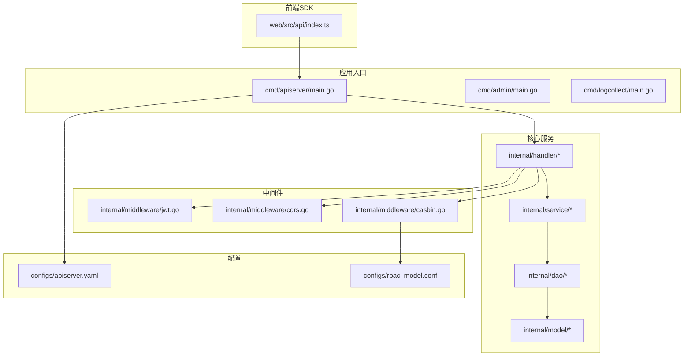
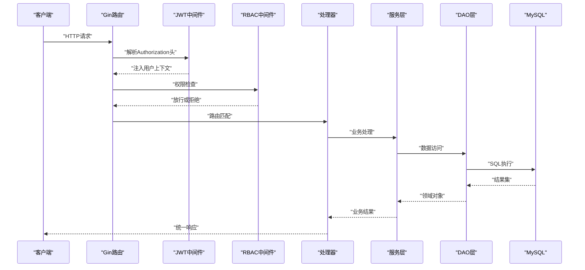
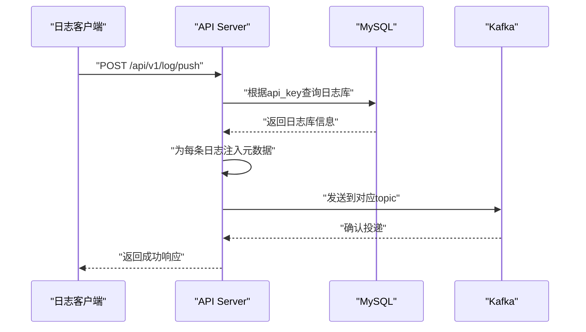
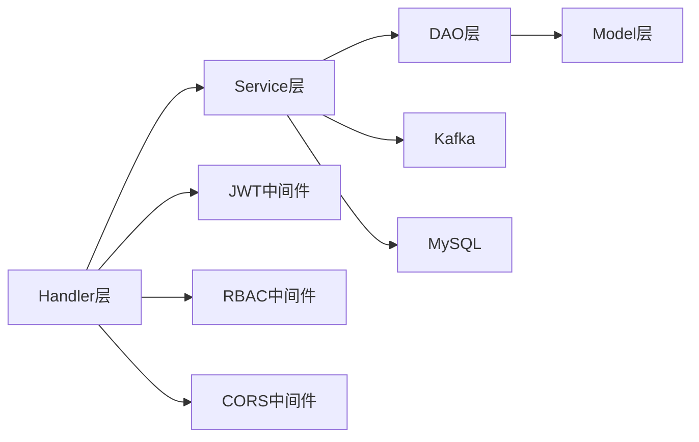
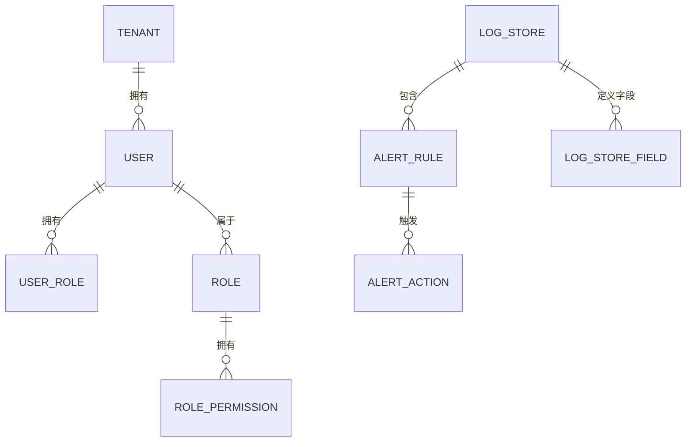

# API参考文档

<cite>
**本文档引用的文件**
- [cmd/apiserver/main.go](file://cmd/apiserver/main.go)
- [internal/handler/auth_handler.go](file://internal/handler/auth_handler.go)
- [internal/handler/rbac_handler.go](file://internal/handler/rbac_handler.go)
- [internal/service/auth_service.go](file://internal/service/auth_service.go)
- [internal/service/rbac_service.go](file://internal/service/rbac_service.go)
- [internal/middleware/jwt.go](file://internal/middleware/jwt.go)
- [internal/middleware/cors.go](file://internal/middleware/cors.go)
- [internal/middleware/casbin.go](file://internal/middleware/casbin.go)
- [internal/model/logstore.go](file://internal/model/logstore.go)
- [internal/model/base.go](file://internal/model/base.go)
- [internal/dao/user_dao.go](file://internal/dao/user_dao.go)
- [internal/dao/rbac_dao.go](file://internal/dao/rbac_dao.go)
- [internal/pkg/response/response.go](file://internal/pkg/response/response.go)
- [configs/apiserver.yaml](file://configs/apiserver.yaml)
- [web/src/api/index.ts](file://web/src/api/index.ts)
</cite>

## 目录
1. [简介](#简介)
2. [项目结构](#项目结构)
3. [核心组件](#核心组件)
4. [架构总览](#架构总览)
5. [详细组件分析](#详细组件分析)
6. [依赖关系分析](#依赖关系分析)
7. [性能考虑](#性能考虑)
8. [故障排除指南](#故障排除指南)
9. [结论](#结论)
10. [附录](#附录)

## 简介
本API参考文档面向日志收集与AI分析系统，覆盖以下内容：
- 全部RESTful API接口定义：HTTP方法、URL路径、请求参数、响应格式
- 关键接口详解：日志推送API（POST /api/v1/log/push）、用户认证相关接口、系统管理API（用户、角色、菜单、租户）
- 错误码说明与统一响应结构
- API调用示例与SDK使用指南
- 架构与数据流图示，帮助开发者快速理解系统设计

## 项目结构
后端采用Go语言与Gin框架实现，按职责划分为：
- cmd：应用入口与启动逻辑（apiserver、admin、logcollect等）
- internal：核心业务层（handler、service、dao、middleware、model）
- configs：运行时配置（apiserver.yaml、rbac_model.conf等）
- web：前端Vue应用（SDK示例）

图表来源
- [cmd/apiserver/main.go:1-129](file://cmd/apiserver/main.go#L1-L129)
- [internal/handler/auth_handler.go:1-135](file://internal/handler/auth_handler.go#L1-L135)
- [internal/handler/rbac_handler.go:1-221](file://internal/handler/rbac_handler.go#L1-L221)
- [internal/middleware/jwt.go:1-132](file://internal/middleware/jwt.go#L1-L132)
- [internal/middleware/cors.go:1-26](file://internal/middleware/cors.go#L1-L26)
- [internal/middleware/casbin.go:1-104](file://internal/middleware/casbin.go#L1-L104)
- [configs/apiserver.yaml:1-46](file://configs/apiserver.yaml#L1-L46)
- [web/src/api/index.ts:1-85](file://web/src/api/index.ts#L1-L85)

章节来源
- [cmd/apiserver/main.go:1-129](file://cmd/apiserver/main.go#L1-L129)
- [configs/apiserver.yaml:1-46](file://configs/apiserver.yaml#L1-L46)

## 核心组件
- 统一响应结构：所有接口返回统一的JSON结构，包含状态码、消息与数据体
- JWT认证：基于Bearer Token的认证机制，支持超管与租户隔离
- RBAC权限控制：基于Casbin的细粒度权限模型
- 数据模型：用户、角色、权限、菜单、租户、日志库等核心实体
- DAO层：对GORM的封装，提供CRUD与关联操作
- 服务层：业务编排与参数校验，连接DAO与中间件
- Handler层：路由绑定与请求处理，负责参数绑定与响应输出

章节来源
- [internal/pkg/response/response.go:1-100](file://internal/pkg/response/response.go#L1-L100)
- [internal/middleware/jwt.go:1-132](file://internal/middleware/jwt.go#L1-L132)
- [internal/middleware/casbin.go:1-104](file://internal/middleware/casbin.go#L1-L104)
- [internal/model/base.go:1-93](file://internal/model/base.go#L1-L93)
- [internal/dao/user_dao.go:1-70](file://internal/dao/user_dao.go#L1-L70)
- [internal/dao/rbac_dao.go:1-171](file://internal/dao/rbac_dao.go#L1-L171)
- [internal/service/auth_service.go:1-194](file://internal/service/auth_service.go#L1-L194)
- [internal/service/rbac_service.go:1-227](file://internal/service/rbac_service.go#L1-L227)

## 架构总览
系统采用“网关/入口 + 中间件 + 处理器 + 服务 + DAO + 数据库”的分层架构。认证与跨域中间件贯穿所有请求；JWT用于用户身份识别；Casbin用于API级权限控制；服务层负责业务逻辑与参数校验；DAO层抽象数据库访问；模型层定义表结构与关联。

图表来源
- [internal/middleware/jwt.go:67-95](file://internal/middleware/jwt.go#L67-L95)
- [internal/middleware/casbin.go:41-77](file://internal/middleware/casbin.go#L41-L77)
- [internal/handler/auth_handler.go:22-64](file://internal/handler/auth_handler.go#L22-L64)
- [internal/service/auth_service.go:55-98](file://internal/service/auth_service.go#L55-L98)
- [internal/dao/user_dao.go:17-38](file://internal/dao/user_dao.go#L17-L38)

## 详细组件分析

### 日志推送API
- 接口描述：接收外部系统推送的日志，进行API Key校验、元数据注入与Kafka投递
- 请求方式：POST
- 路径：/api/v1/log/push
- 认证：无需登录，但需提供有效的API Key
- 请求头：
  - Content-Type: application/json
- 请求体字段：
  - api_key: 字符串，必填，用于标识日志库与租户
  - logs: 数组，必填，每项为一条日志对象
    - 支持任意键值对，系统会自动注入以下字段：
      - _timestamp: 推送时间（毫秒时间戳）
      - _source_ip: 推送方IP
      - _store_id: 日志库ID
      - _tenant_id: 租户ID
- 响应体：
  - code: 整数，0表示成功，非0为错误码
  - message: 字符串，操作结果描述
  - data: 对象，包含count字段（本次推送的日志条数）
- 错误码：
  - 401 未授权：无效或不存在的API Key
  - 422 参数校验失败：请求体格式不正确
  - -1 通用错误：Kafka投递失败或其他内部错误
- 示例请求（示意）：
  - POST /api/v1/log/push
  - Body: {"api_key":"<你的API Key>","logs":[{"level":"info","msg":"应用启动"}]}
- 示例响应（成功）：
  - {"code":0,"message":"success","data":{"count":1}}
- 示例响应（失败）：
  - {"code":401,"message":"invalid api key"}

图表来源
- [cmd/apiserver/main.go:78-128](file://cmd/apiserver/main.go#L78-L128)
- [internal/model/logstore.go:3-17](file://internal/model/logstore.go#L3-L17)

章节来源
- [cmd/apiserver/main.go:59-128](file://cmd/apiserver/main.go#L59-L128)
- [internal/pkg/response/response.go:24-31](file://internal/pkg/response/response.go#L24-L31)

### 用户认证相关API
- 登录
  - 方法：POST
  - 路径：/auth/login
  - 请求体：{"username":"...","password":"..."}
  - 响应体：{"code":0,"message":"success","data":{"token":"...","user_info":{...}}}
  - 说明：登录成功后返回JWT Token及用户信息（含角色列表）
- 获取当前用户信息
  - 方法：GET
  - 路径：/auth/userinfo
  - 需要：Authorization: Bearer <token>
  - 响应体：{"code":0,"message":"success","data":{...}}
- 修改密码
  - 方法：PUT
  - 路径：/auth/password
  - 需要：Authorization: Bearer <token>
  - 请求体：{"old_password":"...","new_password":"...（最少6位）"}
  - 响应体：{"code":0,"message":"success","data":null}

章节来源
- [internal/handler/auth_handler.go:22-64](file://internal/handler/auth_handler.go#L22-L64)
- [internal/service/auth_service.go:55-98](file://internal/service/auth_service.go#L55-L98)
- [internal/middleware/jwt.go:67-95](file://internal/middleware/jwt.go#L67-L95)

### 系统管理API
- 用户管理
  - 列表：GET /users?page=1&page_size=10&tenant_id=1
  - 创建：POST /users（非超管仅能创建本租户用户）
  - 分配角色：PUT /users/{id}/roles（{"role_ids":[1,2]}）
- 角色管理
  - 列表：GET /roles?page=1&page_size=10
  - 新增：POST /roles
  - 更新：PUT /roles/{id}
  - 删除：DELETE /roles/{id}
  - 分配权限：PUT /roles/{id}/permissions（{"permission_ids":[1,2]}）
- 菜单管理
  - 列表：GET /menus
  - 新增：POST /menus
  - 更新：PUT /menus/{id}
  - 删除：DELETE /menus/{id}
- 租户管理
  - 列表：GET /tenants?page=1&page_size=10
  - 新增：POST /tenants
  - 更新：PUT /tenants/{id}
  - 删除：DELETE /tenants/{id}

章节来源
- [internal/handler/auth_handler.go:66-135](file://internal/handler/auth_handler.go#L66-L135)
- [internal/handler/rbac_handler.go:13-221](file://internal/handler/rbac_handler.go#L13-L221)
- [internal/service/rbac_service.go:28-227](file://internal/service/rbac_service.go#L28-L227)

### 统一响应结构与错误码
- 统一响应体
  - code: 整数，业务状态码
  - message: 字符串，提示信息
  - data: 对象或数组，业务数据（可选）
- 分页响应体
  - list: 列表数据
  - total: 总数
  - page: 当前页
  - page_size: 每页大小
- 常用错误码
  - 0: 成功
  - -1: 通用错误
  - 401: 未授权
  - 403: 禁止访问
  - 404: 资源不存在
  - 422: 参数校验失败

章节来源
- [internal/pkg/response/response.go:9-100](file://internal/pkg/response/response.go#L9-L100)

### SDK使用指南（前端）
- 登录
  - 调用：authApi.login({username, password})
  - 返回：Promise，包含token与user_info
- 获取用户信息
  - 调用：authApi.getUserInfo()
  - 返回：Promise，包含用户信息
- 修改密码
  - 调用：authApi.changePassword({old_password, new_password})
  - 返回：Promise
- 用户管理
  - 列表：userApi.list({page, page_size, tenant_id?})
  - 创建：userApi.create({...})
  - 分配角色：userApi.assignRoles(id, [role_ids])
- 角色管理
  - 列表：roleApi.list({page, page_size})
  - 新增/更新/删除：roleApi.create/update/delete
  - 分配权限：roleApi.assignPermissions(id, [permission_ids])
- 租户与菜单
  - 租户：tenantApi.{list,get,create,update,delete}
  - 菜单：menuApi.{list,create,update,delete}

章节来源
- [web/src/api/index.ts:1-85](file://web/src/api/index.ts#L1-L85)

## 依赖关系分析
- 组件耦合
  - Handler依赖Service，Service依赖DAO，DAO依赖Model
  - Handler通过中间件（JWT、RBAC、CORS）增强横切能力
- 外部依赖
  - Gin：Web框架
  - JWT：认证
  - Casbin：权限控制
  - GORM：ORM
  - Kafka：消息队列
  - MySQL：持久化存储
- 可能的循环依赖
  - 代码中未见直接循环导入，分层清晰

图表来源
- [internal/handler/auth_handler.go:13-20](file://internal/handler/auth_handler.go#L13-L20)
- [internal/service/auth_service.go:13-20](file://internal/service/auth_service.go#L13-L20)
- [internal/dao/user_dao.go:8-15](file://internal/dao/user_dao.go#L8-L15)
- [internal/middleware/jwt.go:67-95](file://internal/middleware/jwt.go#L67-L95)
- [internal/middleware/casbin.go:41-77](file://internal/middleware/casbin.go#L41-L77)
- [internal/middleware/cors.go:9-25](file://internal/middleware/cors.go#L9-L25)

## 性能考虑
- 日志推送
  - 批量写入：建议将多条日志合并为一次请求，减少网络开销
  - Kafka异步：投递失败不影响主流程，但需关注错误日志
- 认证与权限
  - JWT轻量：避免频繁查询数据库
  - RBAC策略缓存：Casbin策略加载后在内存中执行
- 数据库
  - 合理分页：避免一次性拉取过多数据
  - 索引优化：确保常用查询字段（如username、tenant_id、api_key）有索引

## 故障排除指南
- 401 未授权
  - 检查Authorization头格式是否为Bearer Token
  - 确认Token未过期且签名正确
- 403 禁止访问
  - 检查用户角色是否具备相应API权限
  - 确认Casbin策略已同步
- 422 参数校验失败
  - 检查请求体JSON格式与字段类型
- Kafka投递失败
  - 检查Kafka Broker连通性与topic配置
  - 查看服务端日志定位具体错误
- 响应异常
  - 统一响应结构中的code字段为-1时，查看message获取错误详情

章节来源
- [internal/middleware/jwt.go:67-95](file://internal/middleware/jwt.go#L67-L95)
- [internal/middleware/casbin.go:41-77](file://internal/middleware/casbin.go#L41-L77)
- [internal/pkg/response/response.go:51-89](file://internal/pkg/response/response.go#L51-L89)

## 结论
本API参考文档提供了日志收集与AI分析系统的核心接口说明、统一响应结构、错误码规范以及SDK使用示例。通过JWT与RBAC的组合，系统实现了安全可控的多租户权限体系；日志推送API支持高吞吐场景下的批量写入与异步投递。建议在生产环境中妥善管理密钥与Token，定期审查权限策略，并监控Kafka与数据库的健康状况。

## 附录

### 数据模型概览

图表来源
- [internal/model/base.go:17-93](file://internal/model/base.go#L17-L93)
- [internal/model/logstore.go:3-78](file://internal/model/logstore.go#L3-L78)