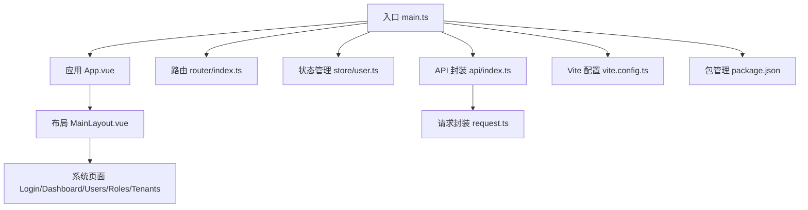
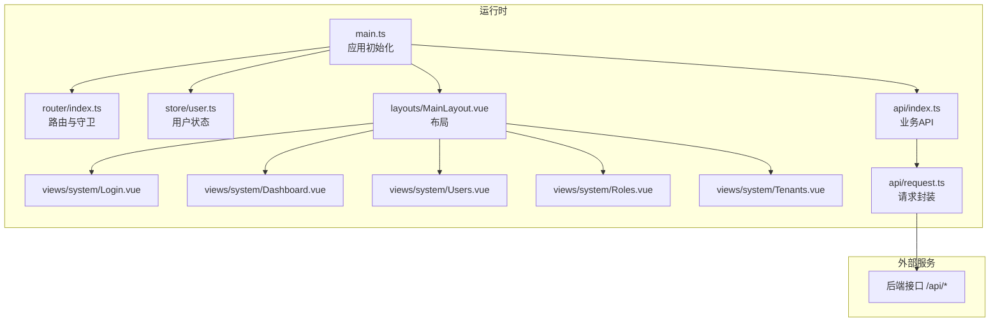
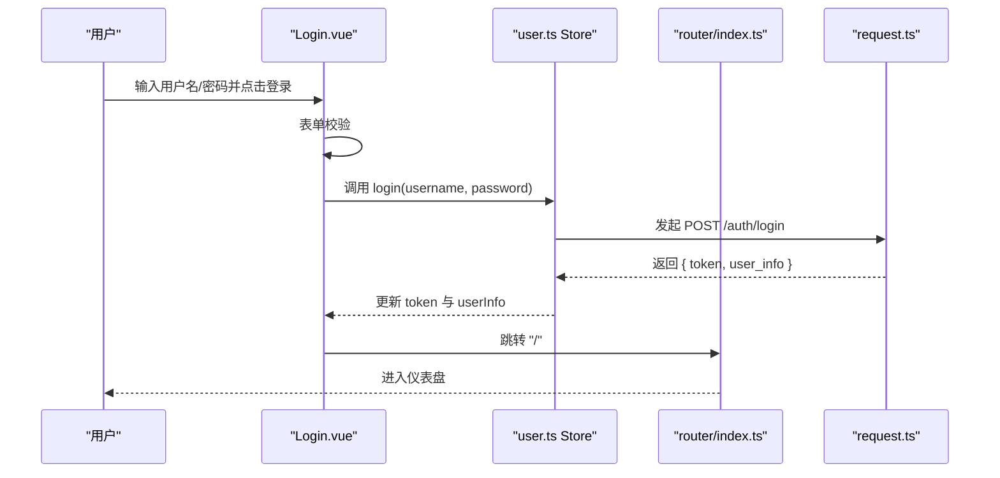
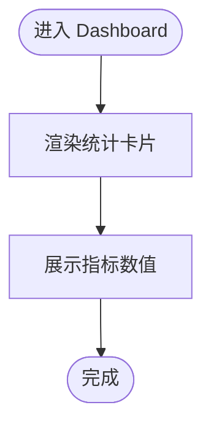
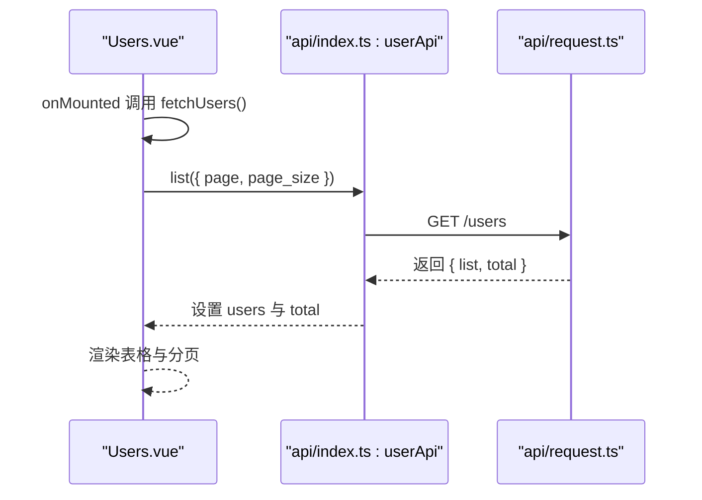
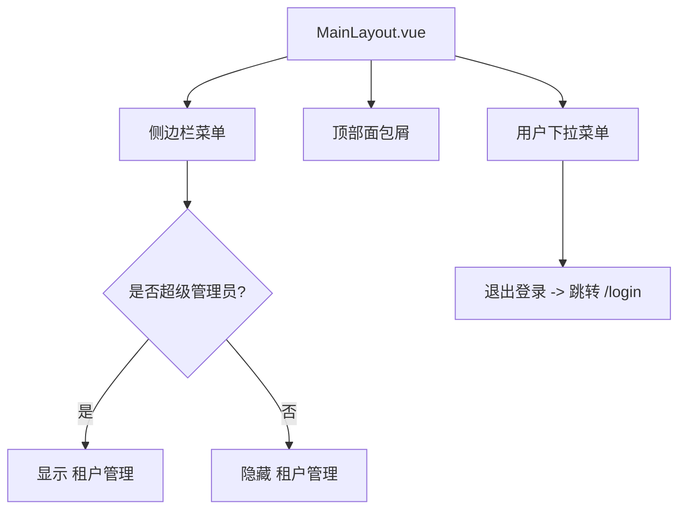
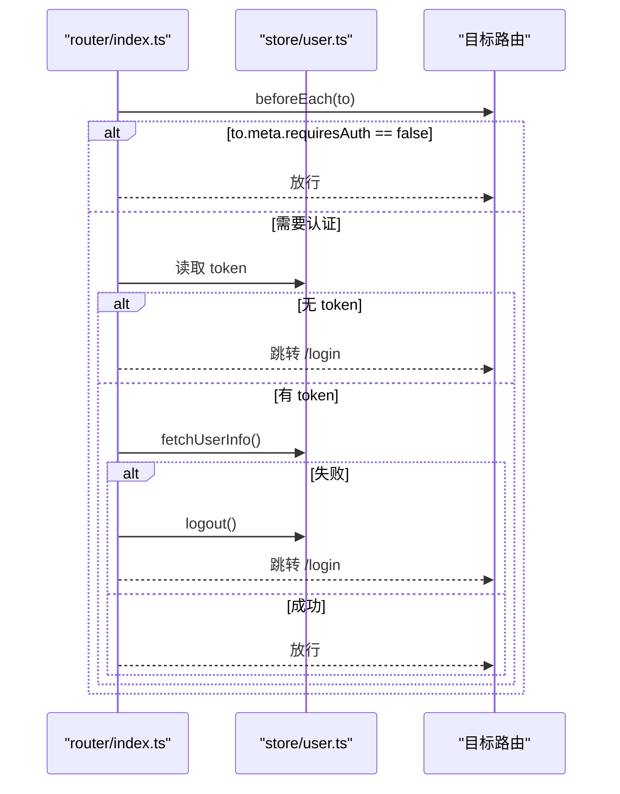
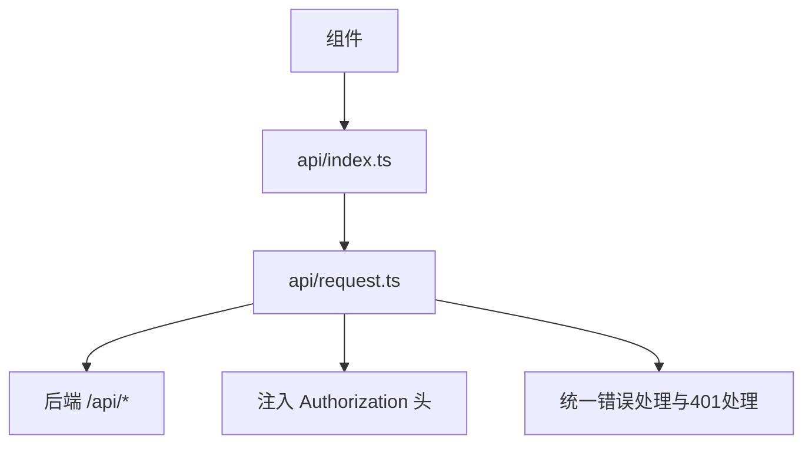
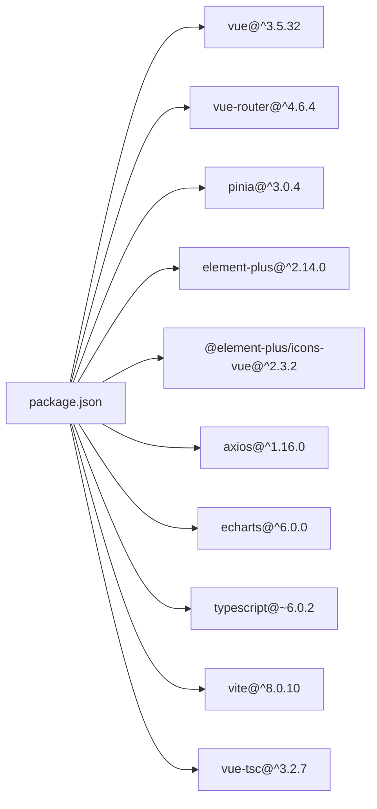

# 前端管理界面

<cite>
**本文引用的文件**
- [web/src/main.ts](file://web/src/main.ts)
- [web/src/App.vue](file://web/src/App.vue)
- [web/src/router/index.ts](file://web/src/router/index.ts)
- [web/src/store/user.ts](file://web/src/store/user.ts)
- [web/src/layouts/MainLayout.vue](file://web/src/layouts/MainLayout.vue)
- [web/src/views/system/Login.vue](file://web/src/views/system/Login.vue)
- [web/src/views/system/Dashboard.vue](file://web/src/views/system/Dashboard.vue)
- [web/src/views/system/Users.vue](file://web/src/views/system/Users.vue)
- [web/src/views/system/Roles.vue](file://web/src/views/system/Roles.vue)
- [web/src/views/system/Tenants.vue](file://web/src/views/system/Tenants.vue)
- [web/src/api/index.ts](file://web/src/api/index.ts)
- [web/src/api/request.ts](file://web/src/api/request.ts)
- [web/vite.config.ts](file://web/vite.config.ts)
- [web/package.json](file://web/package.json)
</cite>

## 目录
1. [简介](#简介)
2. [项目结构](#项目结构)
3. [核心组件](#核心组件)
4. [架构总览](#架构总览)
5. [详细组件分析](#详细组件分析)
6. [依赖关系分析](#依赖关系分析)
7. [性能考虑](#性能考虑)
8. [故障排查指南](#故障排查指南)
9. [结论](#结论)
10. [附录](#附录)

## 简介
本文件面向日志收集AI分析系统的前端管理界面，基于 Vue 3 + TypeScript 技术栈与 Element Plus 组件库构建。文档覆盖系统整体架构、页面功能与使用方式（仪表盘、用户管理、角色管理、菜单管理、租户管理等）、路由与状态管理方案、组件与数据流设计、界面定制与主题修改建议，以及开发环境搭建与构建部署要点。

## 项目结构
前端代码位于 web 目录，采用 Vite 构建工具，使用 Vue 3 单文件组件与 Composition API，配合 Pinia 进行状态管理，Element Plus 提供 UI 组件与样式支持。主要目录组织如下：
- 入口与应用根：main.ts、App.vue
- 路由：router/index.ts
- 状态管理：store/user.ts
- 布局与页面：layouts/MainLayout.vue、views/system/*.vue
- API 封装：api/index.ts、api/request.ts
- 开发与构建：vite.config.ts、package.json



图表来源
- [web/src/main.ts:1-20](file://web/src/main.ts#L1-L20)
- [web/src/App.vue:1-4](file://web/src/App.vue#L1-L4)
- [web/src/router/index.ts:1-127](file://web/src/router/index.ts#L1-L127)
- [web/src/store/user.ts:1-48](file://web/src/store/user.ts#L1-L48)
- [web/src/layouts/MainLayout.vue:1-168](file://web/src/layouts/MainLayout.vue#L1-L168)
- [web/src/views/system/Login.vue:1-82](file://web/src/views/system/Login.vue#L1-L82)
- [web/src/views/system/Dashboard.vue:1-53](file://web/src/views/system/Dashboard.vue#L1-L53)
- [web/src/views/system/Users.vue:1-79](file://web/src/views/system/Users.vue#L1-L79)
- [web/src/views/system/Roles.vue:1-31](file://web/src/views/system/Roles.vue#L1-L31)
- [web/src/views/system/Tenants.vue:1-31](file://web/src/views/system/Tenants.vue#L1-L31)
- [web/src/api/index.ts:1-85](file://web/src/api/index.ts#L1-L85)
- [web/src/api/request.ts:1-50](file://web/src/api/request.ts#L1-L50)
- [web/vite.config.ts:1-17](file://web/vite.config.ts#L1-L17)
- [web/package.json:1-30](file://web/package.json#L1-L30)

章节来源
- [web/src/main.ts:1-20](file://web/src/main.ts#L1-L20)
- [web/src/App.vue:1-4](file://web/src/App.vue#L1-L4)
- [web/src/router/index.ts:1-127](file://web/src/router/index.ts#L1-L127)
- [web/src/store/user.ts:1-48](file://web/src/store/user.ts#L1-L48)
- [web/src/layouts/MainLayout.vue:1-168](file://web/src/layouts/MainLayout.vue#L1-L168)
- [web/src/api/index.ts:1-85](file://web/src/api/index.ts#L1-L85)
- [web/src/api/request.ts:1-50](file://web/src/api/request.ts#L1-L50)
- [web/vite.config.ts:1-17](file://web/vite.config.ts#L1-L17)
- [web/package.json:1-30](file://web/package.json#L1-L30)

## 核心组件
- 应用入口与插件注册：在入口中注册 Element Plus、图标、Pinia、Vue Router，并挂载应用。
- 布局组件：MainLayout 提供侧边栏导航、面包屑、头部用户下拉菜单与主内容区。
- 路由与守卫：定义页面路由与全局前置守卫，处理登录态校验与用户信息拉取。
- 状态管理：Pinia Store 管理 token 与用户信息，持久化到本地存储。
- API 层：统一的请求封装与拦截器，自动注入认证头、处理统一响应格式与 401 重定向。

章节来源
- [web/src/main.ts:1-20](file://web/src/main.ts#L1-L20)
- [web/src/layouts/MainLayout.vue:1-168](file://web/src/layouts/MainLayout.vue#L1-L168)
- [web/src/router/index.ts:94-127](file://web/src/router/index.ts#L94-L127)
- [web/src/store/user.ts:18-47](file://web/src/store/user.ts#L18-L47)
- [web/src/api/request.ts:6-47](file://web/src/api/request.ts#L6-L47)

## 架构总览
前端采用“入口 -> 布局 -> 页面 -> API”的分层架构，路由负责页面切换，Pinia 负责用户状态，Element Plus 提供 UI 组件与主题样式。请求通过 axios 拦截器统一处理认证与错误。



图表来源
- [web/src/main.ts:1-20](file://web/src/main.ts#L1-L20)
- [web/src/router/index.ts:1-127](file://web/src/router/index.ts#L1-L127)
- [web/src/store/user.ts:1-48](file://web/src/store/user.ts#L1-L48)
- [web/src/layouts/MainLayout.vue:1-168](file://web/src/layouts/MainLayout.vue#L1-L168)
- [web/src/views/system/Login.vue:1-82](file://web/src/views/system/Login.vue#L1-L82)
- [web/src/views/system/Dashboard.vue:1-53](file://web/src/views/system/Dashboard.vue#L1-L53)
- [web/src/views/system/Users.vue:1-79](file://web/src/views/system/Users.vue#L1-L79)
- [web/src/views/system/Roles.vue:1-31](file://web/src/views/system/Roles.vue#L1-L31)
- [web/src/views/system/Tenants.vue:1-31](file://web/src/views/system/Tenants.vue#L1-L31)
- [web/src/api/index.ts:1-85](file://web/src/api/index.ts#L1-L85)
- [web/src/api/request.ts:1-50](file://web/src/api/request.ts#L1-L50)

## 详细组件分析

### 登录页 Login
- 功能概述：提供用户名、密码输入与登录按钮；表单校验；登录成功提示与跳转。
- 关键流程：表单校验 -> 调用用户 Store 的登录方法 -> 成功后跳转至首页。
- 错误处理：交由请求拦截器统一处理。



图表来源
- [web/src/views/system/Login.vue:43-57](file://web/src/views/system/Login.vue#L43-L57)
- [web/src/store/user.ts:22-28](file://web/src/store/user.ts#L22-L28)
- [web/src/api/request.ts:6-19](file://web/src/api/request.ts#L6-L19)
- [web/src/router/index.ts:100-124](file://web/src/router/index.ts#L100-L124)

章节来源
- [web/src/views/system/Login.vue:1-82](file://web/src/views/system/Login.vue#L1-L82)
- [web/src/store/user.ts:18-47](file://web/src/store/user.ts#L18-L47)
- [web/src/api/request.ts:6-47](file://web/src/api/request.ts#L6-L47)
- [web/src/router/index.ts:94-127](file://web/src/router/index.ts#L94-L127)

### 仪表盘 Dashboard
- 功能概述：展示统计指标卡片（日志总量、今日日志、在线 Agent、活跃告警）。
- 数据流：组件内使用响应式对象维护统计数据，实际数据可扩展接入 API。



图表来源
- [web/src/views/system/Dashboard.vue:32-41](file://web/src/views/system/Dashboard.vue#L32-L41)

章节来源
- [web/src/views/system/Dashboard.vue:1-53](file://web/src/views/system/Dashboard.vue#L1-L53)

### 用户管理 Users
- 功能概述：列表展示用户，支持分页；提供新增、编辑、分配角色等操作占位。
- 数据流：组件挂载时调用用户 API 获取列表；分页变更触发重新请求。



图表来源
- [web/src/views/system/Users.vue:50-69](file://web/src/views/system/Users.vue#L50-L69)
- [web/src/api/index.ts:18-27](file://web/src/api/index.ts#L18-L27)
- [web/src/api/request.ts:6-19](file://web/src/api/request.ts#L6-L19)

章节来源
- [web/src/views/system/Users.vue:1-79](file://web/src/views/system/Users.vue#L1-L79)
- [web/src/api/index.ts:16-27](file://web/src/api/index.ts#L16-L27)

### 角色管理 Roles
- 功能概述：提供角色列表与基本操作列（编辑、分配权限、删除）占位。
- 扩展建议：接入角色 API，实现增删改查与权限分配。

章节来源
- [web/src/views/system/Roles.vue:1-31](file://web/src/views/system/Roles.vue#L1-L31)
- [web/src/api/index.ts:29-49](file://web/src/api/index.ts#L29-L49)

### 租户管理 Tenants
- 功能概述：提供租户列表与基本操作列（编辑、删除）占位。
- 扩展建议：接入租户 API，实现增删改查。

章节来源
- [web/src/views/system/Tenants.vue:1-31](file://web/src/views/system/Tenants.vue#L1-L31)
- [web/src/api/index.ts:51-68](file://web/src/api/index.ts#L51-L68)

### 布局与导航 MainLayout
- 功能概述：左侧菜单（含系统管理子菜单）、顶部面包屑与用户下拉；支持侧边栏折叠；根据是否超级管理员显示租户管理。
- 交互：折叠按钮切换宽度；下拉菜单跳转个人中心或退出登录。



图表来源
- [web/src/layouts/MainLayout.vue:9-62](file://web/src/layouts/MainLayout.vue#L9-L62)
- [web/src/layouts/MainLayout.vue:110-113](file://web/src/layouts/MainLayout.vue#L110-L113)

章节来源
- [web/src/layouts/MainLayout.vue:1-168](file://web/src/layouts/MainLayout.vue#L1-L168)

### 路由与守卫
- 路由结构：登录页与系统页面（仪表盘、用户、角色、租户、菜单、日志库、搜索、分析、告警、生命周期、Agent）。
- 守卫逻辑：未设置 requiresAuth 为 false 的路由均需登录；若无 token 则跳转登录；若 userInfo 为空则尝试拉取；401 时登出并跳转登录。



图表来源
- [web/src/router/index.ts:100-124](file://web/src/router/index.ts#L100-L124)
- [web/src/store/user.ts:30-34](file://web/src/store/user.ts#L30-L34)

章节来源
- [web/src/router/index.ts:1-127](file://web/src/router/index.ts#L1-L127)
- [web/src/store/user.ts:18-47](file://web/src/store/user.ts#L18-L47)

### 状态管理方案（Pinia）
- 用户状态：token、userInfo、登录、获取用户信息、登出、判断是否超级管理员。
- 存储策略：token 持久化到本地存储；userInfo 在登录后拉取并缓存。

```mermaid
classDiagram
class UserStore {
+string token
+UserInfo|null userInfo
+login(username, password) Promise
+fetchUserInfo() Promise
+logout() void
+isSuperAdmin() boolean
}
class UserInfo {
+number id
+number tenant_id
+string tenant_name
+string username
+string nickname
+string email
+string phone
+string avatar
+boolean is_super_admin
+roles[] : { id, name, code }
}
UserStore --> UserInfo : "持有"
```

图表来源
- [web/src/store/user.ts:5-16](file://web/src/store/user.ts#L5-L16)
- [web/src/store/user.ts:18-47](file://web/src/store/user.ts#L18-L47)

章节来源
- [web/src/store/user.ts:1-48](file://web/src/store/user.ts#L1-L48)

### API 与数据流
- API 分层：按业务模块导出（认证、用户、角色、租户、菜单），统一通过 request.ts 发起请求。
- 请求封装：基础配置、请求头注入 Authorization、响应统一校验与错误提示、401 自动登出与跳转。
- 开发代理：Vite 代理 /api 到后端服务地址。



图表来源
- [web/src/api/index.ts:1-85](file://web/src/api/index.ts#L1-L85)
- [web/src/api/request.ts:6-47](file://web/src/api/request.ts#L6-L47)
- [web/vite.config.ts:7-15](file://web/vite.config.ts#L7-L15)

章节来源
- [web/src/api/index.ts:1-85](file://web/src/api/index.ts#L1-L85)
- [web/src/api/request.ts:1-50](file://web/src/api/request.ts#L1-L50)
- [web/vite.config.ts:1-17](file://web/vite.config.ts#L1-L17)

## 依赖关系分析
- 运行时依赖：Vue 3、Vue Router、Pinia、Element Plus、@element-plus/icons-vue、axios、echarts。
- 开发依赖：Vite、TypeScript、@vitejs/plugin-vue、vue-tsc。
- 依赖关系图：



图表来源
- [web/package.json:11-28](file://web/package.json#L11-L28)

章节来源
- [web/package.json:1-30](file://web/package.json#L1-L30)

## 性能考虑
- 组件懒加载：路由采用动态导入，减少首屏体积。
- 列表分页：Users 页面已实现分页，避免一次性加载大量数据。
- 图表优化：Dashboard 可结合 ECharts 进行可视化，建议按需引入与懒加载。
- 缓存策略：用户信息与 token 已做本地持久化，减少重复登录成本。

## 故障排查指南
- 登录失败或 401：检查后端接口连通性与认证返回；确认请求拦截器已注入 Authorization 头；查看控制台网络与消息提示。
- 路由跳转异常：确认路由守卫逻辑与 token 状态；检查 userInfo 拉取是否成功。
- 开发代理无效：确认 Vite 代理配置与后端服务地址一致；浏览器开发者工具 Network 面板验证代理命中。

章节来源
- [web/src/api/request.ts:23-47](file://web/src/api/request.ts#L23-L47)
- [web/src/router/index.ts:100-124](file://web/src/router/index.ts#L100-L124)
- [web/vite.config.ts:7-15](file://web/vite.config.ts#L7-L15)

## 结论
该前端管理界面以 Vue 3 + TypeScript 为基础，结合 Element Plus 与 Pinia，实现了清晰的路由与状态管理、统一的 API 封装与拦截器机制。页面覆盖系统管理与日志相关功能，具备良好的扩展性与可维护性。后续可在各管理页面完善 CRUD 与权限控制，并持续优化性能与用户体验。

## 附录

### 页面功能一览
- 登录页：用户认证入口，表单校验与登录流程。
- 仪表盘：统计指标展示，可扩展接入实时数据。
- 用户管理：用户列表与分页，预留新增/编辑/分配角色。
- 角色管理：角色列表与权限分配占位。
- 租户管理：租户列表与基本操作占位（仅超级管理员可见）。
- 菜单管理：菜单列表与增删改占位。
- 日志库管理：日志库资源管理占位。
- 日志查询：日志检索与过滤占位。
- 聚合分析：日志聚合与分析占位。
- 告警管理：告警规则与处置占位。
- 生命周期管理：日志生命周期策略占位。
- Agent 管理：Agent 部署与运维占位。

章节来源
- [web/src/router/index.ts:4-91](file://web/src/router/index.ts#L4-L91)
- [web/src/layouts/MainLayout.vue:22-61](file://web/src/layouts/MainLayout.vue#L22-L61)

### 开发环境搭建与构建部署
- 安装依赖：使用包管理器安装运行时与开发依赖。
- 本地开发：启动 Vite 开发服务器，默认端口 3000，代理 /api 到后端服务。
- 构建产物：TypeScript 类型检查与 Vite 构建生成静态资源，输出至 dist 目录。
- 预览：本地预览构建结果。

章节来源
- [web/package.json:6-10](file://web/package.json#L6-L10)
- [web/vite.config.ts:7-16](file://web/vite.config.ts#L7-L16)

### 界面定制与主题修改
- Element Plus 主题：可通过官方主题工具或覆盖 CSS 变量方式进行定制；注意保持与现有配色一致。
- 布局样式：MainLayout 的 aside/header/main 样式可按需调整，确保响应式与可访问性。
- 图标使用：已全局注册 Element Plus 图标，可在组件中直接使用。

章节来源
- [web/src/main.ts:11-14](file://web/src/main.ts#L11-L14)
- [web/src/layouts/MainLayout.vue:116-167](file://web/src/layouts/MainLayout.vue#L116-L167)