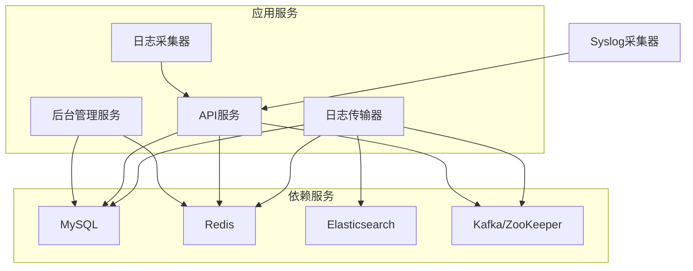
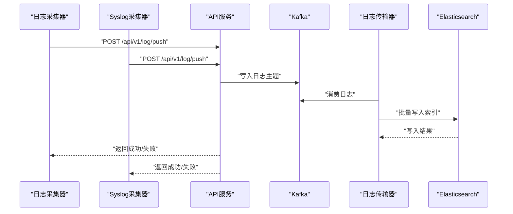
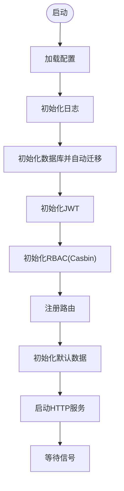
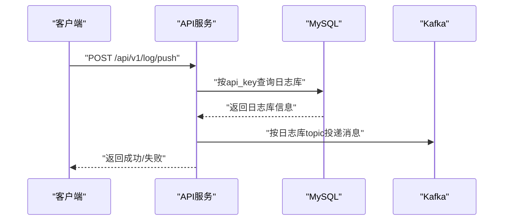
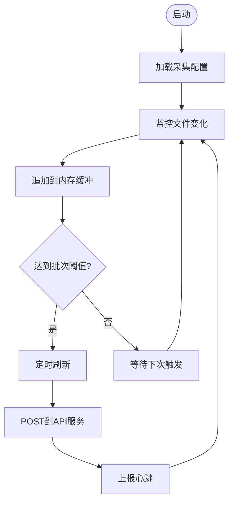
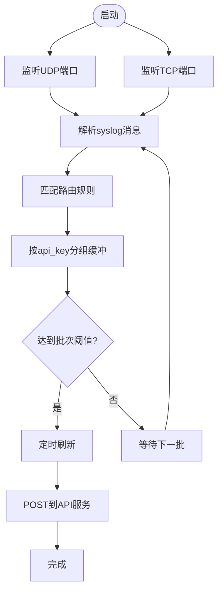
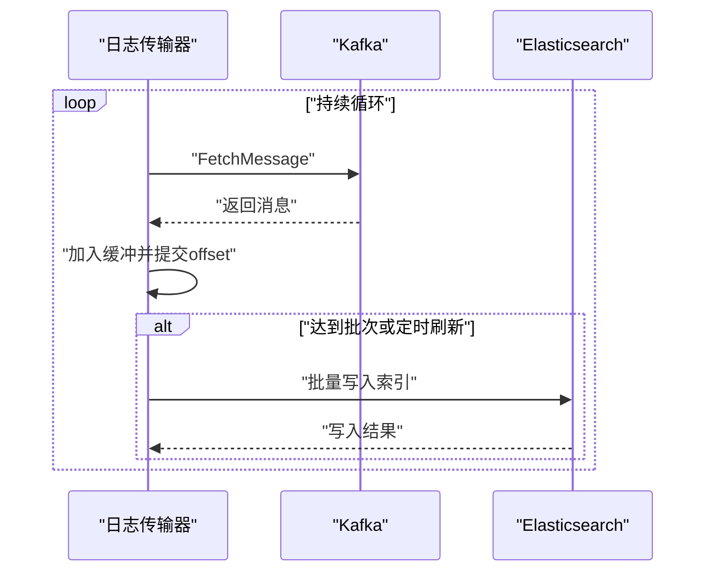
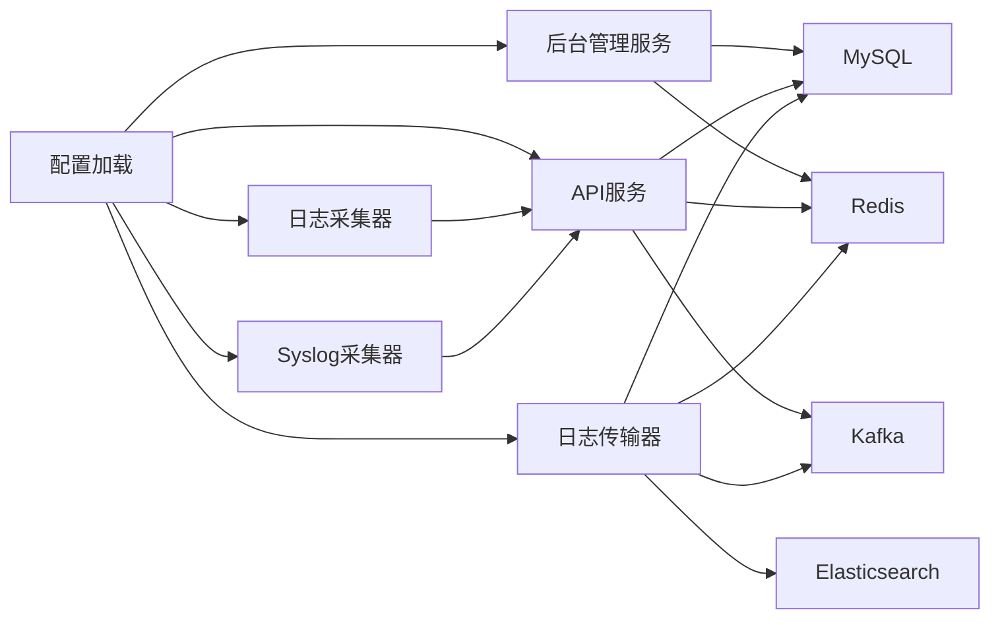

# 快速开始

<cite>
**本文引用的文件**
- [docker-compose/mysql/docker-compose.yaml](file://docker-compose/mysql/docker-compose.yaml)
- [docker-compose/redis/docker-compose.yaml](file://docker-compose/redis/docker-compose.yaml)
- [docker-compose/elasticsearch/docker-compose.yaml](file://docker-compose/elasticsearch/docker-compose.yaml)
- [docker-compose/kafka/docker-compose.yaml](file://docker-compose/kafka/docker-compose.yaml)
- [configs/admin.yaml](file://configs/admin.yaml)
- [configs/apiserver.yaml](file://configs/apiserver.yaml)
- [configs/logcollect.yaml](file://configs/logcollect.yaml)
- [configs/logtransfer.yaml](file://configs/logtransfer.yaml)
- [configs/syslog.yaml](file://configs/syslog.yaml)
- [cmd/admin/main.go](file://cmd/admin/main.go)
- [cmd/apiserver/main.go](file://cmd/apiserver/main.go)
- [cmd/logcollect/main.go](file://cmd/logcollect/main.go)
- [cmd/logtransfer/main.go](file://cmd/logtransfer/main.go)
- [cmd/syslog/main.go](file://cmd/syslog/main.go)
- [internal/pkg/config/config.go](file://internal/pkg/config/config.go)
- [internal/pkg/es/es.go](file://internal/pkg/es/es.go)
- [internal/pkg/kafka/kafka.go](file://internal/pkg/kafka/kafka.go)
- [internal/pkg/redis/redis.go](file://internal/pkg/redis/redis.go)
</cite>

## 目录
1. [简介](#简介)
2. [项目结构](#项目结构)
3. [核心组件](#核心组件)
4. [架构总览](#架构总览)
5. [详细组件分析](#详细组件分析)
6. [依赖关系分析](#依赖关系分析)
7. [性能考虑](#性能考虑)
8. [故障排查指南](#故障排查指南)
9. [结论](#结论)
10. [附录](#附录)

## 简介
本指南面向新用户，帮助您在本地或服务器上快速完成日志收集与AI分析系统的部署与运行。内容涵盖：
- 依赖服务（MySQL、Redis、Elasticsearch、Kafka）的安装与配置
- Docker编排与启动顺序
- 后台管理、API接口、日志采集、日志传输、日志分析等服务的启动步骤
- 基本使用示例（日志采集配置、API调用）

## 项目结构
系统采用多进程微服务架构，包含以下主要模块：
- 后台管理服务：提供用户、角色、菜单、租户等管理能力
- API服务：接收外部日志推送，校验API Key并投递到Kafka
- 日志采集器：从文件或Syslog收集日志，批量推送到API服务
- 日志传输器：从Kafka消费日志，批量写入Elasticsearch
- 前端Web：基于Vue的管理界面（打包产物位于web/dist）

图表来源
- [cmd/admin/main.go:21-147](file://cmd/admin/main.go#L21-L147)
- [cmd/apiserver/main.go:24-76](file://cmd/apiserver/main.go#L24-L76)
- [cmd/logcollect/main.go:52-111](file://cmd/logcollect/main.go#L52-L111)
- [cmd/logtransfer/main.go:24-83](file://cmd/logtransfer/main.go#L24-L83)
- [cmd/syslog/main.go:39-79](file://cmd/syslog/main.go#L39-L79)

章节来源
- [cmd/admin/main.go:21-147](file://cmd/admin/main.go#L21-L147)
- [cmd/apiserver/main.go:24-76](file://cmd/apiserver/main.go#L24-L76)
- [cmd/logcollect/main.go:52-111](file://cmd/logcollect/main.go#L52-L111)
- [cmd/logtransfer/main.go:24-83](file://cmd/logtransfer/main.go#L24-L83)
- [cmd/syslog/main.go:39-79](file://cmd/syslog/main.go#L39-L79)

## 核心组件
- 配置加载：统一通过Viper加载YAML配置，支持环境变量覆盖
- 数据库：MySQL用于存储用户、权限、日志库等元数据
- 缓存：Redis用于会话、鉴权等缓存场景
- 消息队列：Kafka用于日志的高吞吐传输
- 搜索引擎：Elasticsearch用于日志检索与分析
- Web前端：Vue构建的管理界面，静态资源位于web/dist

章节来源
- [internal/pkg/config/config.go:86-111](file://internal/pkg/config/config.go#L86-L111)
- [configs/admin.yaml:1-46](file://configs/admin.yaml#L1-L46)
- [configs/apiserver.yaml:1-46](file://configs/apiserver.yaml#L1-L46)
- [configs/logtransfer.yaml:1-46](file://configs/logtransfer.yaml#L1-L46)

## 架构总览
系统采用“采集-传输-存储-查询”的链路：
- 文件采集与Syslog采集器将日志推送到API服务
- API服务校验API Key后投递到Kafka
- 日志传输器从Kafka消费并批量写入Elasticsearch
- Elasticsearch对外提供检索能力，Web界面进行可视化展示

图表来源
- [cmd/logcollect/main.go:204-229](file://cmd/logcollect/main.go#L204-L229)
- [cmd/syslog/main.go:196-210](file://cmd/syslog/main.go#L196-L210)
- [cmd/apiserver/main.go:84-128](file://cmd/apiserver/main.go#L84-L128)
- [cmd/logtransfer/main.go:85-177](file://cmd/logtransfer/main.go#L85-L177)

## 详细组件分析

### 后台管理服务（Admin）
- 功能：用户、角色、菜单、租户管理；RBAC鉴权；审计日志
- 启动流程：加载配置→初始化日志→初始化数据库→自动迁移→初始化JWT/Casbin→注册路由→启动HTTP服务
- 默认数据：首次启动创建默认租户与超级管理员账号

图表来源
- [cmd/admin/main.go:21-147](file://cmd/admin/main.go#L21-L147)

章节来源
- [cmd/admin/main.go:21-147](file://cmd/admin/main.go#L21-L147)
- [configs/admin.yaml:1-46](file://configs/admin.yaml#L1-L46)

### API服务（API Server）
- 功能：接收日志推送，校验API Key，投递到Kafka
- 接口：/api/v1/log/push（POST），请求体包含api_key与logs数组
- 校验逻辑：根据api_key查询日志库，若状态有效则继续处理

图表来源
- [cmd/apiserver/main.go:84-128](file://cmd/apiserver/main.go#L84-L128)

章节来源
- [cmd/apiserver/main.go:24-128](file://cmd/apiserver/main.go#L24-L128)
- [configs/apiserver.yaml:1-46](file://configs/apiserver.yaml#L1-L46)

### 日志采集器（LogCollect）
- 功能：监控文件路径，按批次与时间间隔推送至API服务
- 配置：api_server、api_key、agent_id、heartbeat_url、batch_size、flush_seconds、collectors
- 采集项：支持多路径、多行模式、解析模式

图表来源
- [cmd/logcollect/main.go:113-229](file://cmd/logcollect/main.go#L113-L229)
- [configs/logcollect.yaml:1-18](file://configs/logcollect.yaml#L1-L18)

章节来源
- [cmd/logcollect/main.go:52-257](file://cmd/logcollect/main.go#L52-L257)
- [configs/logcollect.yaml:1-18](file://configs/logcollect.yaml#L1-L18)

### Syslog采集器（Syslog）
- 功能：监听UDP/TCP端口，按路由规则分发到不同API Key
- 配置：udp_port、tcp_port、api_server、batch_size、flush_seconds、routes

图表来源
- [cmd/syslog/main.go:137-210](file://cmd/syslog/main.go#L137-L210)
- [configs/syslog.yaml:1-12](file://configs/syslog.yaml#L1-L12)

章节来源
- [cmd/syslog/main.go:39-211](file://cmd/syslog/main.go#L39-L211)
- [configs/syslog.yaml:1-12](file://configs/syslog.yaml#L1-L12)

### 日志传输器（LogTransfer）
- 功能：从Kafka消费日志，批量写入Elasticsearch
- 索引命名：{日志库编码}_{年.月.日}
- 批量策略：固定批次大小与刷新间隔

图表来源
- [cmd/logtransfer/main.go:85-177](file://cmd/logtransfer/main.go#L85-L177)
- [configs/logtransfer.yaml:1-46](file://configs/logtransfer.yaml#L1-L46)

章节来源
- [cmd/logtransfer/main.go:24-186](file://cmd/logtransfer/main.go#L24-L186)
- [configs/logtransfer.yaml:1-46](file://configs/logtransfer.yaml#L1-L46)

## 依赖关系分析
- 配置层：统一通过Viper加载YAML配置，支持环境变量覆盖
- 存储层：MySQL负责业务数据；Redis负责缓存；Elasticsearch负责日志检索
- 消息层：Kafka负责日志传输
- 服务层：各服务独立进程，通过配置文件连接依赖

图表来源
- [internal/pkg/config/config.go:86-111](file://internal/pkg/config/config.go#L86-L111)
- [configs/admin.yaml:1-46](file://configs/admin.yaml#L1-L46)
- [configs/apiserver.yaml:1-46](file://configs/apiserver.yaml#L1-L46)
- [configs/logtransfer.yaml:1-46](file://configs/logtransfer.yaml#L1-L46)
- [configs/logcollect.yaml:1-18](file://configs/logcollect.yaml#L1-L18)
- [configs/syslog.yaml:1-12](file://configs/syslog.yaml#L1-L12)

章节来源
- [internal/pkg/config/config.go:86-111](file://internal/pkg/config/config.go#L86-L111)
- [internal/pkg/es/es.go:15-36](file://internal/pkg/es/es.go#L15-L36)
- [internal/pkg/kafka/kafka.go:15-103](file://internal/pkg/kafka/kafka.go#L15-L103)
- [internal/pkg/redis/redis.go:16-32](file://internal/pkg/redis/redis.go#L16-L32)

## 性能考虑
- Kafka生产者/消费者批处理与刷新间隔可调，建议根据吞吐需求调整批次大小与刷新周期
- Elasticsearch写入采用批量请求，注意索引模板与映射优化
- API服务与日志传输器的日志级别建议在生产环境设为info以上
- 采集器的flush_seconds与batch_size需结合磁盘IO与网络带宽平衡

## 故障排查指南
- 后台管理服务健康检查：访问 /health 返回状态ok
- API服务健康检查：访问 /health 返回状态ok
- 常见问题定位：
  - 数据库连接失败：检查MySQL配置与DSN
  - Redis连接失败：检查地址、密码、DB
  - Kafka连接失败：检查broker地址与网络连通性
  - Elasticsearch连接失败：检查地址、认证与集群状态
  - API Key无效：确认日志库状态与API Key是否正确

章节来源
- [cmd/admin/main.go:80-83](file://cmd/admin/main.go#L80-L83)
- [cmd/apiserver/main.go:55-57](file://cmd/apiserver/main.go#L55-L57)
- [internal/pkg/es/es.go:15-36](file://internal/pkg/es/es.go#L15-L36)
- [internal/pkg/kafka/kafka.go:15-103](file://internal/pkg/kafka/kafka.go#L15-L103)
- [internal/pkg/redis/redis.go:16-32](file://internal/pkg/redis/redis.go#L16-L32)

## 结论
通过本指南，您可以完成依赖服务的安装与配置、Docker编排启动以及各服务的启动与基本使用。建议在生产环境中进一步完善安全策略（如启用TLS、鉴权）、监控与告警，并对Kafka、Elasticsearch、MySQL进行容量规划与高可用部署。

## 附录

### 环境准备与依赖安装
- MySQL
  - 使用官方镜像启动，设置root密码与持久化目录
  - 参考文件：[docker-compose/mysql/docker-compose.yaml:1-14](file://docker-compose/mysql/docker-compose.yaml#L1-L14)
- Redis
  - 使用官方镜像启动，设置密码与持久化目录
  - 参考文件：[docker-compose/redis/docker-compose.yaml:1-10](file://docker-compose/redis/docker-compose.yaml#L1-L10)
- Elasticsearch
  - 使用官方镜像启动，配置集群与持久化目录，开放Kibana
  - 参考文件：[docker-compose/elasticsearch/docker-compose.yaml:1-66](file://docker-compose/elasticsearch/docker-compose.yaml#L1-L66)
- Kafka
  - 使用ZooKeeper与Kafka组合镜像，配置监听与广告地址
  - 参考文件：[docker-compose/kafka/docker-compose.yaml:1-34](file://docker-compose/kafka/docker-compose.yaml#L1-L34)

章节来源
- [docker-compose/mysql/docker-compose.yaml:1-14](file://docker-compose/mysql/docker-compose.yaml#L1-L14)
- [docker-compose/redis/docker-compose.yaml:1-10](file://docker-compose/redis/docker-compose.yaml#L1-L10)
- [docker-compose/elasticsearch/docker-compose.yaml:1-66](file://docker-compose/elasticsearch/docker-compose.yaml#L1-L66)
- [docker-compose/kafka/docker-compose.yaml:1-34](file://docker-compose/kafka/docker-compose.yaml#L1-L34)

### Docker编排与启动顺序
- 建议顺序：MySQL → Redis → Elasticsearch → Kafka → 后台管理 → API服务 → 日志传输器 → 日志采集器/Syslog采集器
- 说明：
  - 后台管理与API服务依赖MySQL与Redis
  - 日志传输器依赖Kafka与Elasticsearch
  - 日志采集器与Syslog采集器依赖API服务

章节来源
- [cmd/admin/main.go:38-44](file://cmd/admin/main.go#L38-L44)
- [cmd/apiserver/main.go:41-48](file://cmd/apiserver/main.go#L41-L48)
- [cmd/logtransfer/main.go:44-47](file://cmd/logtransfer/main.go#L44-L47)

### 系统启动教程
- 后台管理服务
  - 启动命令：go run cmd/admin/main.go -config configs/admin.yaml
  - 访问：浏览器打开后台管理页面
- API服务
  - 启动命令：go run cmd/apiserver/main.go -config configs/apiserver.yaml
  - 接口：POST /api/v1/log/push
- 日志采集器
  - 启动命令：go run cmd/logcollect/main.go -config configs/logcollect.yaml
  - 配置：修改api_server、api_key、collectors等
- Syslog采集器
  - 启动命令：go run cmd/syslog/main.go -config configs/syslog.yaml
  - 配置：udp_port、tcp_port、routes
- 日志传输器
  - 启动命令：go run cmd/logtransfer/main.go -config configs/logtransfer.yaml
  - 配置：kafka、elasticsearch、mysql、redis

章节来源
- [cmd/admin/main.go:132-140](file://cmd/admin/main.go#L132-L140)
- [cmd/apiserver/main.go:62-70](file://cmd/apiserver/main.go#L62-L70)
- [cmd/logcollect/main.go:77-111](file://cmd/logcollect/main.go#L77-L111)
- [cmd/syslog/main.go:68-79](file://cmd/syslog/main.go#L68-L79)
- [cmd/logtransfer/main.go:74-83](file://cmd/logtransfer/main.go#L74-L83)

### 基本使用示例

- 日志采集配置示例
  - 修改采集路径、多行模式、解析模式
  - 参考文件：[configs/logcollect.yaml:8-18](file://configs/logcollect.yaml#L8-L18)
- API调用示例
  - 请求方法：POST
  - 路径：/api/v1/log/push
  - 参数：api_key、logs（数组）
  - 参考实现：[cmd/apiserver/main.go:78-128](file://cmd/apiserver/main.go#L78-L128)
- Syslog路由示例
  - 在routes中配置匹配规则与API Key
  - 参考文件：[configs/syslog.yaml:7-12](file://configs/syslog.yaml#L7-L12)

章节来源
- [configs/logcollect.yaml:1-18](file://configs/logcollect.yaml#L1-L18)
- [cmd/apiserver/main.go:78-128](file://cmd/apiserver/main.go#L78-L128)
- [configs/syslog.yaml:1-12](file://configs/syslog.yaml#L1-L12)