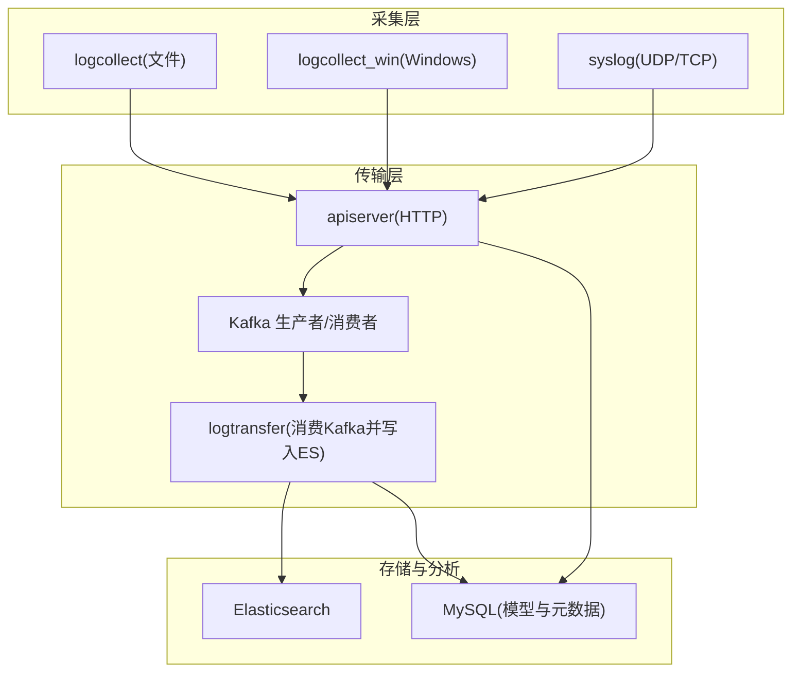
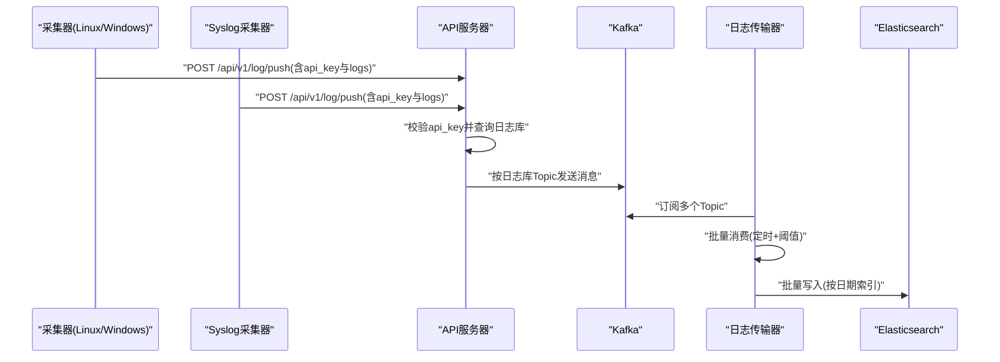
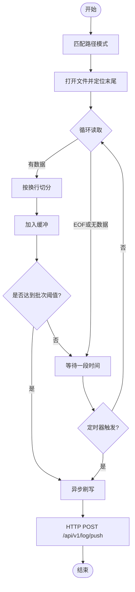
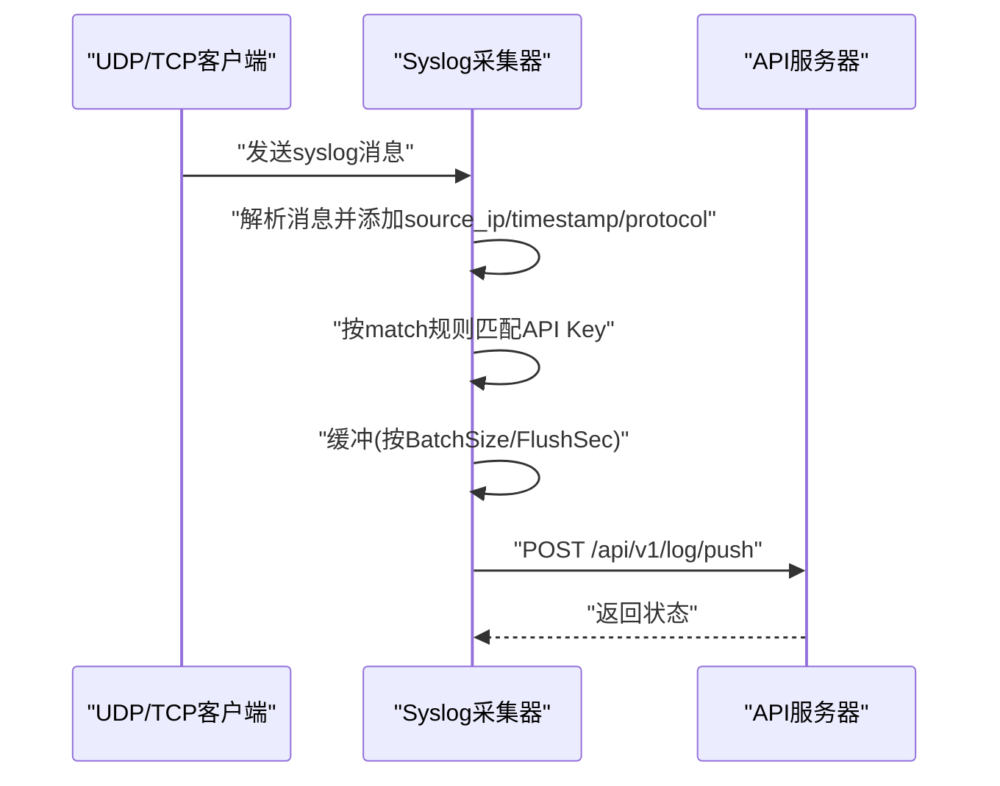
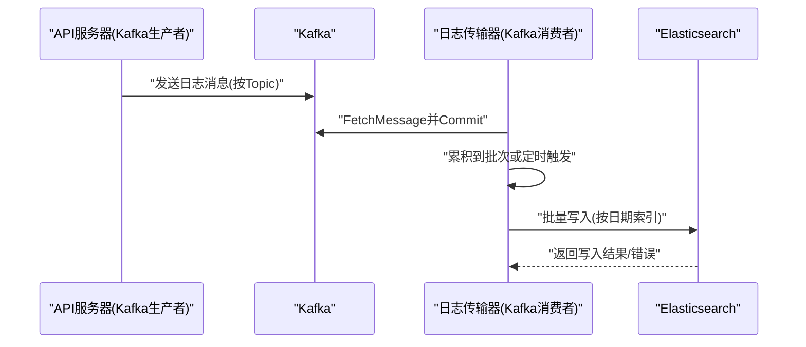
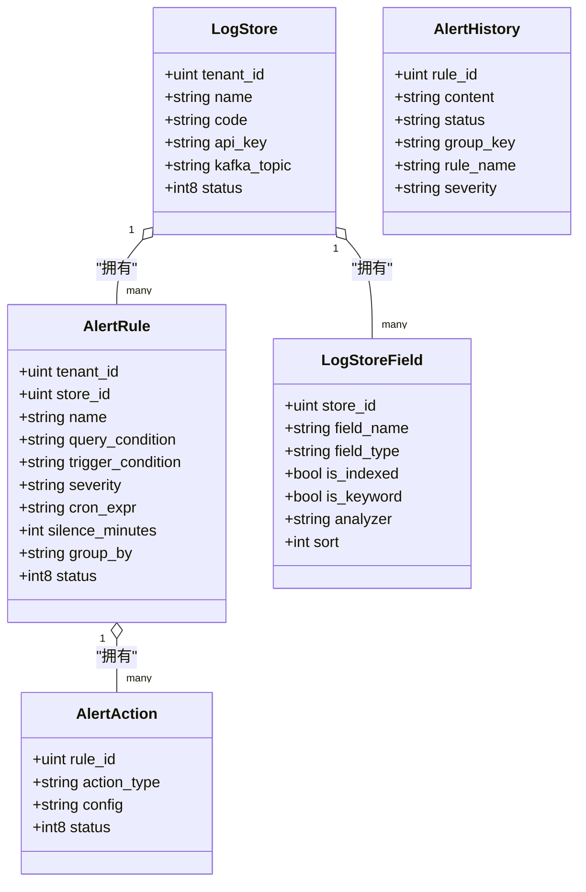
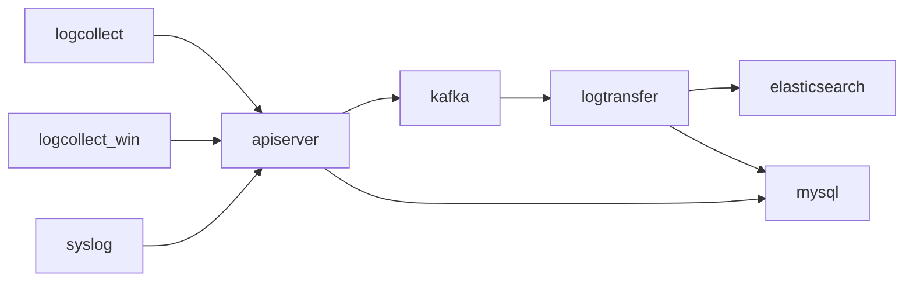

# 核心功能模块

<cite>
**本文引用的文件**
- [cmd/logcollect/main.go](file://cmd/logcollect/main.go)
- [cmd/logcollect_win/main.go](file://cmd/logcollect_win/main.go)
- [cmd/syslog/main.go](file://cmd/syslog/main.go)
- [cmd/logtransfer/main.go](file://cmd/logtransfer/main.go)
- [cmd/apiserver/main.go](file://cmd/apiserver/main.go)
- [internal/pkg/kafka/kafka.go](file://internal/pkg/kafka/kafka.go)
- [internal/pkg/es/es.go](file://internal/pkg/es/es.go)
- [internal/model/logstore.go](file://internal/model/logstore.go)
- [internal/model/db.go](file://internal/model/db.go)
- [internal/model/lifecycle.go](file://internal/model/lifecycle.go)
- [configs/logcollect.yaml](file://configs/logcollect.yaml)
- [configs/logtransfer.yaml](file://configs/logtransfer.yaml)
</cite>

## 目录
1. [简介](#简介)
2. [项目结构](#项目结构)
3. [核心组件](#核心组件)
4. [架构总览](#架构总览)
5. [详细组件分析](#详细组件分析)
6. [依赖分析](#依赖分析)
7. [性能考虑](#性能考虑)
8. [故障排查指南](#故障排查指南)
9. [结论](#结论)
10. [附录](#附录)

## 简介
本文件面向日志收集AI分析系统的核心功能模块，围绕以下目标展开：  
- 日志收集系统：文件监控机制、syslog支持、Windows版本适配  
- 日志传输系统：Kafka集成、批量写入策略、错误处理机制  
- 日志分析引擎与告警管理：规则模型、查询DSL、聚合分析、告警规则配置与通知渠道、静默机制  
- 模块间协作关系与数据流

系统采用“采集-传输-存储-分析-告警”的分层架构，采集端负责从文件与syslog源拉取日志；传输端通过Kafka汇聚至ES；分析与告警在后端服务中基于规则模型与DSL进行工作。

## 项目结构
- 可执行程序入口位于 cmd/*，分别对应日志采集（Linux/Windows）、syslog接入、日志传输、API网关与管理后台
- 核心库位于 internal/pkg 与 internal/model，封装了Kafka、Elasticsearch、数据库模型与基础能力
- 配置文件位于 configs/，包含采集、传输、syslog等运行参数

图表来源
- [cmd/logcollect/main.go:1-257](file://cmd/logcollect/main.go#L1-L257)
- [cmd/logcollect_win/main.go:1-210](file://cmd/logcollect_win/main.go#L1-L210)
- [cmd/syslog/main.go:1-211](file://cmd/syslog/main.go#L1-L211)
- [cmd/logtransfer/main.go:1-186](file://cmd/logtransfer/main.go#L1-L186)
- [cmd/apiserver/main.go:1-129](file://cmd/apiserver/main.go#L1-L129)
- [internal/pkg/kafka/kafka.go:1-103](file://internal/pkg/kafka/kafka.go#L1-L103)
- [internal/pkg/es/es.go:1-42](file://internal/pkg/es/es.go#L1-L42)

章节来源
- [cmd/logcollect/main.go:1-257](file://cmd/logcollect/main.go#L1-L257)
- [cmd/logcollect_win/main.go:1-210](file://cmd/logcollect_win/main.go#L1-L210)
- [cmd/syslog/main.go:1-211](file://cmd/syslog/main.go#L1-L211)
- [cmd/logtransfer/main.go:1-186](file://cmd/logtransfer/main.go#L1-L186)
- [cmd/apiserver/main.go:1-129](file://cmd/apiserver/main.go#L1-L129)
- [configs/logcollect.yaml:1-18](file://configs/logcollect.yaml#L1-L18)
- [configs/logtransfer.yaml:1-46](file://configs/logtransfer.yaml#L1-L46)

## 核心组件
- 日志采集器（Linux）：按配置扫描路径，增量读取文件，按批次与定时器推送至API服务器
- 日志采集器（Windows）：与Linux版本共享逻辑，针对Windows换行符与心跳字段差异做适配
- Syslog采集器：同时监听UDP/TCP端口，按路由规则匹配API Key并批量推送
- API服务器：校验API Key，为日志附加元数据，投递到Kafka对应Topic
- 日志传输器：订阅多个日志库Topic，批量消费并写入Elasticsearch，按日期生成索引
- 数据与模型：LogStore、AlertRule、AlertAction、AlertHistory等，支撑日志库、字段、告警规则与历史
- 基础设施：Kafka生产/消费者、Elasticsearch客户端、MySQL连接与自动迁移

章节来源
- [cmd/logcollect/main.go:1-257](file://cmd/logcollect/main.go#L1-L257)
- [cmd/logcollect_win/main.go:1-210](file://cmd/logcollect_win/main.go#L1-L210)
- [cmd/syslog/main.go:1-211](file://cmd/syslog/main.go#L1-L211)
- [cmd/logtransfer/main.go:1-186](file://cmd/logtransfer/main.go#L1-L186)
- [cmd/apiserver/main.go:1-129](file://cmd/apiserver/main.go#L1-L129)
- [internal/pkg/kafka/kafka.go:1-103](file://internal/pkg/kafka/kafka.go#L1-L103)
- [internal/pkg/es/es.go:1-42](file://internal/pkg/es/es.go#L1-L42)
- [internal/model/logstore.go:1-78](file://internal/model/logstore.go#L1-L78)
- [internal/model/db.go:1-74](file://internal/model/db.go#L1-L74)

## 架构总览
系统以“采集-传输-存储-分析-告警”为主线，形成如下闭环：

图表来源
- [cmd/logcollect/main.go:204-229](file://cmd/logcollect/main.go#L204-L229)
- [cmd/logcollect_win/main.go:172-185](file://cmd/logcollect_win/main.go#L172-L185)
- [cmd/syslog/main.go:196-210](file://cmd/syslog/main.go#L196-L210)
- [cmd/apiserver/main.go:84-128](file://cmd/apiserver/main.go#L84-L128)
- [cmd/logtransfer/main.go:85-132](file://cmd/logtransfer/main.go#L85-L132)
- [internal/pkg/kafka/kafka.go:15-58](file://internal/pkg/kafka/kafka.go#L15-L58)

## 详细组件分析

### 日志收集系统（文件监控与Windows适配）
- 文件监控机制
  - 遍历配置中的路径模式，对匹配到的文件开启tail循环，按4096字节缓冲读取，按换行切分
  - 支持多文件并发追踪，每个文件独立goroutine
- 批量与定时刷新
  - 缓冲达到BatchSize即异步刷写；或按FlushSec周期性触发
  - 刷写时序列化为payload，携带message、file、hostname、timestamp等字段
- 心跳上报
  - 定期向管理端上报agent_id、hostname、状态与时间戳
- Windows版本适配
  - 与Linux版本共享逻辑；Windows下按CRLF换行切分；心跳额外携带os_type字段

图表来源
- [cmd/logcollect/main.go:114-149](file://cmd/logcollect/main.go#L114-L149)
- [cmd/logcollect/main.go:161-176](file://cmd/logcollect/main.go#L161-L176)
- [cmd/logcollect/main.go:178-189](file://cmd/logcollect/main.go#L178-L189)
- [cmd/logcollect/main.go:191-202](file://cmd/logcollect/main.go#L191-L202)
- [cmd/logcollect_win/main.go:100-130](file://cmd/logcollect_win/main.go#L100-L130)
- [cmd/logcollect_win/main.go:132-145](file://cmd/logcollect_win/main.go#L132-L145)
- [cmd/logcollect_win/main.go:147-158](file://cmd/logcollect_win/main.go#L147-L158)
- [cmd/logcollect_win/main.go:160-170](file://cmd/logcollect_win/main.go#L160-L170)

章节来源
- [cmd/logcollect/main.go:1-257](file://cmd/logcollect/main.go#L1-L257)
- [cmd/logcollect_win/main.go:1-210](file://cmd/logcollect_win/main.go#L1-L210)
- [configs/logcollect.yaml:1-18](file://configs/logcollect.yaml#L1-L18)

### Syslog支持
- 协议支持：UDP/TCP双栈监听，默认端口514
- 路由匹配：根据消息内容匹配路由规则，决定API Key
- 批量推送：按BatchSize与FlushSec定时刷写，按API Key分组后统一推送

图表来源
- [cmd/syslog/main.go:81-135](file://cmd/syslog/main.go#L81-L135)
- [cmd/syslog/main.go:137-158](file://cmd/syslog/main.go#L137-L158)
- [cmd/syslog/main.go:169-194](file://cmd/syslog/main.go#L169-L194)
- [cmd/syslog/main.go:196-210](file://cmd/syslog/main.go#L196-L210)

章节来源
- [cmd/syslog/main.go:1-211](file://cmd/syslog/main.go#L1-L211)

### 日志传输系统（Kafka集成与批量写入）
- Kafka集成
  - 生产者：支持按Topic发送消息，批量写入，低延迟提交
  - 消费者：按GroupID消费，支持FetchMessage与CommitMessages
- 批量写入策略
  - 消费端按固定批次大小与定时器触发批量flush
  - 将日志写入Elasticsearch，索引命名规则为“日志库编码_日期”
- 错误处理
  - 消费异常时记录错误并继续；批量写入部分失败时记录前若干条原因

图表来源
- [cmd/apiserver/main.go:114-125](file://cmd/apiserver/main.go#L114-L125)
- [internal/pkg/kafka/kafka.go:15-58](file://internal/pkg/kafka/kafka.go#L15-L58)
- [internal/pkg/kafka/kafka.go:70-97](file://internal/pkg/kafka/kafka.go#L70-L97)
- [cmd/logtransfer/main.go:85-132](file://cmd/logtransfer/main.go#L85-L132)
- [cmd/logtransfer/main.go:134-177](file://cmd/logtransfer/main.go#L134-L177)

章节来源
- [cmd/logtransfer/main.go:1-186](file://cmd/logtransfer/main.go#L1-L186)
- [internal/pkg/kafka/kafka.go:1-103](file://internal/pkg/kafka/kafka.go#L1-L103)
- [internal/pkg/es/es.go:1-42](file://internal/pkg/es/es.go#L1-L42)
- [configs/logtransfer.yaml:1-46](file://configs/logtransfer.yaml#L1-L46)

### 日志分析引擎与告警管理
- 规则模型
  - 告警规则：包含查询条件DSL、触发条件JSON、严重级别、Cron表达式、静默时长、分组字段等
  - 告警动作：支持webhook/email/wecom/dingtalk等类型，配置JSON
  - 告警历史：记录触发状态、分组键、规则名与严重级别
- 查询DSL与聚合
  - DSL字段用于描述查询条件，聚合分析在前端界面标注为后续Phase 4实现
- 字段与索引
  - 日志库字段定义支持keyword/text/long/double/date/ip等类型，可配置分词器与排序
- 生命周期与备份
  - ILM/SLM策略与备份记录模型支撑索引生命周期与快照管理

图表来源
- [internal/model/logstore.go:3-78](file://internal/model/logstore.go#L3-L78)

章节来源
- [internal/model/logstore.go:1-78](file://internal/model/logstore.go#L1-L78)
- [internal/model/lifecycle.go:1-97](file://internal/model/lifecycle.go#L1-L97)

### 数据库与租户隔离
- MySQL初始化与连接池配置
- 自动迁移：包含用户、角色、菜单、日志库、字段、告警规则、历史、ILM/SLM、备份、采集任务、审计日志等
- 租户隔离：TenantDB辅助在查询时自动加上tenant_id条件

章节来源
- [internal/model/db.go:1-74](file://internal/model/db.go#L1-L74)

## 依赖分析
- 组件耦合
  - 采集器仅依赖HTTP与本地文件系统，耦合度低
  - API服务器依赖Kafka生产者与数据库，承担鉴权与路由职责
  - 传输器依赖Kafka消费者与ES客户端，承担数据落库职责
- 外部依赖
  - Kafka：segmentio/kafka-go
  - Elasticsearch：olivere/elastic
  - MySQL：gorm.io与mysql驱动
- 循环依赖
  - 未发现直接循环依赖；模块边界清晰

图表来源
- [internal/pkg/kafka/kafka.go:1-103](file://internal/pkg/kafka/kafka.go#L1-L103)
- [internal/pkg/es/es.go:1-42](file://internal/pkg/es/es.go#L1-L42)
- [internal/model/db.go:1-74](file://internal/model/db.go#L1-L74)

## 性能考虑
- 批量与定时策略
  - 采集端：BatchSize与FlushSec平衡吞吐与延迟
  - 传输端：固定批次大小与定时器避免频繁小批量写入
- 并发与资源
  - 采集端对每个文件独立goroutine，注意文件数量与句柄限制
  - 传输端消费者并发按Topic数量扩展，注意内存与网络带宽
- 存储与索引
  - ES批量写入减少网络往返；按日期生成索引利于滚动与清理
- 建议
  - 根据业务峰值调整BatchSize与FlushSec
  - 对高吞吐场景增加Kafka分区与logtransfer消费者实例
  - 对ES启用ILM策略与合理的副本/分片配置

## 故障排查指南
- 采集器无法推送
  - 检查api_server与api_key配置
  - 查看HTTP返回码与错误日志
  - Windows换行问题：确认使用logcollect_win二进制
- API服务器鉴权失败
  - 确认数据库中存在有效日志库且状态为启用
  - 核对传入api_key是否正确
- Kafka写入失败
  - 检查Broker连通性与Topic是否存在
  - 查看生产者错误日志
- ES写入异常
  - 检查索引映射与@timestamp字段转换
  - 关注批量写入的错误原因列表
- 心跳不上报
  - 确认heartbeat_url配置与管理端可用性

章节来源
- [cmd/logcollect/main.go:204-229](file://cmd/logcollect/main.go#L204-L229)
- [cmd/logcollect_win/main.go:172-185](file://cmd/logcollect_win/main.go#L172-L185)
- [cmd/syslog/main.go:196-210](file://cmd/syslog/main.go#L196-L210)
- [cmd/apiserver/main.go:94-97](file://cmd/apiserver/main.go#L94-L97)
- [cmd/logtransfer/main.go:162-176](file://cmd/logtransfer/main.go#L162-L176)

## 结论
本系统通过采集-传输-存储-分析-告警的完整链路，实现了从多源日志到可检索、可观测、可预警的数据平台。采集器与syslog适配器覆盖主流日志输入场景；Kafka与ES构成高吞吐、可扩展的中间件与存储层；告警规则与历史模型为运维与安全运营提供基础能力。建议在生产环境中完善错误重试、持久化缓冲、告警引擎与查询DSL实现，并持续优化索引与分区策略。

## 附录
- 配置要点
  - 采集端：api_server、api_key、agent_id、heartbeat_url、batch_size、flush_seconds、collectors.paths
  - 传输端：kafka.brokers、kafka.group_id、es.addresses、db连接参数、日志级别
- 常见问题
  - Windows换行导致的行切分异常：使用logcollect_win
  - API Key无效：检查数据库中日志库状态与api_key
  - ES索引映射错误：确保@timestamp字段正确转换

章节来源
- [configs/logcollect.yaml:1-18](file://configs/logcollect.yaml#L1-L18)
- [configs/logtransfer.yaml:1-46](file://configs/logtransfer.yaml#L1-L46)