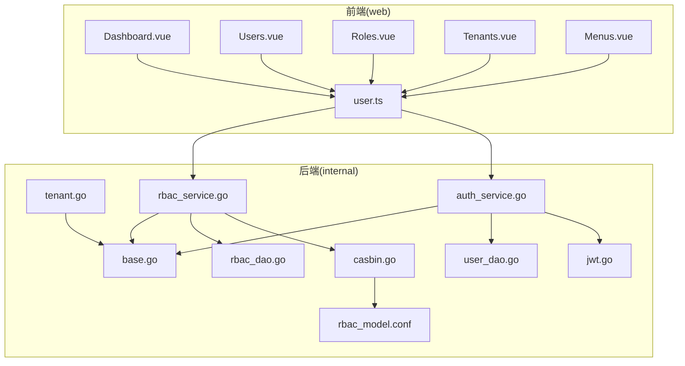
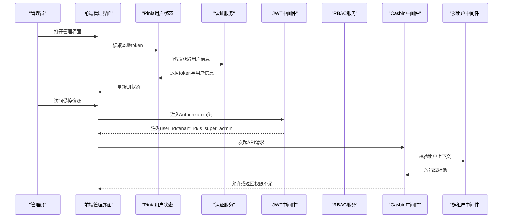
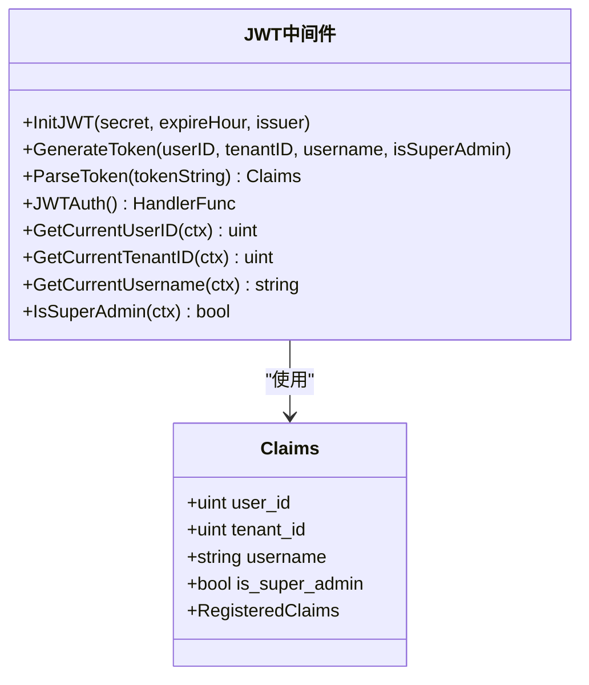
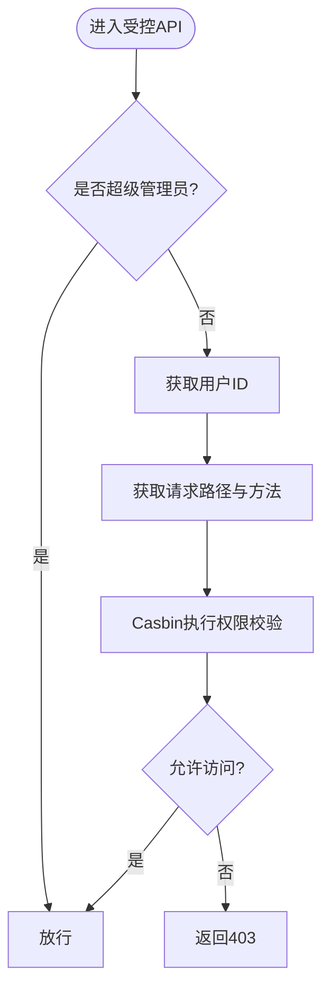
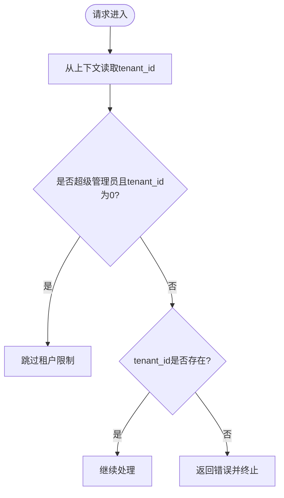
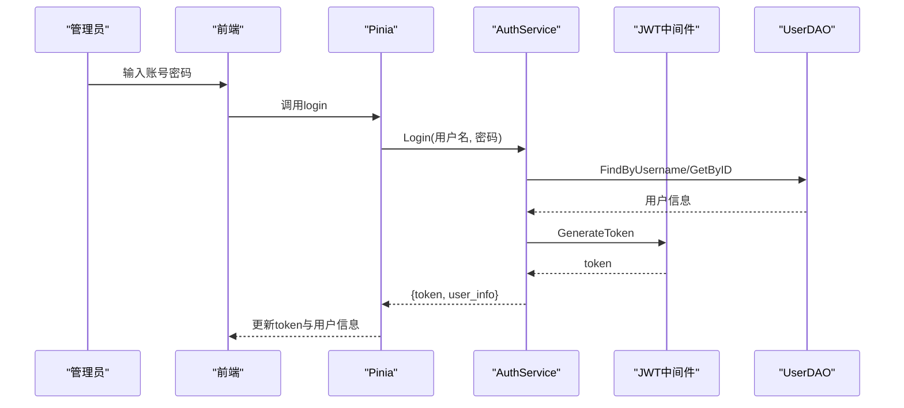
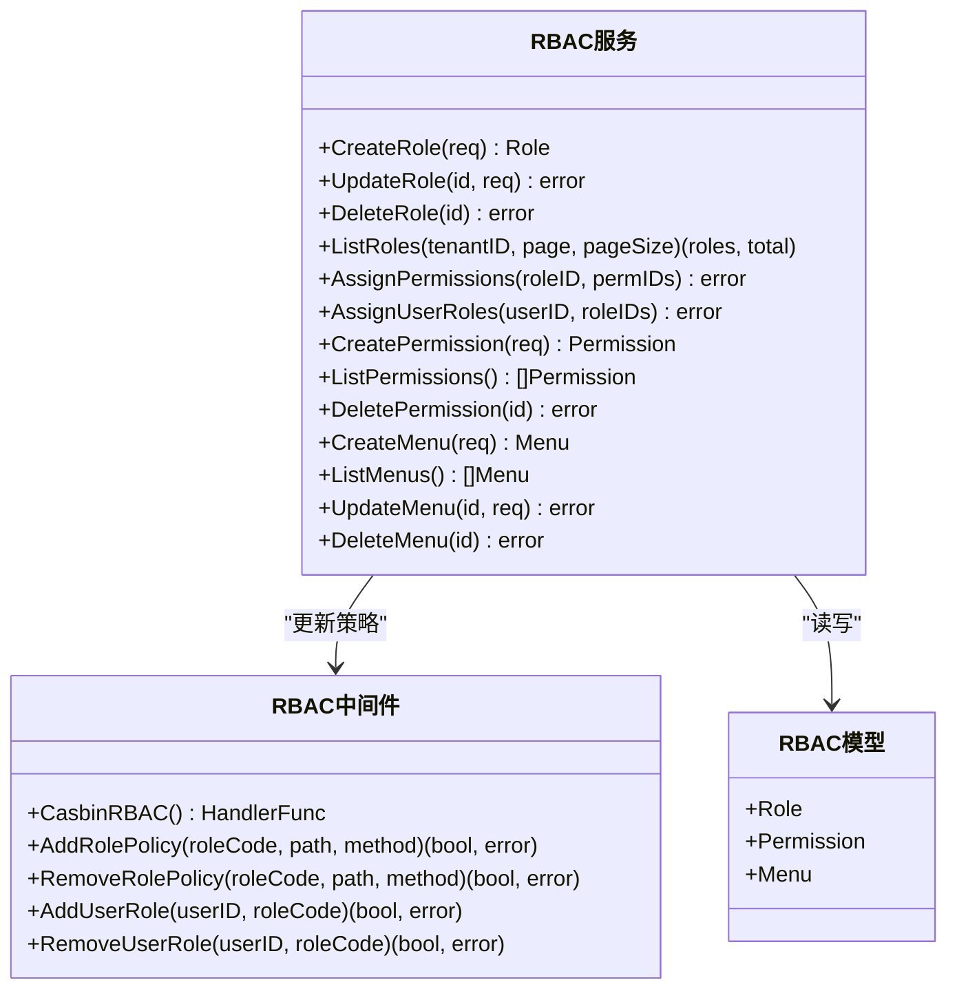
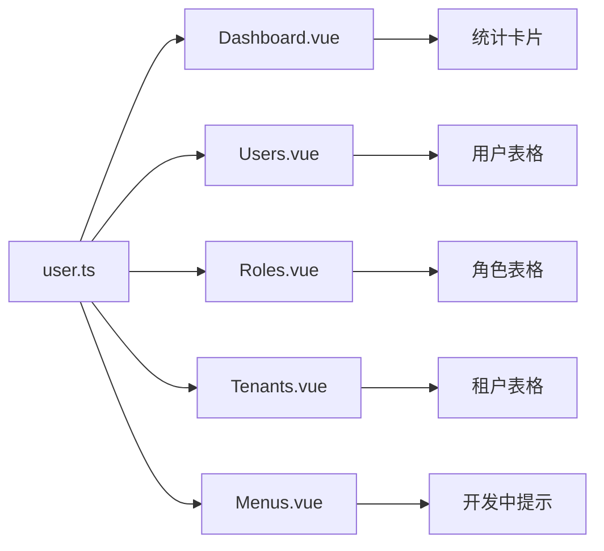
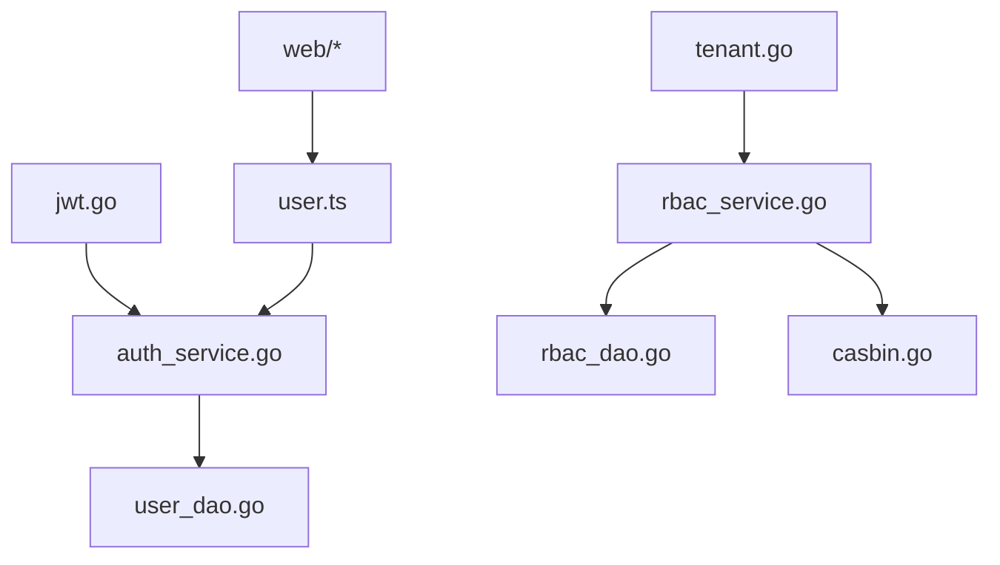
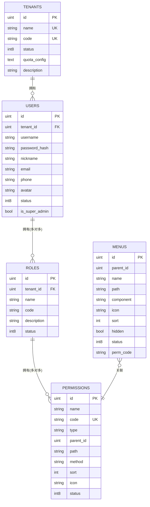

# 系统管理功能

<cite>
**本文档引用的文件**
- [internal/middleware/jwt.go](file://internal/middleware/jwt.go)
- [internal/middleware/casbin.go](file://internal/middleware/casbin.go)
- [internal/middleware/tenant.go](file://internal/middleware/tenant.go)
- [internal/service/rbac_service.go](file://internal/service/rbac_service.go)
- [internal/service/auth_service.go](file://internal/service/auth_service.go)
- [internal/dao/rbac_dao.go](file://internal/dao/rbac_dao.go)
- [internal/dao/user_dao.go](file://internal/dao/user_dao.go)
- [internal/model/base.go](file://internal/model/base.go)
- [configs/rbac_model.conf](file://configs/rbac_model.conf)
- [web/src/views/system/Dashboard.vue](file://web/src/views/system/Dashboard.vue)
- [web/src/views/system/Users.vue](file://web/src/views/system/Users.vue)
- [web/src/views/system/Roles.vue](file://web/src/views/system/Roles.vue)
- [web/src/views/system/Tenants.vue](file://web/src/views/system/Tenants.vue)
- [web/src/views/system/Menus.vue](file://web/src/views/system/Menus.vue)
- [web/src/store/user.ts](file://web/src/store/user.ts)
</cite>

## 目录
1. [简介](#简介)
2. [项目结构](#项目结构)
3. [核心组件](#核心组件)
4. [架构总览](#架构总览)
5. [详细组件分析](#详细组件分析)
6. [依赖分析](#依赖分析)
7. [性能考虑](#性能考虑)
8. [故障排查指南](#故障排查指南)
9. [结论](#结论)
10. [附录](#附录)

## 简介
本文件面向系统管理员与运维人员，系统性梳理日志收集AI分析系统的“系统管理功能”。重点覆盖以下方面：
- 用户权限管理体系：基于RBAC的权限模型、JWT令牌管理、多租户支持
- 用户管理功能：用户创建、角色分配、权限设置
- 系统配置管理：日志库配置、字段映射、分析规则等（通过后端接口与配置文件体现）
- 前端管理界面：Dashboard仪表板、菜单管理、租户管理等模块
- 系统监控与运维：鉴权链路、权限校验、租户隔离与审计建议

## 项目结构
系统采用前后端分离架构，后端以Gin框架为核心，结合GORM、Casbin、JWT等技术栈；前端使用Vue3+Element Plus构建管理界面。

图表来源
- [internal/middleware/jwt.go:1-132](file://internal/middleware/jwt.go#L1-L132)
- [internal/middleware/casbin.go:1-104](file://internal/middleware/casbin.go#L1-L104)
- [internal/middleware/tenant.go:1-41](file://internal/middleware/tenant.go#L1-L41)
- [internal/service/auth_service.go:1-194](file://internal/service/auth_service.go#L1-L194)
- [internal/service/rbac_service.go:1-227](file://internal/service/rbac_service.go#L1-L227)
- [internal/dao/user_dao.go:1-70](file://internal/dao/user_dao.go#L1-L70)
- [internal/dao/rbac_dao.go:1-171](file://internal/dao/rbac_dao.go#L1-L171)
- [internal/model/base.go:1-93](file://internal/model/base.go#L1-L93)
- [configs/rbac_model.conf:1-15](file://configs/rbac_model.conf#L1-L15)
- [web/src/views/system/Dashboard.vue:1-53](file://web/src/views/system/Dashboard.vue#L1-L53)
- [web/src/views/system/Users.vue:1-79](file://web/src/views/system/Users.vue#L1-L79)
- [web/src/views/system/Roles.vue:1-31](file://web/src/views/system/Roles.vue#L1-L31)
- [web/src/views/system/Tenants.vue:1-31](file://web/src/views/system/Tenants.vue#L1-L31)
- [web/src/views/system/Menus.vue:1-10](file://web/src/views/system/Menus.vue#L1-L10)
- [web/src/store/user.ts:1-48](file://web/src/store/user.ts#L1-L48)

章节来源
- [internal/middleware/jwt.go:1-132](file://internal/middleware/jwt.go#L1-L132)
- [internal/middleware/casbin.go:1-104](file://internal/middleware/casbin.go#L1-L104)
- [internal/middleware/tenant.go:1-41](file://internal/middleware/tenant.go#L1-L41)
- [internal/service/auth_service.go:1-194](file://internal/service/auth_service.go#L1-L194)
- [internal/service/rbac_service.go:1-227](file://internal/service/rbac_service.go#L1-L227)
- [internal/dao/user_dao.go:1-70](file://internal/dao/user_dao.go#L1-L70)
- [internal/dao/rbac_dao.go:1-171](file://internal/dao/rbac_dao.go#L1-L171)
- [internal/model/base.go:1-93](file://internal/model/base.go#L1-L93)
- [configs/rbac_model.conf:1-15](file://configs/rbac_model.conf#L1-L15)
- [web/src/views/system/Dashboard.vue:1-53](file://web/src/views/system/Dashboard.vue#L1-L53)
- [web/src/views/system/Users.vue:1-79](file://web/src/views/system/Users.vue#L1-L79)
- [web/src/views/system/Roles.vue:1-31](file://web/src/views/system/Roles.vue#L1-L31)
- [web/src/views/system/Tenants.vue:1-31](file://web/src/views/system/Tenants.vue#L1-L31)
- [web/src/views/system/Menus.vue:1-10](file://web/src/views/system/Menus.vue#L1-L10)
- [web/src/store/user.ts:1-48](file://web/src/store/user.ts#L1-L48)

## 核心组件
- JWT认证中间件：负责令牌签发、解析与上下文注入，提供当前用户、租户、超级管理员标识的读取能力。
- Casbin RBAC中间件：基于策略模型进行权限校验，支持超级管理员豁免与动态策略更新。
- 多租户中间件：确保非超级管理员场景下必须具备租户上下文，提供租户作用域查询封装。
- 认证服务：处理登录、用户信息获取、修改密码、创建用户、用户列表等。
- RBAC服务：提供角色、权限、菜单的增删改查与分配逻辑，同步Casbin策略。
- 数据访问层：UserDAO、RoleDAO、PermissionDAO、TenantDAO封装数据库操作。
- 前端管理界面：Dashboard、Users、Roles、Tenants、Menus等页面，配合Pinia状态管理。

章节来源
- [internal/middleware/jwt.go:14-132](file://internal/middleware/jwt.go#L14-L132)
- [internal/middleware/casbin.go:16-104](file://internal/middleware/casbin.go#L16-L104)
- [internal/middleware/tenant.go:10-41](file://internal/middleware/tenant.go#L10-L41)
- [internal/service/auth_service.go:13-194](file://internal/service/auth_service.go#L13-L194)
- [internal/service/rbac_service.go:11-227](file://internal/service/rbac_service.go#L11-L227)
- [internal/dao/user_dao.go:8-70](file://internal/dao/user_dao.go#L8-L70)
- [internal/dao/rbac_dao.go:8-171](file://internal/dao/rbac_dao.go#L8-L171)
- [web/src/views/system/Dashboard.vue:1-53](file://web/src/views/system/Dashboard.vue#L1-L53)
- [web/src/views/system/Users.vue:1-79](file://web/src/views/system/Users.vue#L1-L79)
- [web/src/views/system/Roles.vue:1-31](file://web/src/views/system/Roles.vue#L1-L31)
- [web/src/views/system/Tenants.vue:1-31](file://web/src/views/system/Tenants.vue#L1-L31)
- [web/src/views/system/Menus.vue:1-10](file://web/src/views/system/Menus.vue#L1-L10)
- [web/src/store/user.ts:18-47](file://web/src/store/user.ts#L18-L47)

## 架构总览
系统管理相关的关键交互流程如下：

图表来源
- [internal/middleware/jwt.go:67-95](file://internal/middleware/jwt.go#L67-L95)
- [internal/middleware/casbin.go:41-77](file://internal/middleware/casbin.go#L41-L77)
- [internal/middleware/tenant.go:10-21](file://internal/middleware/tenant.go#L10-L21)
- [internal/service/auth_service.go:55-98](file://internal/service/auth_service.go#L55-L98)
- [web/src/store/user.ts:22-34](file://web/src/store/user.ts#L22-L34)

## 详细组件分析

### JWT令牌管理
- Claims结构包含用户ID、租户ID、用户名、是否超级管理员及标准声明。
- 提供初始化、令牌生成、解析、认证中间件、上下文读取工具函数。
- 令牌默认包含过期时间与签发者，便于跨服务信任与审计。

图表来源
- [internal/middleware/jwt.go:14-132](file://internal/middleware/jwt.go#L14-L132)

章节来源
- [internal/middleware/jwt.go:14-132](file://internal/middleware/jwt.go#L14-L132)

### RBAC权限模型与中间件
- 使用Casbin模型定义请求主体、策略与匹配器，支持基于路径的API访问控制。
- 中间件在非超级管理员场景下强制执行权限校验，支持动态策略更新与用户角色分组。
- 提供角色策略增删、用户角色分组、策略持久化等辅助方法。

图表来源
- [internal/middleware/casbin.go:41-77](file://internal/middleware/casbin.go#L41-L77)
- [configs/rbac_model.conf:1-15](file://configs/rbac_model.conf#L1-L15)

章节来源
- [internal/middleware/casbin.go:16-104](file://internal/middleware/casbin.go#L16-L104)
- [configs/rbac_model.conf:1-15](file://configs/rbac_model.conf#L1-L15)

### 多租户支持
- 通过中间件确保非超级管理员必须具备有效的租户上下文。
- 提供租户作用域查询封装与租户数据库实例构造，便于后续扩展。

图表来源
- [internal/middleware/tenant.go:10-41](file://internal/middleware/tenant.go#L10-L41)

章节来源
- [internal/middleware/tenant.go:10-41](file://internal/middleware/tenant.go#L10-L41)

### 用户管理功能
- 登录：校验用户状态与密码，生成JWT令牌并返回用户信息。
- 用户信息：按ID查询用户及其角色集合。
- 修改密码：校验原密码，加密新密码并保存。
- 创建用户：检查用户名唯一性，加密密码并创建用户。
- 用户列表：按租户分页查询用户并预加载角色信息。

图表来源
- [internal/service/auth_service.go:55-98](file://internal/service/auth_service.go#L55-L98)
- [internal/middleware/jwt.go:34-50](file://internal/middleware/jwt.go#L34-L50)
- [internal/dao/user_dao.go:27-38](file://internal/dao/user_dao.go#L27-L38)

章节来源
- [internal/service/auth_service.go:55-194](file://internal/service/auth_service.go#L55-L194)
- [internal/dao/user_dao.go:8-70](file://internal/dao/user_dao.go#L8-L70)

### 角色与权限管理
- 角色管理：创建、查询、更新、删除、分页列表；支持为角色分配权限。
- 权限管理：创建、查询全部、删除；支持按类型筛选。
- 菜单管理：创建、查询全部、更新、删除；支持与权限绑定。
- 分配逻辑：角色分配权限时，同步更新Casbin策略；用户分配角色时，同步更新用户-角色分组。

图表来源
- [internal/service/rbac_service.go:11-227](file://internal/service/rbac_service.go#L11-L227)
- [internal/middleware/casbin.go:83-104](file://internal/middleware/casbin.go#L83-L104)
- [internal/model/base.go:48-92](file://internal/model/base.go#L48-L92)

章节来源
- [internal/service/rbac_service.go:11-227](file://internal/service/rbac_service.go#L11-L227)
- [internal/middleware/casbin.go:16-104](file://internal/middleware/casbin.go#L16-L104)
- [internal/model/base.go:17-92](file://internal/model/base.go#L17-L92)

### 前端管理界面
- Dashboard：展示日志总量、今日日志、在线Agent、活跃告警等关键指标。
- Users：用户列表、分页、状态显示、分配角色入口（预留）。
- Roles：角色列表、编辑、分配权限、删除入口（预留）。
- Tenants：租户列表、编辑、删除入口（预留）。
- Menus：菜单管理提示（开发中）。
- Pinia用户状态：登录、获取用户信息、登出、判断超级管理员。

图表来源
- [web/src/views/system/Dashboard.vue:1-53](file://web/src/views/system/Dashboard.vue#L1-L53)
- [web/src/views/system/Users.vue:1-79](file://web/src/views/system/Users.vue#L1-L79)
- [web/src/views/system/Roles.vue:1-31](file://web/src/views/system/Roles.vue#L1-L31)
- [web/src/views/system/Tenants.vue:1-31](file://web/src/views/system/Tenants.vue#L1-L31)
- [web/src/views/system/Menus.vue:1-10](file://web/src/views/system/Menus.vue#L1-L10)
- [web/src/store/user.ts:18-47](file://web/src/store/user.ts#L18-L47)

章节来源
- [web/src/views/system/Dashboard.vue:1-53](file://web/src/views/system/Dashboard.vue#L1-L53)
- [web/src/views/system/Users.vue:1-79](file://web/src/views/system/Users.vue#L1-L79)
- [web/src/views/system/Roles.vue:1-31](file://web/src/views/system/Roles.vue#L1-L31)
- [web/src/views/system/Tenants.vue:1-31](file://web/src/views/system/Tenants.vue#L1-L31)
- [web/src/views/system/Menus.vue:1-10](file://web/src/views/system/Menus.vue#L1-L10)
- [web/src/store/user.ts:18-47](file://web/src/store/user.ts#L18-L47)

## 依赖分析
- 组件内聚与耦合
  - RBAC服务与DAO层通过接口解耦，便于替换存储与扩展策略。
  - 中间件层独立于业务逻辑，仅依赖上下文与共享配置。
- 外部依赖
  - JWT用于身份凭证与上下文注入。
  - Casbin用于策略引擎与权限校验。
  - GORM用于数据持久化。
- 循环依赖
  - 当前结构未见循环导入，保持清晰的单向依赖。

图表来源
- [internal/service/auth_service.go:13-194](file://internal/service/auth_service.go#L13-L194)
- [internal/service/rbac_service.go:11-227](file://internal/service/rbac_service.go#L11-L227)
- [internal/dao/user_dao.go:8-70](file://internal/dao/user_dao.go#L8-L70)
- [internal/dao/rbac_dao.go:8-171](file://internal/dao/rbac_dao.go#L8-L171)
- [internal/middleware/casbin.go:16-104](file://internal/middleware/casbin.go#L16-L104)
- [internal/middleware/jwt.go:27-50](file://internal/middleware/jwt.go#L27-L50)
- [internal/middleware/tenant.go:10-41](file://internal/middleware/tenant.go#L10-L41)
- [web/src/store/user.ts:18-47](file://web/src/store/user.ts#L18-L47)

章节来源
- [internal/service/auth_service.go:13-194](file://internal/service/auth_service.go#L13-L194)
- [internal/service/rbac_service.go:11-227](file://internal/service/rbac_service.go#L11-L227)
- [internal/dao/user_dao.go:8-70](file://internal/dao/user_dao.go#L8-L70)
- [internal/dao/rbac_dao.go:8-171](file://internal/dao/rbac_dao.go#L8-L171)
- [internal/middleware/casbin.go:16-104](file://internal/middleware/casbin.go#L16-L104)
- [internal/middleware/jwt.go:27-50](file://internal/middleware/jwt.go#L27-L50)
- [internal/middleware/tenant.go:10-41](file://internal/middleware/tenant.go#L10-L41)
- [web/src/store/user.ts:18-47](file://web/src/store/user.ts#L18-L47)

## 性能考虑
- JWT令牌签名与解析成本低，适合高频鉴权场景。
- Casbin策略缓存与持久化需关注策略规模增长带来的加载与写入开销。
- 多租户查询建议在DAO层统一注入租户过滤条件，避免重复逻辑。
- 前端分页与懒加载可降低大数据量下的渲染压力。

## 故障排查指南
- 401 未授权
  - 检查Authorization头格式与令牌有效性；确认令牌未过期。
- 403 权限不足
  - 确认用户角色与权限策略是否正确；检查Casbin策略是否已保存。
- 400 参数错误
  - 校验请求体字段与绑定规则；检查用户名唯一性与密码强度。
- 多租户问题
  - 确认非超级管理员必须携带有效租户上下文；检查租户作用域查询封装。

章节来源
- [internal/middleware/jwt.go:67-95](file://internal/middleware/jwt.go#L67-L95)
- [internal/middleware/casbin.go:41-77](file://internal/middleware/casbin.go#L41-L77)
- [internal/middleware/tenant.go:10-21](file://internal/middleware/tenant.go#L10-L21)
- [internal/service/auth_service.go:162-188](file://internal/service/auth_service.go#L162-L188)

## 结论
该系统通过JWT、Casbin与多租户中间件实现了完善的系统管理能力，配合RBAC服务与前端管理界面，能够满足用户权限、角色与租户的全生命周期管理需求。建议在生产环境中重点关注策略模型维护、令牌安全配置与多租户隔离边界，确保系统稳定与安全。

## 附录
- 数据模型概览（简化）

图表来源
- [internal/model/base.go:17-92](file://internal/model/base.go#L17-L92)