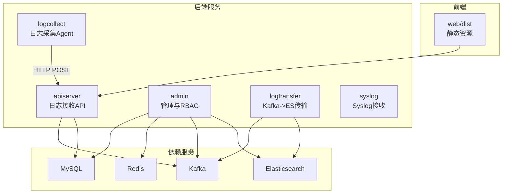
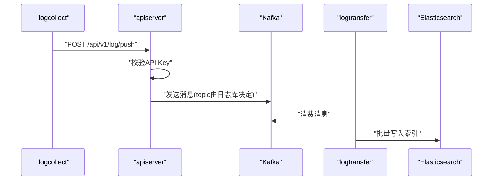
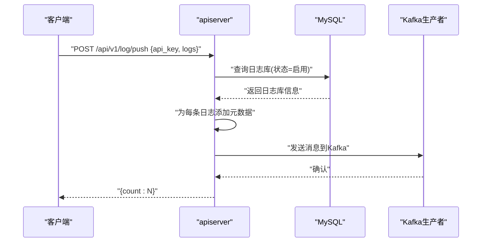
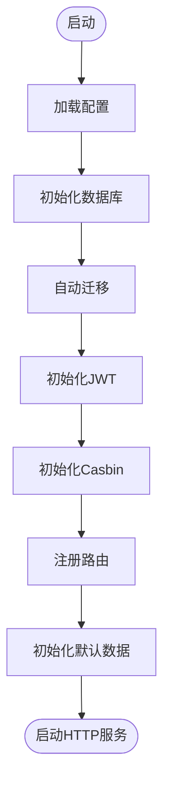
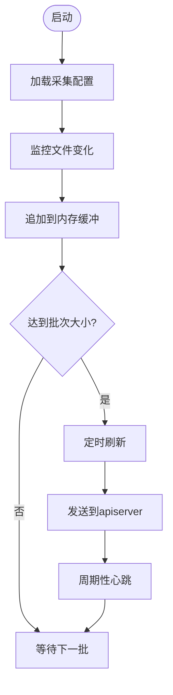
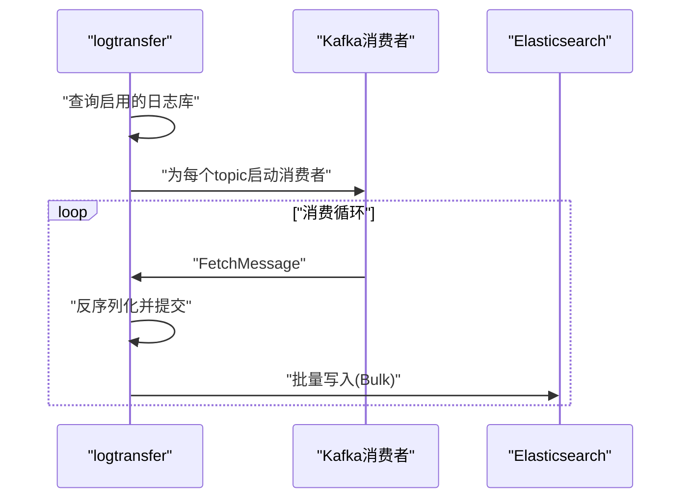
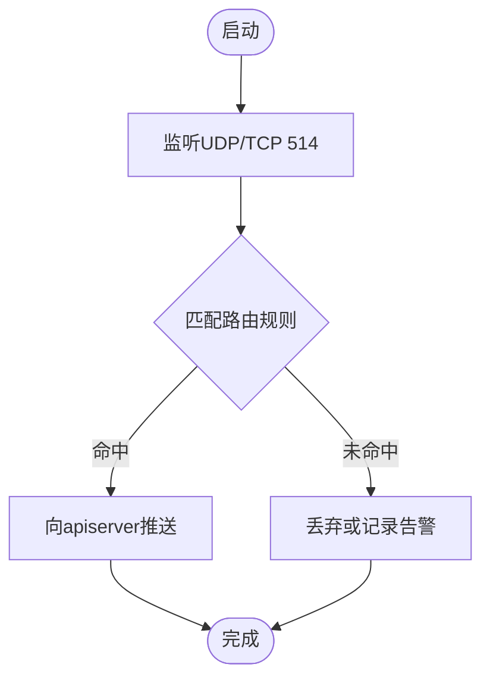
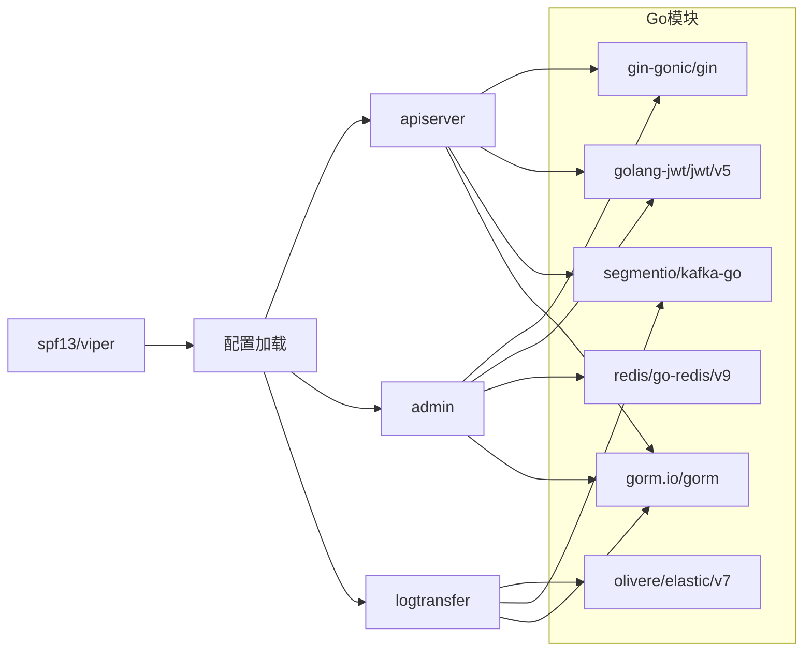

# 部署文档

<cite>
**本文引用的文件**
- [Makefile](file://Makefile)
- [go.mod](file://go.mod)
- [internal/pkg/config/config.go](file://internal/pkg/config/config.go)
- [configs/apiserver.yaml](file://configs/apiserver.yaml)
- [configs/admin.yaml](file://configs/admin.yaml)
- [configs/logcollect.yaml](file://configs/logcollect.yaml)
- [configs/logtransfer.yaml](file://configs/logtransfer.yaml)
- [configs/syslog.yaml](file://configs/syslog.yaml)
- [cmd/apiserver/main.go](file://cmd/apiserver/main.go)
- [cmd/admin/main.go](file://cmd/admin/main.go)
- [cmd/logcollect/main.go](file://cmd/logcollect/main.go)
- [cmd/logtransfer/main.go](file://cmd/logtransfer/main.go)
- [web/README.md](file://web/README.md)
</cite>

## 目录
1. [简介](#简介)
2. [项目结构](#项目结构)
3. [核心组件](#核心组件)
4. [架构总览](#架构总览)
5. [详细组件分析](#详细组件分析)
6. [依赖关系分析](#依赖关系分析)
7. [性能考虑](#性能考虑)
8. [故障排查指南](#故障排查指南)
9. [结论](#结论)
10. [附录](#附录)

## 简介
本部署文档面向日志收集与AI分析系统，提供从开发到生产的完整部署指南。内容覆盖：
- Docker容器化部署方案与依赖服务配置
- 手动部署步骤：Go服务编译、前端构建、配置文件修改
- 生产环境最佳实践：性能调优、安全加固、监控告警
- 配置文件参数详解与修改方法
- 故障排查与常见问题解决方案
- 不同规模部署场景的指导建议

## 项目结构
项目采用多模块Go应用与独立Web前端的分层组织方式：
- 后端服务：多个命令入口（apiserver、admin、logcollect、logtransfer、syslog）
- 配置中心：统一通过Viper加载YAML配置
- 数据与中间件：MySQL、Redis、Kafka、Elasticsearch
- 前端：Vue 3 + TypeScript + Vite

图表来源
- [cmd/apiserver/main.go:24-76](file://cmd/apiserver/main.go#L24-L76)
- [cmd/admin/main.go:21-147](file://cmd/admin/main.go#L21-L147)
- [cmd/logcollect/main.go:52-111](file://cmd/logcollect/main.go#L52-L111)
- [cmd/logtransfer/main.go:24-83](file://cmd/logtransfer/main.go#L24-L83)

章节来源
- [Makefile:1-41](file://Makefile#L1-L41)
- [go.mod:1-97](file://go.mod#L1-L97)

## 核心组件
- apiserver：提供日志推送接口，校验API Key并将日志投递至Kafka
- admin：管理后台，提供用户、角色、菜单、租户管理及RBAC能力
- logcollect：文件日志采集Agent，支持多路径、多行合并、JSON解析
- logtransfer：Kafka消费者，批量写入Elasticsearch
- syslog：Syslog接收器，按路由匹配写入不同API Key
- 配置系统：统一使用Viper加载YAML，支持环境变量覆盖

章节来源
- [cmd/apiserver/main.go:24-129](file://cmd/apiserver/main.go#L24-L129)
- [cmd/admin/main.go:21-178](file://cmd/admin/main.go#L21-L178)
- [cmd/logcollect/main.go:52-257](file://cmd/logcollect/main.go#L52-L257)
- [cmd/logtransfer/main.go:24-186](file://cmd/logtransfer/main.go#L24-L186)
- [internal/pkg/config/config.go:86-111](file://internal/pkg/config/config.go#L86-L111)

## 架构总览
系统采用“采集-传输-存储-查询”的分层架构：
- 采集层：logcollect与syslog负责原始日志接入
- 传输层：Kafka作为消息总线，连接采集与存储
- 存储层：Elasticsearch按租户+日志库+日期命名索引
- 查询层：admin提供管理界面，apiserver提供外部API

图表来源
- [cmd/logcollect/main.go:204-229](file://cmd/logcollect/main.go#L204-L229)
- [cmd/apiserver/main.go:84-128](file://cmd/apiserver/main.go#L84-L128)
- [cmd/logtransfer/main.go:85-177](file://cmd/logtransfer/main.go#L85-L177)

## 详细组件分析

### apiserver 组件
- 功能要点
  - 健康检查接口
  - 日志推送接口：校验API Key，注入元数据，投递Kafka
  - Gin框架，支持调试/发布模式
- 关键流程

图表来源
- [cmd/apiserver/main.go:84-128](file://cmd/apiserver/main.go#L84-L128)

章节来源
- [cmd/apiserver/main.go:24-129](file://cmd/apiserver/main.go#L24-L129)
- [configs/apiserver.yaml:1-46](file://configs/apiserver.yaml#L1-L46)

### admin 组件
- 功能要点
  - 登录鉴权（JWT）
  - RBAC（Casbin）权限控制
  - 用户、角色、菜单、租户管理
  - 自动迁移与默认数据初始化
- 关键流程

图表来源
- [cmd/admin/main.go:21-147](file://cmd/admin/main.go#L21-L147)

章节来源
- [cmd/admin/main.go:21-178](file://cmd/admin/main.go#L21-L178)
- [configs/admin.yaml:1-46](file://configs/admin.yaml#L1-L46)

### logcollect 组件
- 功能要点
  - 支持多路径通配符扫描
  - 多行合并与JSON解析
  - 批量发送与定时刷新
  - 心跳上报
- 关键流程

图表来源
- [cmd/logcollect/main.go:178-202](file://cmd/logcollect/main.go#L178-L202)
- [cmd/logcollect/main.go:231-256](file://cmd/logcollect/main.go#L231-L256)

章节来源
- [cmd/logcollect/main.go:52-257](file://cmd/logcollect/main.go#L52-L257)
- [configs/logcollect.yaml:1-18](file://configs/logcollect.yaml#L1-L18)

### logtransfer 组件
- 功能要点
  - 按日志库动态启动消费者
  - 批量写入Elasticsearch，索引按租户+日志库+日期命名
- 关键流程

图表来源
- [cmd/logtransfer/main.go:85-177](file://cmd/logtransfer/main.go#L85-L177)

章节来源
- [cmd/logtransfer/main.go:24-186](file://cmd/logtransfer/main.go#L24-L186)
- [configs/logtransfer.yaml:1-46](file://configs/logtransfer.yaml#L1-L46)

### syslog 组件
- 功能要点
  - UDP/TCP监听514端口
  - 基于路由匹配写入不同API Key
- 关键流程

图表来源
- [configs/syslog.yaml:1-12](file://configs/syslog.yaml#L1-L12)
- [cmd/apiserver/main.go:84-128](file://cmd/apiserver/main.go#L84-L128)

章节来源
- [configs/syslog.yaml:1-12](file://configs/syslog.yaml#L1-L12)
- [cmd/apiserver/main.go:84-128](file://cmd/apiserver/main.go#L84-L128)

## 依赖关系分析
- Go模块依赖：Gin、JWT、Elasticsearch、Kafka、Redis、GORM等
- 配置加载：Viper统一解析YAML，支持环境变量覆盖
- 服务间耦合：通过Kafka解耦，apiserver仅负责接收与转发

图表来源
- [go.mod:5-17](file://go.mod#L5-L17)
- [internal/pkg/config/config.go:86-111](file://internal/pkg/config/config.go#L86-L111)

章节来源
- [go.mod:1-97](file://go.mod#L1-L97)
- [internal/pkg/config/config.go:1-111](file://internal/pkg/config/config.go#L1-L111)

## 性能考虑
- 并发与连接池
  - MySQL最大连接数与空闲连接数应结合CPU与QPS调优
  - Kafka生产/消费并发与批大小需平衡延迟与吞吐
- 缓冲与批处理
  - logcollect批大小与刷新间隔影响网络与CPU占用
  - logtransfer批大小与刷新周期影响ES写入压力
- 存储与索引
  - Elasticsearch索引按天滚动，合理设置副本与刷新间隔
- 日志轮转
  - 后端服务日志文件大小、备份数与保留天数需结合磁盘容量规划

章节来源
- [configs/apiserver.yaml:12-13](file://configs/apiserver.yaml#L12-L13)
- [configs/logcollect.yaml:5-6](file://configs/logcollect.yaml#L5-L6)
- [configs/logtransfer.yaml:42-45](file://configs/logtransfer.yaml#L42-L45)

## 故障排查指南
- 启动失败
  - 检查配置文件路径与权限；确认YAML语法正确
  - 查看服务日志级别与输出位置
- 数据库连接异常
  - 校验主机、端口、用户名、密码、库名
  - 检查防火墙与网络连通性
- Kafka不可达
  - 校验Broker地址与网络策略
  - 确认Topic存在或允许自动创建
- Elasticsearch写入失败
  - 检查索引映射与字段类型
  - 关注部分失败原因与重试策略
- API Key无效
  - 确认日志库状态为启用
  - 校验API Key是否正确
- 前端无法访问
  - 确认静态资源目录与Nginx配置一致
  - 检查跨域与CORS中间件

章节来源
- [cmd/apiserver/main.go:36-44](file://cmd/apiserver/main.go#L36-L44)
- [cmd/admin/main.go:39-44](file://cmd/admin/main.go#L39-L44)
- [cmd/logtransfer/main.go:44-47](file://cmd/logtransfer/main.go#L44-L47)
- [configs/admin.yaml:12-13](file://configs/admin.yaml#L12-L13)

## 结论
本系统通过清晰的服务边界与消息队列解耦，实现了高扩展的日志采集与分析流水线。生产部署建议优先完善依赖服务的高可用与安全基线，再逐步优化吞吐与延迟指标，并建立完善的监控与告警体系。

## 附录

### A. Docker容器化部署方案
- 依赖服务
  - MySQL：提供持久化存储与用户/权限数据
  - Redis：会话与缓存
  - Kafka：消息总线
  - Elasticsearch：日志检索与分析
- 建议
  - 使用官方镜像并固定版本标签
  - 为数据卷配置持久化策略
  - 为Kafka与ES设置合适的JVM与线程参数
  - 为apiserver与logtransfer分别设置资源限制与重启策略

章节来源
- [configs/apiserver.yaml:6-32](file://configs/apiserver.yaml#L6-L32)
- [configs/logtransfer.yaml:6-32](file://configs/logtransfer.yaml#L6-L32)
- [configs/admin.yaml:6-32](file://configs/admin.yaml#L6-L32)

### B. 手动部署步骤
- 编译后端服务
  - 使用Makefile提供的目标进行编译，或直接使用Go build
  - Windows采集器可交叉编译
- 构建前端
  - 使用Vite构建，产物位于web/dist
  - 将dist目录作为静态站点部署
- 修改配置文件
  - 修改各服务的YAML配置，确保数据库、缓存、消息与搜索引擎地址正确
  - 更新JWT密钥与过期时间
- 启动服务
  - 先启动依赖服务，再启动后端服务
  - 使用健康检查接口验证服务可用性

章节来源
- [Makefile:11-30](file://Makefile#L11-L30)
- [web/README.md:1-6](file://web/README.md#L1-L6)
- [cmd/apiserver/main.go:24-33](file://cmd/apiserver/main.go#L24-L33)
- [cmd/admin/main.go:21-30](file://cmd/admin/main.go#L21-L30)

### C. 配置文件参数详解
- 通用参数
  - server：名称、端口、运行模式
  - log：日志级别、文件路径、轮转参数
- 数据库与缓存
  - mysql：主机、端口、用户、密码、库名、最大连接数、空闲连接数
  - redis：主机、端口、密码、数据库编号
- 消息与搜索
  - kafka：Broker列表、消费者组ID、Topic
  - elasticsearch：地址列表、用户名、密码、嗅探开关
- JWT
  - secret：签名密钥
  - expire_hour：过期小时数
  - issuer：签发者标识
- 采集器与Syslog
  - logcollect：API服务器地址、API Key、Agent ID、心跳URL、批大小、刷新秒数、采集器列表（路径、多行正则、解析模式）
  - syslog：UDP/TCP端口、API服务器地址、批大小、刷新秒数、路由规则（匹配关键字与API Key）

章节来源
- [internal/pkg/config/config.go:15-84](file://internal/pkg/config/config.go#L15-L84)
- [configs/apiserver.yaml:1-46](file://configs/apiserver.yaml#L1-L46)
- [configs/admin.yaml:1-46](file://configs/admin.yaml#L1-L46)
- [configs/logcollect.yaml:1-18](file://configs/logcollect.yaml#L1-L18)
- [configs/logtransfer.yaml:1-46](file://configs/logtransfer.yaml#L1-L46)
- [configs/syslog.yaml:1-12](file://configs/syslog.yaml#L1-L12)

### D. 不同规模部署场景建议
- 小规模（单机/虚拟机）
  - 将依赖服务与应用服务在同一主机运行，注意资源隔离
  - 使用较小的批大小与刷新周期，降低延迟
- 中规模（多节点）
  - 分离依赖服务与应用服务，使用负载均衡
  - 为logtransfer增加并行度，提升写入吞吐
- 大规模（容器化集群）
  - 使用Kubernetes部署，开启HPA与Pod亲和性
  - 为ES与Kafka配置专用存储与网络策略
  - 引入Prometheus/Grafana监控与日志聚合