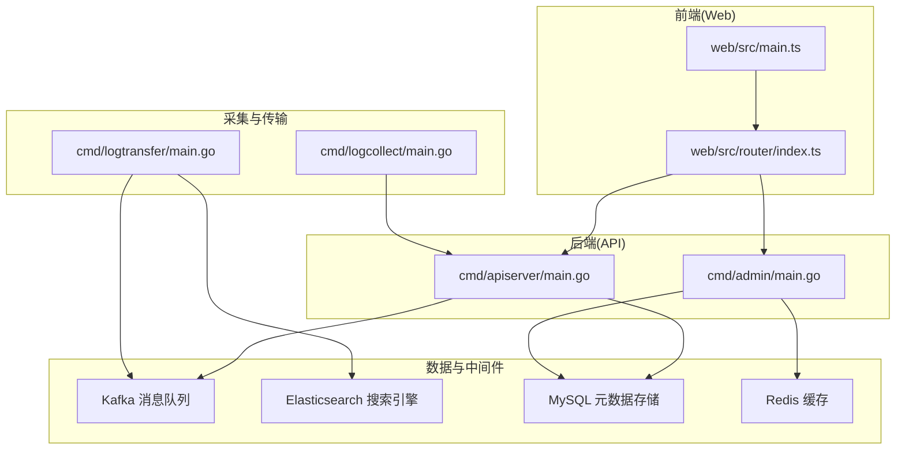
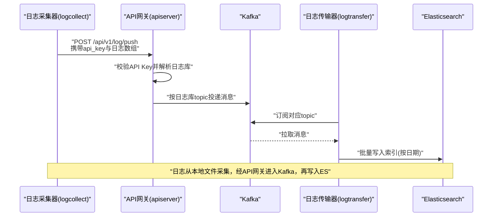
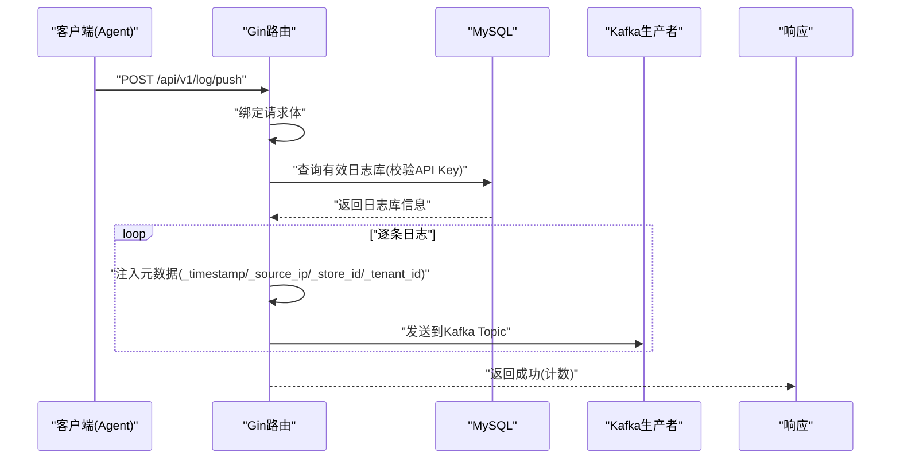
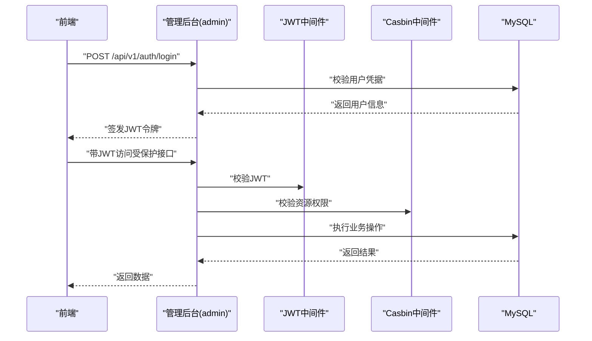
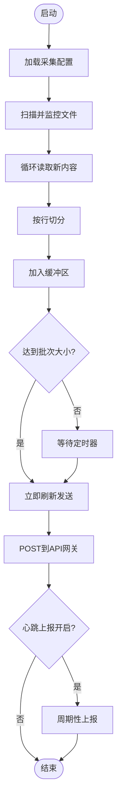
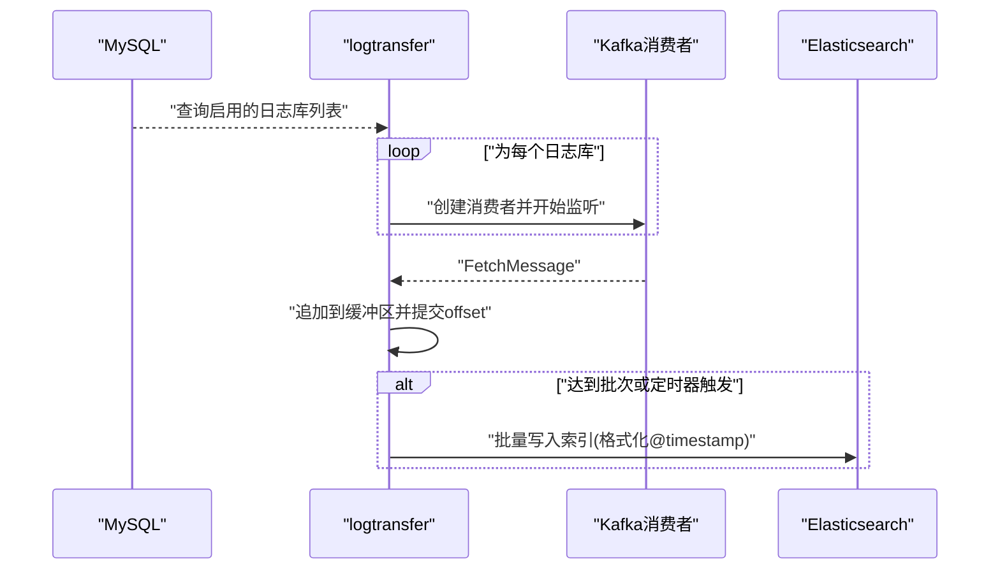
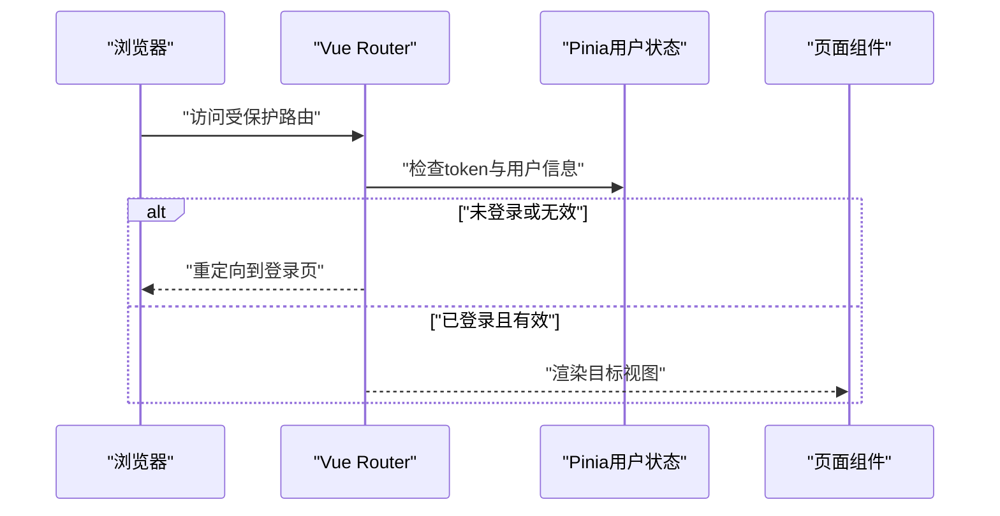
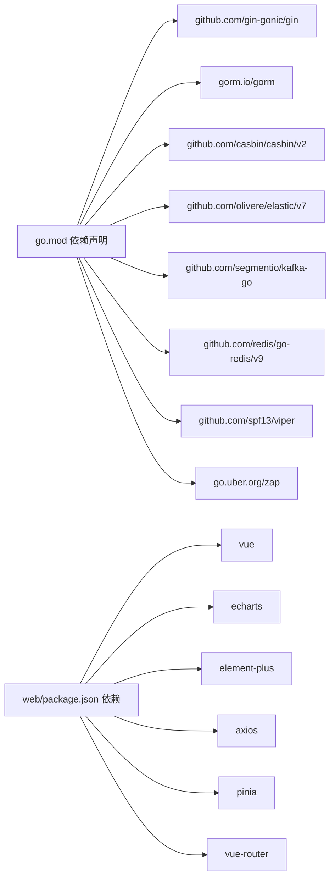

# 项目概述

<cite>
**本文档引用的文件**
- [go.mod](file://go.mod)
- [cmd/apiserver/main.go](file://cmd/apiserver/main.go)
- [cmd/admin/main.go](file://cmd/admin/main.go)
- [cmd/logcollect/main.go](file://cmd/logcollect/main.go)
- [cmd/logtransfer/main.go](file://cmd/logtransfer/main.go)
- [internal/pkg/config/config.go](file://internal/pkg/config/config.go)
- [internal/pkg/kafka/kafka.go](file://internal/pkg/kafka/kafka.go)
- [internal/pkg/es/es.go](file://internal/pkg/es/es.go)
- [internal/pkg/logger/logger.go](file://internal/pkg/logger/logger.go)
- [internal/model/logstore.go](file://internal/model/logstore.go)
- [web/package.json](file://web/package.json)
- [web/src/main.ts](file://web/src/main.ts)
- [web/src/router/index.ts](file://web/src/router/index.ts)
- [configs/apiserver.yaml](file://configs/apiserver.yaml)
- [configs/logcollect.yaml](file://configs/logcollect.yaml)
</cite>

## 目录
1. [简介](#简介)
2. [项目结构](#项目结构)
3. [核心组件](#核心组件)
4. [架构总览](#架构总览)
5. [详细组件分析](#详细组件分析)
6. [依赖分析](#依赖分析)
7. [性能考虑](#性能考虑)
8. [故障排查指南](#故障排查指南)
9. [结论](#结论)
10. [附录](#附录)

## 简介
日志收集AI分析系统（LCA）是一个面向企业级的日志采集、传输与分析平台。系统通过轻量Agent采集本地日志，经由Kafka进行高吞吐消息传递，再由传输服务批量写入Elasticsearch，最终在Web前端提供可视化查询、聚合分析与智能告警能力。系统强调快速部署、高效采集、灵活处理、直观展示与可扩展的告警机制。

## 项目结构
系统采用前后端分离与多进程微服务架构：
- 后端：Go语言实现，包含API网关、管理后台、日志采集器、日志传输器等独立二进制
- 前端：Vue 3 + TypeScript + Element Plus，提供用户管理、日志库管理、查询分析、告警管理等功能
- 数据与中间件：Kafka（消息队列）、Elasticsearch（搜索引擎）、MySQL（元数据存储）、Redis（缓存，配置中存在但当前未在核心流程使用）

**图表来源**
- [cmd/apiserver/main.go:1-129](file://cmd/apiserver/main.go#L1-L129)
- [cmd/admin/main.go:1-178](file://cmd/admin/main.go#L1-L178)
- [cmd/logcollect/main.go:1-257](file://cmd/logcollect/main.go#L1-L257)
- [cmd/logtransfer/main.go:1-186](file://cmd/logtransfer/main.go#L1-L186)
- [web/src/main.ts:1-20](file://web/src/main.ts#L1-L20)
- [web/src/router/index.ts:1-127](file://web/src/router/index.ts#L1-L127)

**章节来源**
- [go.mod:1-97](file://go.mod#L1-L97)
- [configs/apiserver.yaml:1-46](file://configs/apiserver.yaml#L1-L46)
- [configs/logcollect.yaml:1-18](file://configs/logcollect.yaml#L1-L18)

## 核心组件
- API网关（apiserver）
  - 接收来自Agent的日志推送，校验API Key，写入Kafka
  - 提供健康检查接口
- 管理后台（admin）
  - 用户、角色、菜单、租户管理
  - 基于JWT与RBAC的权限控制
- 日志采集器（logcollect）
  - 文件监控与增量读取，按批次上传至API网关
  - 支持心跳上报
- 日志传输器（logtransfer）
  - 订阅Kafka，批量写入Elasticsearch，按日生成索引
- 前端（web）
  - Vue 3应用，路由守卫鉴权，集成Element Plus与ECharts
- 中间件与基础设施
  - Kafka消息队列、Elasticsearch搜索引擎、MySQL元数据存储、Zap日志、Viper配置

**章节来源**
- [cmd/apiserver/main.go:55-128](file://cmd/apiserver/main.go#L55-L128)
- [cmd/admin/main.go:85-127](file://cmd/admin/main.go#L85-L127)
- [cmd/logcollect/main.go:52-111](file://cmd/logcollect/main.go#L52-L111)
- [cmd/logtransfer/main.go:24-83](file://cmd/logtransfer/main.go#L24-L83)
- [web/src/router/index.ts:99-124](file://web/src/router/index.ts#L99-L124)

## 架构总览
系统采用“采集-传输-存储-查询-可视化”的链路设计，核心流程如下：

**图表来源**
- [cmd/logcollect/main.go:204-229](file://cmd/logcollect/main.go#L204-L229)
- [cmd/apiserver/main.go:84-128](file://cmd/apiserver/main.go#L84-L128)
- [cmd/logtransfer/main.go:85-177](file://cmd/logtransfer/main.go#L85-L177)

## 详细组件分析

### API网关（apiserver）
- 功能要点
  - 健康检查与统一路由
  - 日志推送接口：校验API Key，为每条日志注入时间戳、来源IP、日志库与租户标识，投递到Kafka
  - 配置加载：基于Viper与YAML，支持日志级别、MySQL、Kafka、ES、JWT等
- 关键流程

**图表来源**
- [cmd/apiserver/main.go:78-128](file://cmd/apiserver/main.go#L78-L128)
- [internal/pkg/kafka/kafka.go:27-58](file://internal/pkg/kafka/kafka.go#L27-L58)

**章节来源**
- [cmd/apiserver/main.go:24-76](file://cmd/apiserver/main.go#L24-L76)
- [cmd/apiserver/main.go:84-128](file://cmd/apiserver/main.go#L84-L128)
- [internal/pkg/config/config.go:86-111](file://internal/pkg/config/config.go#L86-L111)

### 管理后台（admin）
- 功能要点
  - 登录认证、用户/角色/菜单/租户管理
  - 基于JWT与Casbin的RBAC权限控制
  - 首次启动初始化默认租户与超级管理员
- 关键流程

**图表来源**
- [cmd/admin/main.go:89-126](file://cmd/admin/main.go#L89-L126)
- [internal/middleware/jwt.go](file://internal/middleware/jwt.go)
- [internal/middleware/casbin.go](file://internal/middleware/casbin.go)

**章节来源**
- [cmd/admin/main.go:21-73](file://cmd/admin/main.go#L21-L73)
- [cmd/admin/main.go:149-177](file://cmd/admin/main.go#L149-L177)

### 日志采集器（logcollect）
- 功能要点
  - 文件路径通配符匹配，实时tail新增内容
  - 行切分与多行合并策略，按批次与定时刷新
  - 通过HTTP POST将日志批量推送到API网关
  - 心跳上报（可选）
- 关键流程

**图表来源**
- [cmd/logcollect/main.go:52-111](file://cmd/logcollect/main.go#L52-L111)
- [cmd/logcollect/main.go:178-202](file://cmd/logcollect/main.go#L178-L202)
- [cmd/logcollect/main.go:231-256](file://cmd/logcollect/main.go#L231-L256)

**章节来源**
- [cmd/logcollect/main.go:20-50](file://cmd/logcollect/main.go#L20-L50)
- [configs/logcollect.yaml:1-18](file://configs/logcollect.yaml#L1-L18)

### 日志传输器（logtransfer）
- 功能要点
  - 为每个启用的日志库动态创建消费者，订阅对应Kafka Topic
  - 批量消费消息，转换时间字段，批量写入Elasticsearch
  - 按日生成索引名，支持部分失败记录日志
- 关键流程

**图表来源**
- [cmd/logtransfer/main.go:49-83](file://cmd/logtransfer/main.go#L49-L83)
- [cmd/logtransfer/main.go:85-177](file://cmd/logtransfer/main.go#L85-L177)

**章节来源**
- [cmd/logtransfer/main.go:85-177](file://cmd/logtransfer/main.go#L85-L177)

### 前端（web）
- 功能要点
  - Vue 3 + TypeScript + Vite
  - Element Plus UI组件库，Pinia状态管理，Vue Router路由
  - 路由守卫实现登录态与权限校验
- 关键流程

**图表来源**
- [web/src/router/index.ts:99-124](file://web/src/router/index.ts#L99-L124)
- [web/src/main.ts:1-20](file://web/src/main.ts#L1-L20)

**章节来源**
- [web/package.json:1-30](file://web/package.json#L1-L30)
- [web/src/router/index.ts:1-127](file://web/src/router/index.ts#L1-L127)
- [web/src/main.ts:1-20](file://web/src/main.ts#L1-L20)

### 数据模型与告警机制
- 日志库模型
  - 日志库表包含名称、编码、索引模式、保留天数、API Key、Kafka Topic等字段
  - 字段定义表支持自定义字段类型、是否索引、分词器等
- 告警模型
  - 告警规则：名称、描述、查询DSL、触发条件、严重级别、Cron表达式、静默时长、分组字段
  - 告警动作：webhook/email/企业微信/钉钉等
  - 告警历史：记录触发状态、分组键、规则名与严重级别
- 说明
  - 当前代码仓库未包含独立的告警调度器实现，告警规则与动作定义为后续扩展预留

**章节来源**
- [internal/model/logstore.go:3-78](file://internal/model/logstore.go#L3-L78)

## 依赖分析
- 技术栈概览
  - 后端：Go 1.25.7，Gin（Web框架），GORM（ORM），Casbin（RBAC），Zap（日志），Viper（配置）
  - 中间件：Kafka（消息队列），Elasticsearch（搜索引擎），MySQL（关系型数据库）
  - 前端：Vue 3，Element Plus，Pinia，Vue Router，TypeScript
- 组件耦合
  - apiserver与logcollect通过HTTP协议耦合；apiserver与logtransfer通过Kafka解耦
  - admin与apiserver/admin仅通过MySQL共享数据，无直接耦合
  - web通过apiserver与admin提供数据访问

**图表来源**
- [go.mod:5-16](file://go.mod#L5-L16)
- [web/package.json:11-20](file://web/package.json#L11-L20)

**章节来源**
- [go.mod:1-97](file://go.mod#L1-L97)
- [web/package.json:1-30](file://web/package.json#L1-L30)

## 性能考虑
- 采集侧
  - 批量大小与刷新间隔可调，平衡延迟与吞吐
  - 多文件并发监控，减少I/O瓶颈
- 传输侧
  - 批量写入ES，降低写入开销
  - 按日索引命名，便于滚动与清理
- 存储侧
  - ES索引按日期拆分，利于查询与归档
  - 建议结合索引模板与生命周期策略优化存储成本
- 并发与可靠性
  - Kafka分区与副本配置影响吞吐与容错
  - 建议为不同日志库设置独立Topic，避免热点

## 故障排查指南
- 常见问题定位
  - API网关无法接收：检查API Key是否正确、日志库状态是否启用、Kafka连接与Topic是否存在
  - 采集器无法推送：确认HTTP目标地址可达、网络连通性、批次大小与刷新间隔配置
  - 传输器写入失败：检查ES连接、索引映射、批量写入错误日志
  - 前端登录失败：确认JWT签名密钥一致、过期时间合理、路由守卫逻辑
- 日志与监控
  - 后端使用Zap输出控制台与文件日志，建议在生产环境开启文件输出
  - 建议在Kafka与ES层面增加监控指标与告警

**章节来源**
- [internal/pkg/logger/logger.go:12-87](file://internal/pkg/logger/logger.go#L12-L87)
- [cmd/logtransfer/main.go:162-176](file://cmd/logtransfer/main.go#L162-L176)

## 结论
LCA系统通过清晰的职责划分与成熟的中间件选型，实现了从日志采集、传输到存储与可视化的完整闭环。其模块化设计便于扩展与维护，适合在多租户场景下快速落地。建议在生产环境中完善告警调度器、引入更细粒度的监控与运维工具，并根据业务规模调整Kafka与ES的资源配置。

## 附录
- 配置参考
  - API网关配置示例：[configs/apiserver.yaml:1-46](file://configs/apiserver.yaml#L1-L46)
  - 采集器配置示例：[configs/logcollect.yaml:1-18](file://configs/logcollect.yaml#L1-L18)
- 关键实现参考
  - API网关入口与路由：[cmd/apiserver/main.go:24-76](file://cmd/apiserver/main.go#L24-L76)
  - 管理后台路由与鉴权：[cmd/admin/main.go:85-127](file://cmd/admin/main.go#L85-L127)
  - 采集器主循环与发送：[cmd/logcollect/main.go:52-111](file://cmd/logcollect/main.go#L52-L111)
  - 传输器批量写入：[cmd/logtransfer/main.go:134-177](file://cmd/logtransfer/main.go#L134-L177)
  - 前端应用与路由：[web/src/main.ts:1-20](file://web/src/main.ts#L1-L20)，[web/src/router/index.ts:1-127](file://web/src/router/index.ts#L1-L127)