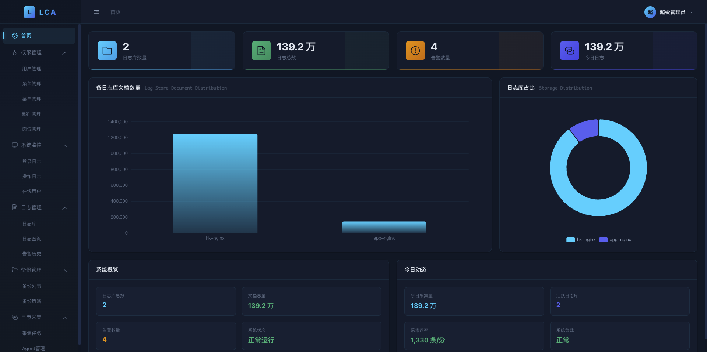
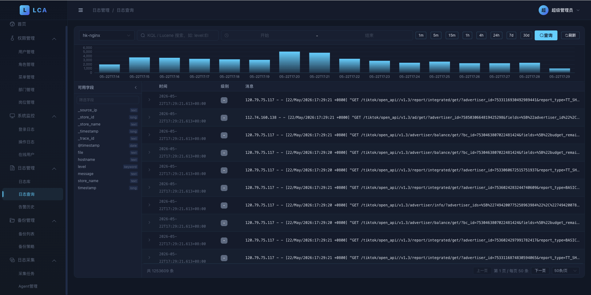
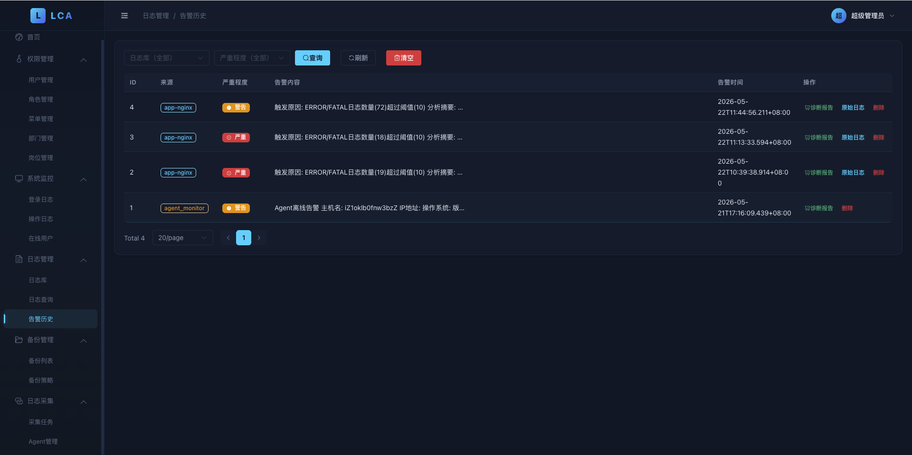
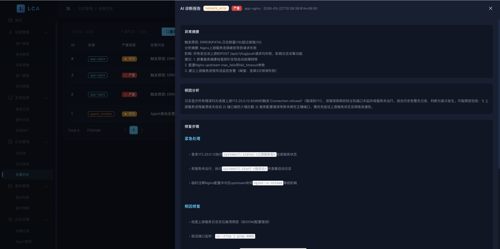
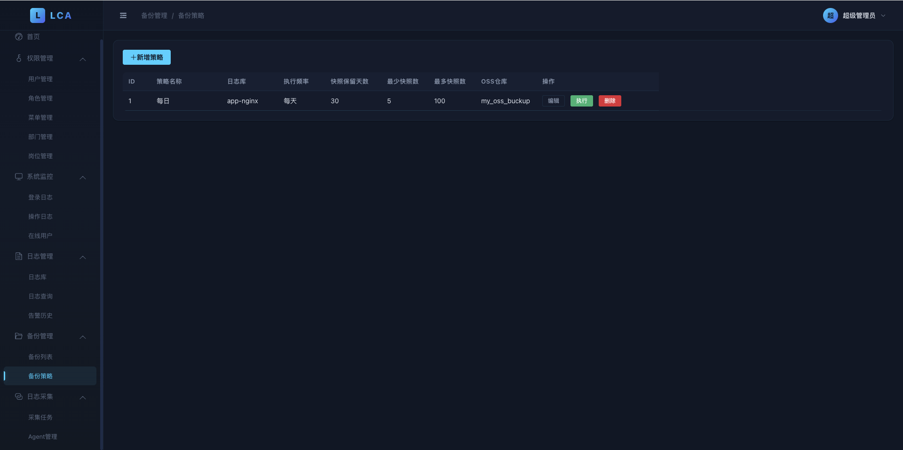
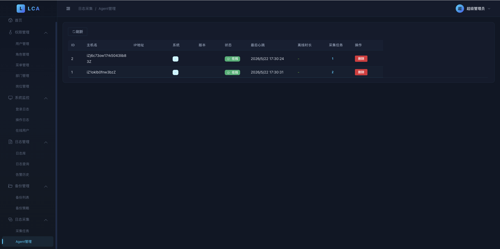
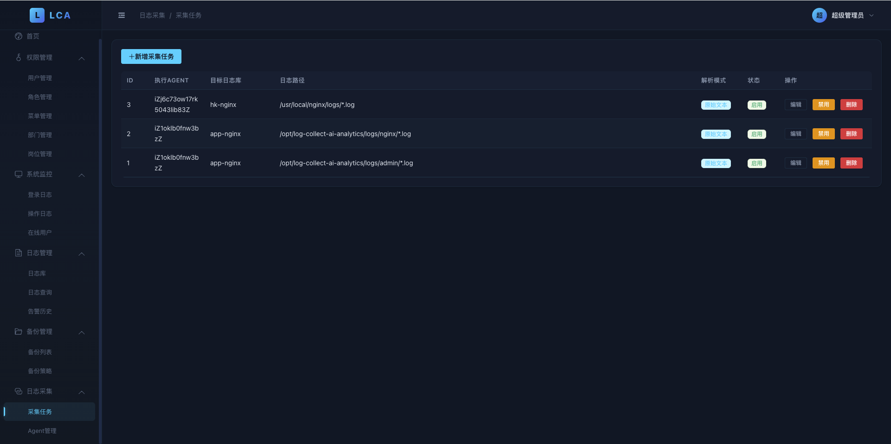

<div align="center">
  
  <h1>LCA · 日志收集智能分析系统</h1>
  <p>企业级日志采集 · 智能运维 · AI 智能告警· 实时分析 · 多渠道通知</p>

  [](LICENSE)
  [](https://golang.org)
  [](https://vuejs.org)
  [](https://www.elastic.co)

  [官网](https://lca.top) · [购买授权](https://lca.top/#pricing) · [问题反馈](https://github.com/jc2255/log-collect-ai-analytics/issues)
</div>

---

> ⚠️ **本项目为商业软件，使用需购买授权码。** 源码仅供评估参考，未经授权不得用于商业用途。详见 [LICENSE](LICENSE)。

---

## 目录

- [功能概览](#功能概览)
- [系统架构](#系统架构)
- [技术栈](#技术栈)
- [快速部署](#快速部署)
  - [方式一：Docker Compose 高可用部署（推荐生产环境）](#方式一docker-compose-高可用部署推荐生产环境)
  - [方式二：手动部署](#方式二手动部署)
- [各服务启动说明](#各服务启动说明)
- [配置文件详解](#配置文件详解)
- [Agent 部署](#agent-部署)
- [API 直接投递日志](#api-直接投递日志)
- [AI 智能告警](#ai-智能告警)
- [授权码](#授权码)
- [项目结构](#项目结构)
- [故障排查](#故障排查)
- [更新日志](#更新日志)

---

## 功能概览

| 模块 | 功能描述 |
|------|---------|
| **日志采集** | Agent 跨平台（Linux/Windows）部署，Glob 路径匹配，断点续传，心跳检测，Agent 离线邮件告警 |
| **API 直推** | 任意应用通过 HTTP API 直接投递日志，无需 Agent，支持批量推送 |
| **日志传输** | Kafka 消峰削谷 → Elasticsearch 存储，支持多日志库独立 Topic 隔离 |
| **日志查询** | 类 Kibana Discover 界面，时间直方图、字段面板、KQL 全文搜索 |
| **AI 智能告警** | ES 规则初筛 + OpenAI 兼容大模型深度分析，企业微信 / 钉钉 / 邮件 / Webhook 多渠道通知 |
| **告警历史** | 所有 AI 告警 + Agent 离线告警统一记录，支持按来源 / 级别 / 状态查询 |
| **采集任务管理** | 可视化配置 Agent 采集路径、解析模式（raw/json/regex/delimiter）、多行合并 |
| **Agent 管理** | 实时心跳监控，在线 / 离线状态，3 分钟超时自动标记并邮件通知管理员 |
| **权限管理** | 基于 Casbin RBAC，支持部门 / 岗位 / 角色 / 菜单精细化权限控制 |
| **备份管理** | Elasticsearch 快照自动备份至阿里云 OSS，支持手动恢复 |
| **授权码管理** | RSA 机器指纹绑定，在线激活，防盗用 |

---

## 系统预览

### 首页 Dashboard

实时展示日志库数量、日志总量、告警数量、今日采集量；柱状图 + 环形图双视角呈现各日志库文档分布，采集速率以「条/分」精准到分钟。



### 日志查询（类 Kibana Discover）

时间直方图 + 可用字段面板 + KQL/Lucene 全文检索，支持快捷时间范围（1m / 5m / 15m / 1h / 4h / 24h / 7d / 30d）与自定义区间。



### 告警历史

统一展示 AI 告警与 Agent 离线告警记录，支持按日志库 / 严重程度过滤，一键查看「诊断报告」或「原始日志」。



### AI 智能诊断报告

大模型深度分析后给出「异常摘要 / 根因分析 / 修复步骤」三段式诊断，步骤内联合可运行命令片段，定位问题不再靠猜。



### 备份策略

可视化配置 ES 快照 SLM 策略：执行频率 / 保留天数 / 最少最多快照数 / OSS 仓库，自动备份至阿里云 OSS。



### Agent 管理

实时心跳状态跟踪，在线 / 离线一目了然，超时自动标记并邮件告警。



### 采集任务管理

为指定 Agent 动态下发采集任务：目标日志库 + Glob 路径 + 解析模式（raw / json / regex / delimiter），60 秒动态生效无需重启。



---

## 系统架构

```
┌────────────────────────────────────────────────────────────────┐
│                         LCA 系统架构                            │
├───────────────┬────────────────────────────────────────────────┤
│               │  ┌─────────────┐   ┌──────────────────────┐   │
│  日志源        │  │ 应用服务器   │   │  网络设备 / 容器      │   │
│               │  └──────┬──────┘   └──────────┬───────────┘   │
│               │         │ 文件 Tail              │ HTTP API       │
│  采集层        │  logcollect Agent               │               │
│               │  （断点续传 + 心跳）             ↓               │
│               │         └──────────────→  apiserver :8086       │
│               │                              │                  │
│  传输层        │                         Kafka Topic             │
│               │                              │                  │
│               │                         logtransfer             │
│               │                              │                  │
│  存储层        │                    Elasticsearch 7.x            │
│               │                    （ILM 生命周期管理）          │
│               │                              ↑                  │
│  管理层        │              admin :8080 (Go + Gin)             │
│  展示层        │           Web UI (Vue 3 + Element Plus)         │
│  告警层        │      AI Scanner → 企业微信/钉钉/邮件/Webhook     │
└───────────────┴────────────────────────────────────────────────┘
```

### 服务说明

| 服务 | 端口 | 说明 |
|------|------|------|
| `admin` | **8080** | 管理后台 API + 静态资源服务（必须启动） |
| `apiserver` | **8086** | 日志推送接入点（Agent 上报 + 直接投递） |
| `logtransfer` | — | Kafka 消费者，写入 Elasticsearch |
| `logcollect` | — | Linux/macOS Agent，部署在被采集机器上 |
| `logcollect_win` | — | Windows Agent |
| `syslog` | **514/UDP** | Syslog 协议接收服务（可选） |

---

## 技术栈

**后端**
- Go 1.21+ · Gin · GORM · Casbin
- MySQL 8.0 · Redis · Apache Kafka · Elasticsearch 7.x
- JWT 认证 · RSA License 验证 · Zap 日志

**前端**
- Vue 3 · TypeScript · Element Plus · Vite · ECharts

---

## 快速部署

### 前置要求

| 组件 | 版本要求 | 说明 |
|------|---------|------|
| Go | 1.21+ | 手动部署时需要 |
| Node.js | 18+ | 前端开发时需要 |
| Docker & Docker Compose | 20+ | Docker 部署时需要 |
| MySQL | 8.0+ | 可复用已有实例 |
| Redis | 6.0+ | 可复用已有实例 |
| Kafka | 2.8+ | 可复用已有实例 |
| Elasticsearch | 7.x | 推荐 7.17 |
| 授权码 | — | [前往购买](https://lca.top/#pricing) |

---

### 方式一：Docker Compose 高可用部署（推荐生产环境）

多实例 + 自动故障转移 + 数据多副本冗余，一键启动 MySQL 主从、Redis Sentinel、Kafka 3 Broker、Elasticsearch 3 节点集群、所有后端服务（admin×2、apiserver×2、logtransfer×2）及 Nginx 负载均衡。

```bash
# 1. 克隆代码
git clone https://github.com/jc2255/log-collect-ai-analytics.git
cd log-collect-ai-analytics

# 2. 复制并编辑环境变量（修改数据库密码、JWT Secret 等）
cp .env.example .env
vim .env

# 3. 启动 HA 集群
docker compose -f docker-compose.ha.yaml up -d

# 4. 查看服务状态
docker compose -f docker-compose.ha.yaml ps

# 5. 查看服务日志
docker compose -f docker-compose.ha.yaml logs -f admin1
docker compose -f docker-compose.ha.yaml logs -f apiserver1
```

启动完成后访问：**http://your-server-ip**

默认账号：`admin`  默认密码：`admin123`

> ⚠️ 首次使用需在「系统设置 → 授权管理」页面激活授权码

#### HA 架构详情

| 层级 | 能力 | 实现方式 |
|------|------|----------|
| **Redis** | 自动故障转移 | Sentinel 1主2从3哨兵 |
| **分布式锁** | 任务互斥执行 | Redis SETNX + Lua 原子释放 |
| **Leader Election** | 定时任务单点执行 | 续约式锁，失败自动降级 standby |
| **Casbin 同步** | 多实例策略一致性 | Redis Pub/Sub 通知重载 |
| **MySQL** | 读写分离 | 主库写 + 从库读，GTID 主从复制 |
| **Kafka** | 数据多副本 | 3 Broker，`replication.factor=3` |
| **Elasticsearch** | 数据冗余 | 3 节点集群 + 1 副本分片 |
| **Nginx** | 负载均衡 | upstream 轮询 + 健康检查 + 故障转发 |
| **应用层** | 水平扩展 | admin×2, apiserver×2, logtransfer×2 |

#### HA 配置文件

| 文件 | 说明 |
|------|------|
| `configs/admin-ha.yaml` | admin 服务 HA 配置（Sentinel + 读副本） |
| `configs/apiserver-ha.yaml` | apiserver 服务 HA 配置 |
| `configs/logtransfer-ha.yaml` | logtransfer 服务 HA 配置 |
| `deploy/ha/nginx-ha.conf` | Nginx 负载均衡配置 |
| `deploy/ha/sentinel.conf` | Redis Sentinel 配置 |
| `deploy/ha/mysql-master.cnf` | MySQL 主库配置 |
| `deploy/ha/mysql-slave.cnf` | MySQL 从库配置 |

---

### 方式二：手动部署

适合已有 MySQL / Redis / Kafka / ES 基础设施的环境。

#### 步骤 1：安装基础依赖

```bash
# Ubuntu / Debian
apt-get update
apt-get install -y mysql-server redis-server

# 安装 Kafka（确保已安装 Java 11+）
wget https://downloads.apache.org/kafka/3.6.0/kafka_2.13-3.6.0.tgz
tar -xzf kafka_2.13-3.6.0.tgz
cd kafka_2.13-3.6.0

# 启动 Kafka（需先启动 Zookeeper）
bin/zookeeper-server-start.sh -daemon config/zookeeper.properties
bin/kafka-server-start.sh -daemon config/server.properties
```

#### 步骤 2：初始化数据库

```bash
mysql -u root -p <<EOF
CREATE DATABASE IF NOT EXISTS lca DEFAULT CHARACTER SET utf8mb4;
CREATE USER IF NOT EXISTS 'lca'@'%' IDENTIFIED BY 'lca2024';
GRANT ALL PRIVILEGES ON lca.* TO 'lca'@'%';
FLUSH PRIVILEGES;
EOF
```

> 数据库表结构由程序启动时 **自动 AutoMigrate** 创建，无需手动执行 SQL。

#### 步骤 3：编译项目

```bash
# 编译所有服务
go build -o bin/admin       ./cmd/admin
go build -o bin/apiserver   ./cmd/apiserver
go build -o bin/logtransfer ./cmd/logtransfer
go build -o bin/logcollect  ./cmd/logcollect

# 编译前端（生产构建）
cd web
npm install
npm run build
# 构建产物在 web/dist/，由 admin 服务托管静态资源
cd ..
```

#### 步骤 4：修改配置文件

```bash
# 根据实际环境修改（MySQL / Redis / Kafka / ES 地址和密码）
vim configs/admin.yaml
vim configs/apiserver.yaml
vim configs/logtransfer.yaml
```

#### 步骤 5：依次启动各服务

```bash
# 建议使用 systemd / supervisord / screen 等方式后台运行

# 管理后台（必须第一个启动，负责 AutoMigrate 和初始化数据）
./bin/admin -config configs/admin.yaml

# 日志接入服务
./bin/apiserver -config configs/apiserver.yaml

# Kafka→ES 传输服务
./bin/logtransfer -config configs/logtransfer.yaml
```

---

## 各服务启动说明

### 推荐启动顺序

```
1. MySQL / Redis / Kafka / Elasticsearch  ← 基础设施
2. admin          ← 管理后台，负责建表和初始数据
3. apiserver      ← 日志接入，依赖 MySQL + Kafka
4. logtransfer    ← 数据传输，依赖 Kafka + ES
5. logcollect     ← 采集 Agent（部署在各业务机器上）
```

### 使用 systemd 托管（推荐生产环境）

以 `admin` 服务为例：

```ini
# /etc/systemd/system/lca-admin.service
[Unit]
Description=LCA Admin Server
After=network.target mysql.service

[Service]
Type=simple
User=www-data
WorkingDirectory=/opt/lca
ExecStart=/opt/lca/bin/admin -config /opt/lca/configs/admin.yaml
Restart=always
RestartSec=5

[Install]
WantedBy=multi-user.target
```

```bash
systemctl daemon-reload
systemctl enable lca-admin
systemctl start lca-admin
systemctl status lca-admin
```

### 健康检查接口

```bash
curl http://localhost:8080/health   # admin
curl http://localhost:8086/health   # apiserver
```

---

## 配置文件详解

### configs/admin.yaml

```yaml
server:
  port: 8080          # 管理后台端口
  mode: release       # debug / release

mysql:
  host: 127.0.0.1
  port: 3306
  user: root
  password: "lca2024"
  dbname: lca

redis:
  host: 127.0.0.1
  port: 6379
  password: "lca2024"

kafka:
  brokers:
    - "127.0.0.1:9092"

elasticsearch:
  addresses:
    - "http://127.0.0.1:9200"
  username: ""   # ES 有密码时填写
  password: ""

jwt:
  secret: "change-this-secret-in-production"  # 必须修改！
  expire_hour: 24

log:
  level: info
  filename: logs/admin.log   # 留空则输出到 stdout

license:
  public_key: |               # RSA 公钥，用于验证授权码
    -----BEGIN PUBLIC KEY-----
    ...
    -----END PUBLIC KEY-----
```

### configs/apiserver.yaml

```yaml
server:
  port: 8086   # 日志接入端口，Agent 和直推 API 均使用此端口

# 其余配置同 admin.yaml
```

### configs/logcollect.yaml（Agent 配置）

```yaml
api_server: "http://your-apiserver"   # apiserver 地址
admin_server: "http://your-admin"     # admin 地址，用于拉取采集任务
api_key: "ak_your_logstore_xxx"            # 日志库的 API Key（在日志库页面查看）
agent_id: "server-prod-001"               # 当前机器的唯一标识
batch_size: 50                             # 批量发送条数
flush_seconds: 5                           # 最大积攒秒数（超时强制发送）
```

---

## Agent 部署

### Linux / macOS

```bash
# 从 GitHub 下载预编译二进制
wget https://github.com/jc2255/log-collect-ai-analytics/raw/main/release/bin/logcollect -O logcollect
chmod +x logcollect

# 创建工作目录
mkdir -p /opt/lca-agent && mv logcollect /opt/lca-agent/

# 创建配置文件
cat > /opt/lca-agent/logcollect.yaml <<'EOF'
api_server: "http://localhost"
admin_server: "http://localhost:80"
api_key: "ak_app-nginx_a1b2c3d4"
agent_id: "web-server-01"
batch_size: 50
flush_seconds: 5
EOF

# 启动（前台调试）
cd /opt/lca-agent && ./logcollect -config logcollect.yaml

# 后台守护进程
nohup /opt/lca-agent/logcollect -config /opt/lca-agent/logcollect.yaml > /var/log/lca-agent.log 2>&1 &
```

### Windows

```powershell
# 从 GitHub 下载预编译二进制
Invoke-WebRequest -Uri "https://github.com/jc2255/log-collect-ai-analytics/raw/main/release/bin/logcollect.exe" -OutFile "C:\lca-agent\logcollect.exe"

# 创建配置文件 C:\lca-agent\logcollect.yaml（内容同上）

# 启动
C:\lca-agent\logcollect.exe -config C:\lca-agent\logcollect.yaml

# 注册为 Windows 服务（使用 NSSM）
nssm install LCACollect "C:\lca-agent\logcollect.exe" "-config C:\lca-agent\logcollect.yaml"
nssm start LCACollect
```

### 采集任务配置

Agent 启动后，在管理后台「日志采集 → 采集任务」中添加任务：

| 字段 | 说明 | 示例 |
|------|------|------|
| 绑定 Agent | 指定由哪台 Agent 执行（0=全部 Agent） | `web-server-01` |
| 日志库 | 日志写入哪个日志库 | `app-nginx` |
| 路径模式 | 支持 Glob 通配符 | `/var/log/nginx/*.log` |
| 解析模式 | raw / json / regex / delimiter | `raw` |
| 多行合并 | Java 堆栈等多行日志的合并正则 | `^\d{4}-\d{2}-\d{2}` |

Agent 每 **60 秒**自动从 admin 拉取最新任务，无需重启即可生效。

---

## API 直接投递日志

无需部署 Agent，任意应用通过 HTTP API 直接推送日志，适合：
- 容器化应用（Sidecar 模式）
- 无法安装 Agent 的场景
- SDK 集成、Logstash / Fluentd 对接

### 接口说明

```
POST http://your-apiserver:8086/api/v1/log/push
Content-Type: application/json
X-Trace-Id: <16位 hex>      // 可选，不传服务端会自动生成

{
  "api_key": "ak_your_logstore_xxx",  // 日志库的 API Key（必填）
  "logs": [                            // 日志数组（必填，支持批量）
    { ... },
    { ... }
  ]
}
```

**响应体：**
```json
{
  "code": 0,
  "message": "success",
  "data": {
    "count": 1,
    "trace_id": "7eae7b75176463bd"   // 全链路追踪 ID，后续问题定位仅需提供该 ID
  }
}
```

响应 Header 也会携带 `X-Trace-Id`；同一条日志在 apiserver / Kafka / logtransfer / ES 中均可通过该 ID 串联。

每条日志可以是任意 JSON 对象，系统会自动附加以下字段：
- `_timestamp`：Unix 毫秒时间戳
- `_source_ip`：推送方 IP
- `_store_name`：日志库名称
- `_trace_id`：全链路追踪 ID（便于事后 ES 检索）

---

### curl 示例

#### 1. 推送单条原始日志

```bash
curl -X POST http://localhost:8086/api/v1/log/push \
  -H "Content-Type: application/json" \
  -d '{
    "api_key": "ak_app-nginx_a1b2c3d4",
    "logs": [
      {
        "@timestamp": "2026-05-18T10:30:00Z",
        "message": "GET /api/users 200 125ms",
        "level": "INFO"
      }
    ]
  }'
```

#### 2. 批量推送多条日志

```bash
curl -X POST http://localhost:8086/api/v1/log/push \
  -H "Content-Type: application/json" \
  -d '{
    "api_key": "ak_app-nginx_a1b2c3d4",
    "logs": [
      {
        "@timestamp": "2026-05-18T10:30:01Z",
        "message": "192.168.1.1 - GET /index.html 200 1234",
        "level": "INFO",
        "host": "web-01"
      },
      {
        "@timestamp": "2026-05-18T10:30:02Z",
        "message": "192.168.1.2 - POST /api/login 401 56",
        "level": "WARN",
        "host": "web-01"
      },
      {
        "@timestamp": "2026-05-18T10:30:03Z",
        "message": "Connection refused: database unreachable",
        "level": "ERROR",
        "host": "web-01",
        "service": "user-service"
      }
    ]
  }'
```

#### 3. 推送结构化 JSON 日志（Java / Go / Python 应用）

```bash
curl -X POST http://localhost:8086/api/v1/log/push \
  -H "Content-Type: application/json" \
  -d '{
    "api_key": "ak_app-backend_b5c6d7e8",
    "logs": [
      {
        "@timestamp": "2026-05-18T10:31:00Z",
        "level": "ERROR",
        "logger": "com.example.UserService",
        "message": "Failed to save user",
        "thread": "http-nio-8080-exec-3",
        "traceId": "abc123def456",
        "userId": 1001,
        "exception": "java.sql.SQLException: Timeout waiting for connection from pool"
      }
    ]
  }'
```

#### 4. 推送 Nginx 访问日志（格式化为 JSON）

```bash
# 假设 Nginx 配置了 JSON 格式日志
curl -X POST http://localhost:8086/api/v1/log/push \
  -H "Content-Type: application/json" \
  -d '{
    "api_key": "ak_app-nginx_a1b2c3d4",
    "logs": [
      {
        "@timestamp": "2026-05-18T10:32:00+08:00",
        "remote_addr": "1.2.3.4",
        "request": "GET /api/v1/users HTTP/1.1",
        "status": 200,
        "body_bytes_sent": 1234,
        "request_time": 0.125,
        "http_user_agent": "Mozilla/5.0",
        "http_referer": "https://example.com"
      }
    ]
  }'
```

#### 5. 返回示例

```json
{
  "code": 0,
  "msg": "success",
  "data": {
    "count": 3
  }
}
```

---

### Shell 脚本持续推送示例

```bash
#!/bin/bash
# 实时推送应用日志到 LCA
API_URL="http://localhost:8086/api/v1/log/push"
API_KEY="ak_app-backend_b5c6d7e8"
LOG_FILE="/var/log/app/app.log"

tail -F "$LOG_FILE" | while IFS= read -r line; do
  TIMESTAMP=$(date -u +"%Y-%m-%dT%H:%M:%SZ")
  curl -s -X POST "$API_URL" \
    -H "Content-Type: application/json" \
    -d "{\"api_key\":\"$API_KEY\",\"logs\":[{\"@timestamp\":\"$TIMESTAMP\",\"message\":$(echo "$line" | python3 -c 'import json,sys; print(json.dumps(sys.stdin.read().strip()))')}]}" \
    > /dev/null
done
```

---

### Python 集成示例

```python
import requests
import json
from datetime import datetime, timezone

LCA_URL = "http://localhost:8086/api/v1/log/push"
API_KEY = "ak_app-backend_b5c6d7e8"

def push_log(level: str, message: str, **extra):
    payload = {
        "api_key": API_KEY,
        "logs": [{
            "@timestamp": datetime.now(timezone.utc).isoformat(),
            "level": level,
            "message": message,
            **extra
        }]
    }
    try:
        resp = requests.post(LCA_URL, json=payload, timeout=5)
        return resp.json()
    except Exception as e:
        print(f"[LCA] push failed: {e}")

# 使用示例
push_log("INFO", "User login successful", user_id=1001, ip="1.2.3.4")
push_log("ERROR", "Database connection failed", service="user-service", retry=3)
```

---

### Logstash 对接示例

在 Logstash pipeline 中使用 `http` output 直接将日志推送到 LCA：

```ruby
output {
  http {
    url    => "http://localhost:8086/api/v1/log/push"
    format => "json"
    http_method => "post"
    mapping => {
      "api_key" => "ak_app-nginx_a1b2c3d4"
      "logs" => ["%{[@metadata][event]}"]
    }
  }
}
```

---

## AI 智能告警

在「日志管理 → 日志库」列表页开启「AI 智能告警」开关，点击「配置」进行设置。

### 配置参数说明

| 参数 | 说明 | 示例 |
|------|------|------|
| 扫描间隔 | 多少分钟扫描一次 | `5` |
| ERROR 阈值 | 近期 ERROR/FATAL 数量超过此值触发告警 | `10` |
| 关键词 | 命中任意关键词超过 5 次也触发告警 | `OOM、Connection refused` |
| LLM 提供商 | openai / deepseek / qwen / ollama | `deepseek` |
| LLM API Key | 大模型 API 密钥 | `sk-xxx` |
| LLM Base URL | API 地址（OpenAI 兼容格式） | `https://api.deepseek.com/v1` |
| 静默期 | 同一日志库告警后多少分钟内不再重复告警 | `60` |
| 通知渠道 | 企业微信 / 钉钉 / 邮件 / Webhook | 见下表 |

### 通知渠道配置

| 渠道 | 需要的参数 |
|------|-----------|
| 企业微信机器人 | Webhook URL |
| 钉钉机器人 | Webhook URL |
| 邮件 | SMTP服务器、端口、账号、密码、收件人 |
| 自定义 Webhook | Webhook URL |

**邮件配置说明：**
- QQ邮箱：`smtp.qq.com`，端口 `465`（SSL），密码为授权码
- 163邮箱：`smtp.163.com`，端口 `465`（SSL）
- Gmail：`smtp.gmail.com`，端口 `587`（STARTTLS）

### 支持的大模型

| 提供商 | API Base URL | 推荐模型 |
|--------|-------------|---------|
| DeepSeek | `https://api.deepseek.com/v1` | `deepseek-chat` |
| 阿里通义千问 | `https://dashscope.aliyuncs.com/compatible-mode/v1` | `qwen-plus` |
| OpenAI | `https://api.openai.com/v1` | `gpt-4o-mini` |
| Ollama（本地） | `http://localhost:11434/v1` | `llama3` |

### Agent 离线通知

当 Agent 超过 3 分钟没有心跳时，系统会：
1. 自动将 Agent 状态标记为**离线**
2. 在「告警历史」中写入告警记录
3. 发送**邮件通知**给超级管理员（`admin` 账号）

**前提条件：**
- 超级管理员在「个人中心」填写了邮箱
- 在任意一个日志库的 AI 告警中已配置了邮件（SMTP）通知渠道

---

## 授权码

本系统使用 **RSA 机器指纹绑定**授权机制，防止授权码跨机器使用。

### 激活步骤

1. 部署并启动 admin 服务后，进入「系统设置 → 授权管理」
2. 页面显示当前机器的**指纹码**（基于 CPU 序列号、MAC 地址等生成）
3. 前往 [lca.top](https://lca.top) 购买授权码，提交机器指纹
4. 将收到的授权码粘贴到激活框，点击「激活」
5. 激活成功后系统功能全部解锁

### 版本说明

| 版本 | 适用场景 | 授权码 |
|------|---------|--------|
| Community | 个人非商业用途，部分功能受限 | 免费申请 |
| Professional | 商业用途，单机部署 | 付费购买 |
| Enterprise | 商业用途，多机部署 + 优先技术支持 | 联系商务 |

> 购买地址：**https://lca.top** · 商务咨询：**13925090458**

---

## 项目结构

```
log-collect-ai-analytics/
├── cmd/                        # 各服务可执行入口
│   ├── admin/                  # 管理后台服务
│   ├── apiserver/              # 日志接入服务（HTTP Push）
│   ├── logcollect/             # Linux/macOS 采集 Agent
│   ├── logcollect_win/         # Windows 采集 Agent
│   ├── logtransfer/            # Kafka → Elasticsearch 传输服务
│   └── syslog/                 # Syslog 接收服务（UDP 514）
├── configs/                    # 配置文件
│   ├── admin.yaml              # 管理后台配置
│   ├── apiserver.yaml          # 日志接入服务配置
│   ├── logtransfer.yaml        # 传输服务配置
│   ├── logcollect.yaml         # Agent 配置
│   └── rbac_model.conf         # Casbin RBAC 模型定义
├── deploy/                     # Docker 构建文件
│   ├── Dockerfile              # 后端镜像
│   ├── Dockerfile.web          # 前端镜像
│   ├── nginx.conf              # Nginx 反向代理配置
│   └── ha/                     # 高可用部署配置
│       ├── nginx-ha.conf       # Nginx 负载均衡配置
│       ├── sentinel.conf       # Redis Sentinel 配置
│       ├── mysql-master.cnf    # MySQL 主库配置
│       └── mysql-slave.cnf     # MySQL 从库配置
├── internal/
│   ├── handler/                # HTTP 处理器（各业务模块）
│   ├── middleware/             # 中间件（JWT / RBAC / License / 审计日志）
│   ├── model/                  # GORM 数据模型
│   ├── pkg/                    # 公共包（ES / Kafka / Redis / Config / Logger）
│   └── service/                # 业务服务
│       ├── ai_alert_scanner.go         # AI 告警规则扫描
│       ├── ai_alert_notifier.go        # 多渠道通知发送
│       ├── ai_alert_llm.go             # 大模型调用
│       ├── ai_alert_scheduler.go       # 定时调度器
│       └── agent_offline_notifier.go   # Agent 离线检测 & 邮件通知
├── keys/                       # RSA 公钥（私钥不入库！）
├── scripts/
│   ├── init-ha.sh             # HA 基础设施初始化脚本
│   └── start.sh                # 一键启动脚本
├── web/                        # Vue 3 前端工程
│   ├── src/
│   │   ├── api/                # 后端 API 封装
│   │   ├── views/              # 页面组件
│   │   │   ├── log/            # 日志管理（日志库、日志查询、告警历史）
│   │   │   ├── collect/        # 采集任务管理、Agent 管理
│   │   │   ├── monitor/        # 系统监控（登录日志、操作日志、在线用户）
│   │   │   ├── permission/     # 权限管理
│   │   │   ├── backup/         # 备份管理
│   │   │   └── dashboard/      # 首页统计
│   │   └── layouts/            # 主布局
│   └── dist/                   # 构建产物（由 admin 服务托管）
└── docker-compose.ha.yaml      # 高可用部署编排
```

---

## 故障排查

### 使用 trace_id 定位问题（推荐）

所有走 `/api/v1/log/push` 的请求会获得一个全链路 `trace_id`，同一条日志在 4 个组件中均可以该 ID 串联。出问题时，只需拿到 trace_id 后依次类似以下检索：

```bash
TRACE=<响应中返回的 trace_id>

# 1) apiserver 是否接收并写入 Kafka
docker logs lca-apiserver1 lca-apiserver2 2>&1 | grep "trace=$TRACE"
# 期望：recv push → api_key OK → kafka write OK

# 2) logtransfer 是否从 Kafka 拉到并写入 ES
docker logs lca-logtransfer 2>&1 | grep "trace=$TRACE"
# 期望：fetch → flush start → flush OK

# 3) ES 是否落库（索引名以 logtransfer “flush OK” 日志中输出为准）
curl -sS "http://localhost:9200/<真实索引名>/_search?q=_trace_id:$TRACE&pretty"
```

**进一步按初步表现决定排查方向：**

| 初步表现 | 可能原因 |
|---|---|
| apiserver 不出 trace 日志 | nginx 未调到该 apiserver / agent 未推到服务端 |
| apiserver 有、logtransfer 无 | Kafka topic / partition 未分配、consumer group 未 join（查 `kafka-consumer-groups.sh --describe`） |
| logtransfer 出 fetch 但无 flush OK | ES 连接问题、index 写入被拒 |
| logtransfer flush OK 但 ES 查不到 | 查询索引名拼错（以“`flush OK index=...`”日志为准） |

### Kafka HA 集群 `Group Coordinator Not Available`

现象：consumer 反复报 `[15] Group Coordinator Not Available`，`__consumer_offsets` 不存在。

原因：Kafka 默认 `offsets.topic.replication.factor=1`，与 `min.insync.replicas=2` 冲突，`__consumer_offsets` 创建后不可写。

修复：`docker-compose.ha.yaml` 中 3 个 Kafka broker 均需加上：

```yaml
KAFKA_OFFSETS_TOPIC_REPLICATION_FACTOR: 3
KAFKA_TRANSACTION_STATE_LOG_REPLICATION_FACTOR: 3
KAFKA_TRANSACTION_STATE_LOG_MIN_ISR: 2
```

修改后 `docker compose -f docker-compose.ha.yaml up -d --force-recreate kafka1 kafka2 kafka3`。

### 镜像代码不生效

`deploy/Dockerfile` 采用 `COPY release/bin/${APP_NAME} ./server`，**二进制嵌入镜像**。重新编译后必须：

```bash
docker compose -f docker-compose.ha.yaml build --no-cache <service>
docker compose -f docker-compose.ha.yaml up -d --force-recreate <service>
```

单纯 `up -d --force-recreate` **不会**重新打包镜像。

---

## 更新日志

### v1.3.1
- 新增**全链路 trace_id 追踪**：agent → apiserver → Kafka → logtransfer → ES 同一条日志共享一个 `X-Trace-Id`，后续问题定位只需提供该 ID
- HTTP 响应体 / Header / Kafka Header / ES `_trace_id` 字段多点透传
- 修复 Kafka HA 集群 `__consumer_offsets` 创建失败问题（`OFFSETS_TOPIC_REPLICATION_FACTOR` 与 `MIN_INSYNC_REPLICAS` 匹配）
- kafka-go Reader 统一接入 ErrorLogger，group join / sync 错误不再静默吃掉
- logtransfer flush 日志从 debug 升为 info，默认可见

### v1.3.0
- 新增高可用（HA）部署模式：Redis Sentinel 自动故障转移、MySQL 主从读写分离、Kafka 3 Broker 集群、ES 3 节点集群
- 新增分布式锁（Redis SETNX + Lua），保障多实例下定时任务互斥执行
- 新增 Leader Election 机制，AI 告警调度器、Agent 离线检测自动主备切换
- 新增 Casbin 策略多实例同步（Redis Pub/Sub），权限变更实时生效
- 新增 Nginx 负载均衡配置，upstream 健康检查 + 故障自动转发
- 新增一键 HA 初始化脚本（`scripts/init-ha.sh`）

### v1.2.0
- 新增「告警历史」列表页，统一展示 AI 告警 + Agent 离线告警记录
- 新增 Agent 离线自动检测，3 分钟超时标记离线并邮件通知管理员
- 告警历史支持按日志库 / 严重程度 / 状态过滤、单条删除、批量清空

### v1.1.0
- 新增 AI 智能告警（ES 规则初筛 + 大模型深度分析）
- 支持企业微信 / 钉钉 / 邮件（SSL 465 / STARTTLS 587）/ Webhook 多渠道通知
- 告警静默期配置，防止告警风暴

### v1.0.0
- 日志采集 Agent（Linux/Windows），断点续传，60 秒动态拉取任务
- 日志库管理、采集任务管理
- 类 Kibana 日志查询界面（时间直方图 + 字段面板 + KQL）
- API 直接推送（任意应用 HTTP 接入，无需 Agent）
- RBAC 权限管理（部门 / 岗位 / 角色 / 菜单）
- ES 快照备份管理（阿里云 OSS）
- RSA 机器指纹 License 授权码机制

---

<div align="center">
  <p>Copyright © 2024-2026 LCA Software. All Rights Reserved.</p>
  <p>
    <a href="https://lca.top">官网</a> ·
    <a href="https://lca.top/#pricing">购买授权</a> ·
    <a href="mailto:support@lca.top">联系我们</a>
  </p>
</div>
