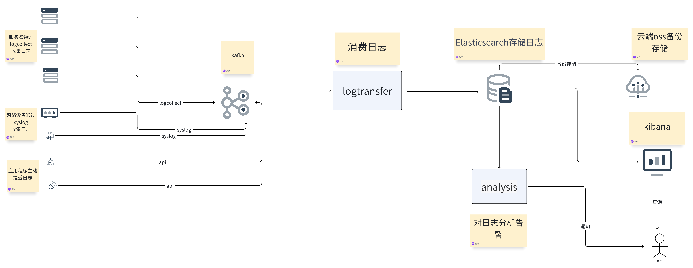
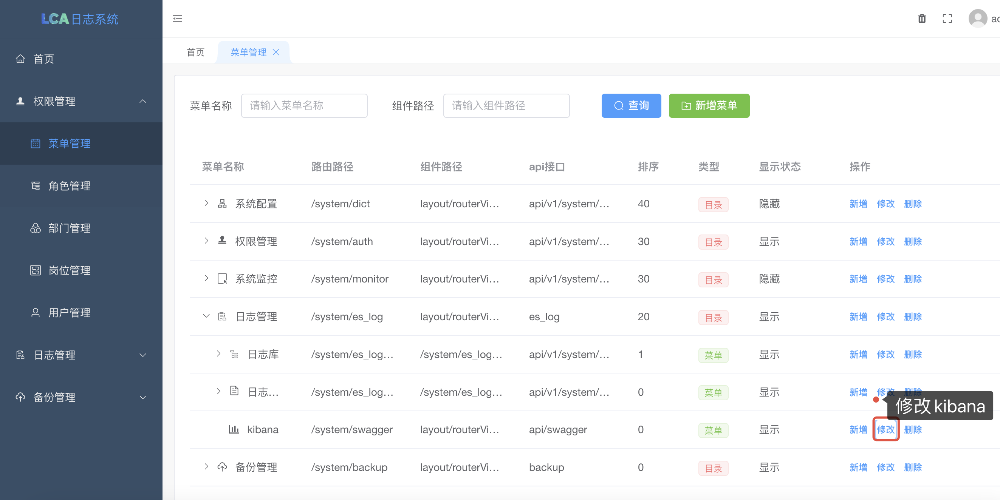
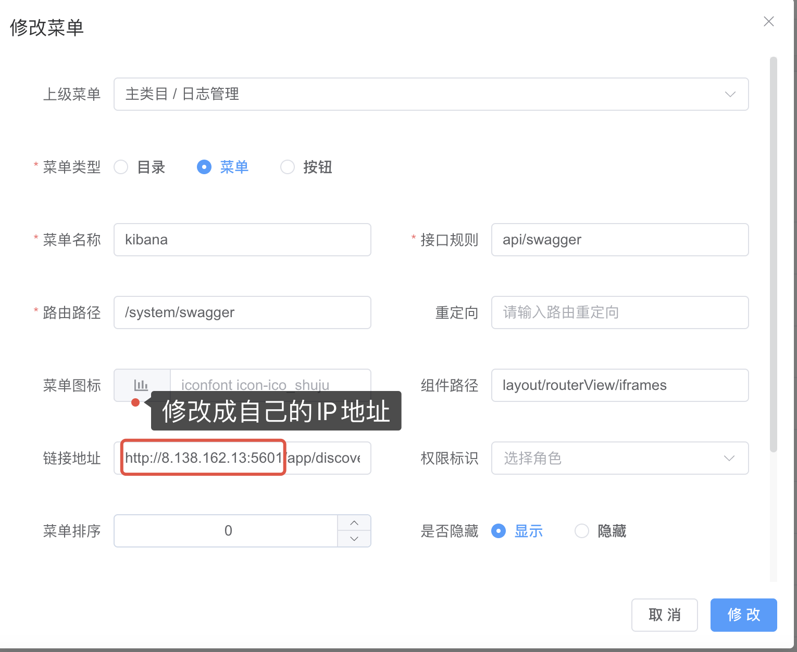
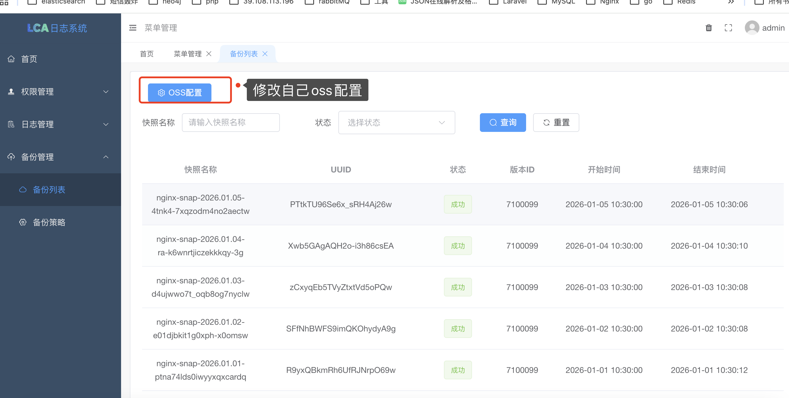
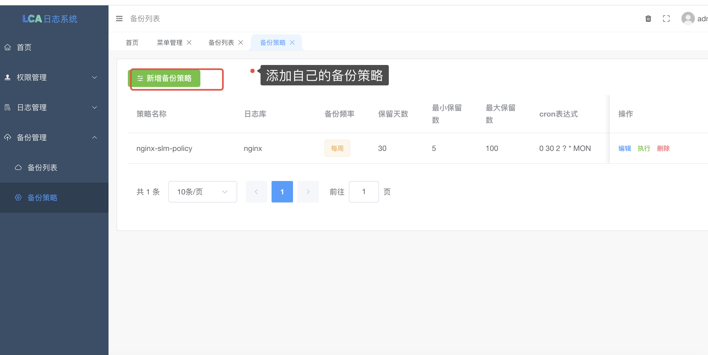
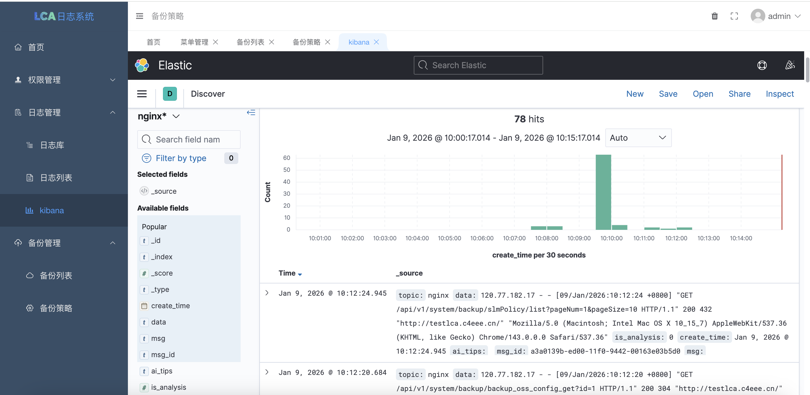
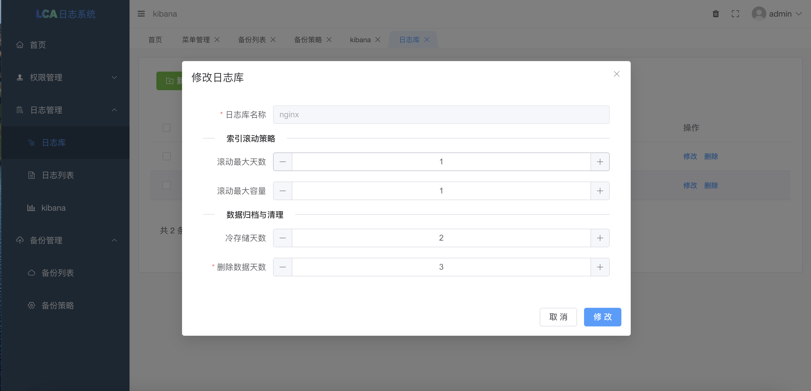

# log-collect-ai-analytics

#### 介绍
日志收集智能分析系统-LCA
- 快速部署：部署丝滑，管理方便，有web后台管理。
- 高效的数据采集：LCA 支持多种数据源，无论是服务器日志、应用日志还是网络设备日志，都能一键配置，快速部署。
- 灵活的数据处理：比起传统的elk更加灵活，而且还集成了日志分析和告警，内置强大的数据处理功能，包括过滤、聚合、关联等，让您轻松应对复杂的数据处理需求，除了按配置好的目录收集日志还提供了api接口实时调用,吞吐率高。
- 直观的数据可视化：通过丰富的图表和仪表板，LCA 让数据分析变得更加简单直观，让您一目了然地了解业务状况。
- 智能告警机制：实时监控关键指标，一旦发现异常立即触发告警，确保问题第一时间得到解决。
- 安全可靠：web管理后台访问控制策略，保障您的数据安全无忧。

#### 软件架构

通过在运维平台上配置日志收集项，或者通过api接口调用推送日志，logagent从etcd中获取要收集的日志信息从业务服务器读取日志信息，发往kafka，logtransfer负责从kafka读取日志，写入到Elasticsearch中，通过Kibana进行日志检索。loganalysis将安装规则分析日志，将告警，报错日志信息推给企业微信。

1. 可实时收集常用的软件的日志，比如nginx，项目系统，业务日志
2. 可以通过api调用主动推送日志到日志分析系统（吞吐率高）
3. 可以对收集的日志进行分析，智能分析，然后按规则告警（nginx状态不是200，error报错等）
4. 实现如阿里sls一般查询日志
5. 可实现日志备份存储到oss，极大的节约本地服务器磁盘存储，Elasticsearch内存占用

#### 安装教程

1.  MySQL
    `cd docker-compose/mysql ` `docker-compose up -d` `账号：root，密码：max2024` `导入lca.sql`
2.  Redis
    `cd docker-compose/redis ` `docker-compose up -d`
3.  Elasticsearch   
    vi /etc/sysctl.conf 修改 vm.max_map_count = 262144  sysctl -p
    创建映射目录
    `mkdir -p /data/backups/es 给足够的权限 如果不知道什么权限就 chmod 777 es`
    `mkdir -p /data/es01/data 给足够的权限 如果不知道什么权限就 chmod 777 data`
    `mkdir -p /data/es02/data 给足够的权限 如果不知道什么权限就 chmod 777 data`
    `记得修改 docker-compose.yaml 里面的ES_JAVA_OPTS=-Xms256m -Xmx256m，ELASTICSEARCH_HOSTS=http://172.16.0.70:9200 按照自己实际情况`
    `cd docker-compose/elasticsearch ` `docker-compose up -d`

4.  Kafka
    `cd docker-compose/kafka ` `docker-compose up -d`

#### 启动教程
1. 启动后台管理 【先修改好manage/manifest/config/config.yaml】文件 监听端口可修改
   `cd manage/log_manage` `nohup ./log_manage & ` `账号：admin 密码：123456` manage前端需要nginx，安装好nginx直接复制根目录的lca_nginx.conf
2. 启动接口 【先修改好/config.json】监听8086端口固定了
   `cd api/api` `nohup ./api & `
3. 启动收集日志【先修改好/config.json】
   `cd logcollect`  `nohup ./logcollect & `
4. 启动消费【先修改好/config.json】
   `cd logtransfer` `nohup ./logtransfer &` 
5. 启动日志分析【先修改好/config.json】
   `cd analysis` `nohup ./analysis &` 
#### 使用说明

- 日志收集
通过配置logcollect/config.json，logcollect会实时自动收集好需要收集的日志。
  "LogSources": [
  {
  "Path": "/wwwlogs/*.log",
  "Topic": "nginx"
  }
  ]

- api调用
通过调用 http://ip/send 这个接口可以实时把日志写入分析系统当中
事例：curl -X POST "http://ip/send" -H "Content-Type: application/x-www-form-urlencoded" -d "topic=ai_api&data=你的日志内容"
- topic 必须是系统已经配置好的cmd/logTransfer/etc/config.ini topic = ai_nginx,ai_api 
- data 日志内容可以是任意字符串，如果是json字符串 {"msg":"这是一个隐藏的功能"} 可以定义一个msg 字段会被单独解析跟阿里云sls日志一样
- 安装oss插件 https://blog.csdn.net/jc2255/article/details/154742193?spm=1011.2415.3001.5331
- 
- 
- 
- 
- 
- 

1.  登录
演示地址 服务器配置2核8G 轻量应用 大家手下留情拜托🙏🏻 如果所有的程序都部署在一台服务器建议 2核8G 起步

http://testlca.c4eee.cn/

账号：admin
密码：123456

官网下载最新程序：https://lca.top/
#### 备注
本项目免费使用，已经帮助很多人搭建了属于自己公司的日志分析系统，技术支持联系WX:j13925090458
