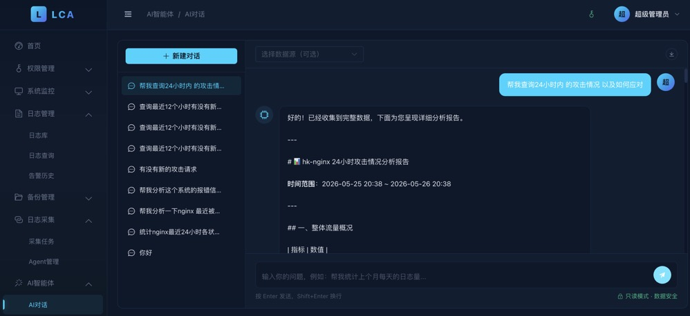

<div align="center">
  
  <h1>LCA · Log Collection & AI Analytics</h1>
  <p>Enterprise Log Collection · Intelligent Operations · AI-Powered Alerting · Real-Time Analysis · Multi-Channel Notifications</p>

  [](LICENSE)
  [](https://golang.org)
  [](https://vuejs.org)
  [](https://www.elastic.co)

  [Website](https://lca.top) · [Purchase License](https://lca.top/#pricing) · [Issues](https://github.com/jc2255/log-collect-ai-analytics/issues)
</div>

---

> ⚠️ **This project is commercial software. A license key is required for use.** Source code is for evaluation only. Commercial use without authorization is prohibited. See [LICENSE](LICENSE).

---

## Table of Contents

- [Feature Overview](#feature-overview)
- [Screenshots](#screenshots)
- [System Architecture](#system-architecture)
- [Tech Stack](#tech-stack)
- [Quick Deployment](#quick-deployment)
  - [Option 1: Docker Compose HA (Recommended for Production)](#option-1-docker-compose-ha-recommended-for-production)
  - [Option 2: Manual Deployment](#option-2-manual-deployment)
- [Service Startup Guide](#service-startup-guide)
- [Configuration Reference](#configuration-reference)
- [Agent Deployment](#agent-deployment)
- [Direct Log Push API](#direct-log-push-api)
- [AI Intelligent Alerting](#ai-intelligent-alerting)
- [License Key](#license-key)
- [Project Structure](#project-structure)
- [Troubleshooting](#troubleshooting)
- [Changelog](#changelog)

---

## Feature Overview

| Module | Description |
|------|---------|
| **Log Collection** | Cross-platform agent (Linux/Windows), Glob path matching, resume from breakpoint, heartbeat monitoring, Agent offline email alerts |
| **Direct Push API** | Push logs from any application via HTTP API — no agent required. Supports batch push |
| **Log Transport** | Kafka peak shaving → Elasticsearch storage, with per-logstore topic isolation |
| **Log Search** | Kibana-Discover-like UI: time histogram, field panel, KQL full-text search |
| **AI Intelligent Alerting** | ES rule pre-filtering + OpenAI-compatible LLM deep analysis. Multi-channel: WeCom / DingTalk / Email / Webhook |
| **Alert History** | Unified record of all AI alerts + Agent offline alerts, filterable by source / severity / status |
| **Collection Task Management** | Visual configuration: Agent collection paths, parse modes (raw/json/regex/delimiter), multiline merging |
| **Agent Management** | Real-time heartbeat monitoring, online/offline status, auto-mark offline after 3 minutes with email notification |
| **RBAC Access Control** | Casbin-based RBAC: departments, positions, roles, menu-level fine-grained permissions |
| **Backup Management** | Elasticsearch snapshot auto-backup to Alibaba Cloud OSS, with manual restore |
| **AI Agents** | Task-automation agents that execute commands on your behalf — just tell them what to do |
| **License Management** | RSA machine-fingerprint binding, online activation, anti-piracy protection |

---

## Screenshots

### Dashboard

Real-time display: logstore count, total logs, alert count, today's ingestion volume; bar chart + donut chart dual-view for per-logstore distribution, ingestion rate in logs/minute.


### Log Search (Kibana-Discover-like)

Time histogram + available fields panel + KQL/Lucene full-text search. Quick time ranges (1m / 5m / 15m / 1h / 4h / 24h / 7d / 30d) and custom ranges.


### Alert History

Unified display of AI alerts and Agent offline alerts, filterable by logstore / severity. One-click access to diagnostics report or raw logs.


### AI Diagnostic Report

LLM-powered deep analysis delivers a three-part diagnostic: anomaly summary / root cause analysis / remediation steps — with executable commands embedded.


### Backup Policies

Visual SLM policy configuration: execution frequency / retention days / min & max snapshots / OSS repository — auto-backup to Alibaba Cloud OSS.


### Agent Management

Real-time heartbeat status tracking. Online/offline at a glance. Auto-mark with email alert on timeout.


### Collection Task Management

Dynamically assign collection tasks to target agents: logstore + Glob path + parse mode (raw / json / regex / delimiter). Takes effect within 60 seconds, no restart required.


### AI Agents

Task-automation agents that execute commands based on your instructions.



---

## System Architecture

```
┌────────────────────────────────────────────────────────────────┐
│                     LCA System Architecture                     │
├───────────────┬────────────────────────────────────────────────┤
│               │  ┌─────────────┐   ┌──────────────────────┐   │
│  Log Sources  │  │ App Servers  │   │ Network Devices /     │   │
│               │  └──────┬──────┘   │ Containers            │   │
│               │         │ File Tail│          │ HTTP API    │   │
│  Collection   │  logcollect Agent  │          │              │   │
│               │  (resume + heartbeat)         ↓              │   │
│               │         └──────────────→  apiserver :8086    │   │
│               │                              │               │   │
│  Transport    │                         Kafka Topic           │   │
│               │                              │               │   │
│               │                         logtransfer          │   │
│               │                              │               │   │
│  Storage      │                    Elasticsearch 7.x          │   │
│               │                    (ILM Lifecycle Management) │   │
│               │                              ↑               │   │
│  Management   │              admin :8080 (Go + Gin)           │   │
│  Presentation │        Web UI (Vue 3 + Element Plus)          │   │
│  Alerting     │   AI Scanner → WeCom/DingTalk/Email/Webhook   │   │
└───────────────┴────────────────────────────────────────────────┘
```

### Services

| Service | Port | Description |
|------|------|------|
| `admin` | **8080** | Management backend API + static asset server (must start first) |
| `apiserver` | **8086** | Log ingestion endpoint (Agent reporting + direct push) |
| `logtransfer` | — | Kafka consumer, writes to Elasticsearch |
| `logcollect` | — | Linux/macOS agent, deployed on target machines |
| `logcollect_win` | — | Windows agent |
| `syslog` | **514/UDP** | Syslog protocol receiver (optional) |

---

## Tech Stack

**Backend**
- Go 1.21+ · Gin · GORM · Casbin
- MySQL 8.0 · Redis · Apache Kafka · Elasticsearch 7.x
- JWT Authentication · RSA License Verification · Zap Logger

**Frontend**
- Vue 3 · TypeScript · Element Plus · Vite · ECharts

---

## Quick Deployment

### Prerequisites

| Component | Version | Notes |
|------|---------|------|
| Go | 1.21+ | Required for manual build |
| Node.js | 18+ | Required for frontend development |
| Docker & Docker Compose | 20+ | Required for Docker deployment |
| MySQL | 8.0+ | Can reuse existing instance |
| Redis | 6.0+ | Can reuse existing instance |
| Kafka | 2.8+ | Can reuse existing instance |
| Elasticsearch | 7.x | 7.17 recommended |
| License Key | — | [Purchase here](https://lca.top/#pricing) |

---

### Option 1: Docker Compose HA (Recommended for Production)

Multi-instance + automatic failover + multi-replica data redundancy. One command to start: MySQL master-slave, Redis Sentinel, Kafka 3 brokers, Elasticsearch 3-node cluster, all backend services (admin×2, apiserver×2, logtransfer×2), and Nginx load balancer.

```bash
# 1. Clone the repository
git clone https://github.com/jc2255/log-collect-ai-analytics.git
cd log-collect-ai-analytics

# 2. Configure environment variables (database passwords, JWT secret, etc.)
cp .env.example .env
vim .env

# 3. Start the HA cluster
docker compose -f docker-compose.ha.yaml up -d

# 4. Check service status
docker compose -f docker-compose.ha.yaml ps

# 5. View service logs
docker compose -f docker-compose.ha.yaml logs -f admin1
docker compose -f docker-compose.ha.yaml logs -f apiserver1
```

After startup, visit: **http://your-server-ip**

Default credentials: `admin` / `admin123`

> ⚠️ On first use, activate your license key in **System Settings → License Management**.

#### HA Architecture Details

| Tier | Capability | Implementation |
|------|------|----------|
| **Redis** | Automatic failover | Sentinel: 1 master + 2 replicas + 3 sentinels |
| **Distributed Lock** | Mutually exclusive task execution | Redis SETNX + Lua atomic release |
| **Leader Election** | Single-instance cron execution | Lease-renewal lock, auto-downgrade to standby on failure |
| **Casbin Sync** | Multi-instance policy consistency | Redis Pub/Sub notification + reload |
| **MySQL** | Read/write separation | Master writes + replica reads, GTID replication |
| **Kafka** | Multi-replica data | 3 brokers, `replication.factor=3` |
| **Elasticsearch** | Data redundancy | 3-node cluster + 1 replica shard |
| **Nginx** | Load balancing | Upstream round-robin + health checks + failover |
| **Application** | Horizontal scaling | admin×2, apiserver×2, logtransfer×2 |

#### HA Configuration Files

| File | Description |
|------|------|
| `configs/admin-ha.yaml` | Admin service HA config (Sentinel + read replicas) |
| `configs/apiserver-ha.yaml` | Apiserver service HA config |
| `configs/logtransfer-ha.yaml` | Logtransfer service HA config |
| `deploy/ha/nginx-ha.conf` | Nginx load balancer config |
| `deploy/ha/sentinel.conf` | Redis Sentinel config |
| `deploy/ha/mysql-master.cnf` | MySQL master config |
| `deploy/ha/mysql-slave.cnf` | MySQL replica config |

---

### Option 2: Manual Deployment

For environments with existing MySQL / Redis / Kafka / ES infrastructure.

#### Step 1: Install Dependencies

```bash
# Ubuntu / Debian
apt-get update
apt-get install -y mysql-server redis-server

# Install Kafka (ensure Java 11+ is installed)
wget https://downloads.apache.org/kafka/3.6.0/kafka_2.13-3.6.0.tgz
tar -xzf kafka_2.13-3.6.0.tgz
cd kafka_2.13-3.6.0

# Start Kafka (requires Zookeeper first)
bin/zookeeper-server-start.sh -daemon config/zookeeper.properties
bin/kafka-server-start.sh -daemon config/server.properties
```

#### Step 2: Initialize Database

```bash
mysql -u root -p <<EOF
CREATE DATABASE IF NOT EXISTS lca DEFAULT CHARACTER SET utf8mb4;
CREATE USER IF NOT EXISTS 'lca'@'%' IDENTIFIED BY 'lca2024';
GRANT ALL PRIVILEGES ON lca.* TO 'lca'@'%';
FLUSH PRIVILEGES;
EOF
```

> Table schemas are **automatically created via AutoMigrate** at startup. No manual SQL execution is needed.

#### Step 3: Build from Source

```bash
# Build all services
go build -o bin/admin       ./cmd/admin
go build -o bin/apiserver   ./cmd/apiserver
go build -o bin/logtransfer ./cmd/logtransfer
go build -o bin/logcollect  ./cmd/logcollect

# Build frontend (production)
cd web
npm install
npm run build
# Output is in web/dist/, served by admin as static assets
cd ..
```

#### Step 4: Update Configuration

```bash
# Modify for your environment (MySQL / Redis / Kafka / ES addresses and passwords)
vim configs/admin.yaml
vim configs/apiserver.yaml
vim configs/logtransfer.yaml
```

#### Step 5: Start Services in Order

```bash
# Recommended: use systemd / supervisord / screen for background execution

# Admin backend (start first — handles AutoMigrate and data initialization)
./bin/admin -config configs/admin.yaml

# Log ingestion service
./bin/apiserver -config configs/apiserver.yaml

# Kafka→ES transport service
./bin/logtransfer -config configs/logtransfer.yaml
```

---

## Service Startup Guide

### Recommended Startup Order

```
1. MySQL / Redis / Kafka / Elasticsearch  ← Infrastructure
2. admin          ← Management backend, creates tables and seed data
3. apiserver      ← Log ingestion, depends on MySQL + Kafka
4. logtransfer    ← Data transport, depends on Kafka + ES
5. logcollect     ← Collection agent (deployed on each target machine)
```

### systemd Service (Recommended for Production)

Example for the `admin` service:

```ini
# /etc/systemd/system/lca-admin.service
[Unit]
Description=LCA Admin Server
After=network.target mysql.service

[Service]
Type=simple
User=www-data
WorkingDirectory=/opt/lca
ExecStart=/opt/lca/bin/admin -config /opt/lca/configs/admin.yaml
Restart=always
RestartSec=5

[Install]
WantedBy=multi-user.target
```

```bash
systemctl daemon-reload
systemctl enable lca-admin
systemctl start lca-admin
systemctl status lca-admin
```

### Health Check Endpoints

```bash
curl http://localhost:8080/health   # admin
curl http://localhost:8086/health   # apiserver
```

---

## Configuration Reference

### configs/admin.yaml

```yaml
server:
  port: 8080          # Management backend port
  mode: release       # debug / release

mysql:
  host: 127.0.0.1
  port: 3306
  user: root
  password: "lca2024"
  dbname: lca

redis:
  host: 127.0.0.1
  port: 6379
  password: "lca2024"

kafka:
  brokers:
    - "127.0.0.1:9092"

elasticsearch:
  addresses:
    - "http://127.0.0.1:9200"
  username: ""   # Fill in if ES has authentication
  password: ""

jwt:
  secret: "change-this-secret-in-production"  # MUST be changed!
  expire_hour: 24

log:
  level: info
  filename: logs/admin.log   # Leave empty to output to stdout

license:
  public_key: |               # RSA public key for license verification
    -----BEGIN PUBLIC KEY-----
    ...
    -----END PUBLIC KEY-----
```

### configs/apiserver.yaml

```yaml
server:
  port: 8086   # Log ingestion port (used by both Agent and direct push API)

# Other config is same as admin.yaml
```

### configs/logcollect.yaml (Agent Configuration)

```yaml
api_server: "http://your-apiserver"   # Apiserver address
admin_server: "http://your-admin"     # Admin address, for pulling collection tasks
api_key: "ak_your_logstore_xxx"       # Logstore API Key (found on logstore page)
agent_id: "server-prod-001"           # Unique identifier for this machine
batch_size: 50                        # Batch send count
flush_seconds: 5                      # Max buffering seconds (flush on timeout)
```

---

## Agent Deployment

### Linux / macOS

```bash
# Download pre-built binary from GitHub
wget https://github.com/jc2255/log-collect-ai-analytics/raw/main/release/bin/logcollect -O logcollect
chmod +x logcollect

# Create working directory
mkdir -p /opt/lca-agent && mv logcollect /opt/lca-agent/

# Create config file
cat > /opt/lca-agent/logcollect.yaml <<'EOF'
api_server: "http://localhost"
admin_server: "http://localhost:80"
api_key: "ak_app-nginx_a1b2c3d4"
agent_id: "web-server-01"
batch_size: 50
flush_seconds: 5
EOF

# Start (foreground debugging)
cd /opt/lca-agent && ./logcollect -config logcollect.yaml

# Background daemon
nohup /opt/lca-agent/logcollect -config /opt/lca-agent/logcollect.yaml > /var/log/lca-agent.log 2>&1 &
```

### Windows

```powershell
# Download pre-built binary from GitHub
Invoke-WebRequest -Uri "https://github.com/jc2255/log-collect-ai-analytics/raw/main/release/bin/logcollect.exe" -OutFile "C:\lca-agent\logcollect.exe"

# Create config file C:\lca-agent\logcollect.yaml (same content as above)

# Start
C:\lca-agent\logcollect.exe -config C:\lca-agent\logcollect.yaml

# Register as Windows Service (using NSSM)
nssm install LCACollect "C:\lca-agent\logcollect.exe" "-config C:\lca-agent\logcollect.yaml"
nssm start LCACollect
```

### Collection Task Configuration

After the agent starts, add tasks in the admin panel under **Log Collection → Collection Tasks**:

| Field | Description | Example |
|------|------|------|
| Agent Binding | Which agent executes this task (0 = all agents) | `web-server-01` |
| Logstore | Target logstore for ingestion | `app-nginx` |
| Path Pattern | Glob wildcard supported | `/var/log/nginx/*.log` |
| Parse Mode | raw / json / regex / delimiter | `raw` |
| Multiline Merge | Regex for merging multi-line logs (e.g. Java stack traces) | `^\d{4}-\d{2}-\d{2}` |

Agents pull the latest tasks from admin every **60 seconds** — no restart required.

---

## Direct Log Push API

Push logs directly via HTTP API — no agent deployment needed. Ideal for:
- Containerized applications (sidecar pattern)
- Environments where agent installation is not possible
- SDK integrations, Logstash / Fluentd pipelines

### API Reference

```
POST http://your-apiserver:8086/api/v1/log/push
Content-Type: application/json
X-Trace-Id: <16-char hex>      // Optional, auto-generated if absent

{
  "api_key": "ak_your_logstore_xxx",  // Logstore API Key (required)
  "logs": [                            // Log array (required, supports batch)
    { ... },
    { ... }
  ]
}
```

**Response:**
```json
{
  "code": 0,
  "message": "success",
  "data": {
    "count": 1,
    "trace_id": "7eae7b75176463bd"   // End-to-end trace ID for troubleshooting
  }
}
```

The response header also carries `X-Trace-Id`. The same log can be traced across apiserver / Kafka / logtransfer / ES using this ID.

Each log entry can be any JSON object. The system automatically appends:
- `_timestamp`: Unix timestamp in milliseconds
- `_source_ip`: Sender's IP address
- `_store_name`: Logstore name
- `_trace_id`: End-to-end trace ID (for ES retrieval)

---

### curl Examples

#### 1. Push a Single Raw Log

```bash
curl -X POST http://localhost:8086/api/v1/log/push \
  -H "Content-Type: application/json" \
  -d '{
    "api_key": "ak_app-nginx_a1b2c3d4",
    "logs": [
      {
        "@timestamp": "2026-05-18T10:30:00Z",
        "message": "GET /api/users 200 125ms",
        "level": "INFO"
      }
    ]
  }'
```

#### 2. Push Multiple Logs in Batch

```bash
curl -X POST http://localhost:8086/api/v1/log/push \
  -H "Content-Type: application/json" \
  -d '{
    "api_key": "ak_app-nginx_a1b2c3d4",
    "logs": [
      {
        "@timestamp": "2026-05-18T10:30:01Z",
        "message": "192.168.1.1 - GET /index.html 200 1234",
        "level": "INFO",
        "host": "web-01"
      },
      {
        "@timestamp": "2026-05-18T10:30:02Z",
        "message": "192.168.1.2 - POST /api/login 401 56",
        "level": "WARN",
        "host": "web-01"
      },
      {
        "@timestamp": "2026-05-18T10:30:03Z",
        "message": "Connection refused: database unreachable",
        "level": "ERROR",
        "host": "web-01",
        "service": "user-service"
      }
    ]
  }'
```

#### 3. Push Structured JSON Logs (Java / Go / Python Apps)

```bash
curl -X POST http://localhost:8086/api/v1/log/push \
  -H "Content-Type: application/json" \
  -d '{
    "api_key": "ak_app-backend_b5c6d7e8",
    "logs": [
      {
        "@timestamp": "2026-05-18T10:31:00Z",
        "level": "ERROR",
        "logger": "com.example.UserService",
        "message": "Failed to save user",
        "thread": "http-nio-8080-exec-3",
        "traceId": "abc123def456",
        "userId": 1001,
        "exception": "java.sql.SQLException: Timeout waiting for connection from pool"
      }
    ]
  }'
```

#### 4. Push Nginx Access Logs (Formatted as JSON)

```bash
# Assumes Nginx is configured with JSON log format
curl -X POST http://localhost:8086/api/v1/log/push \
  -H "Content-Type: application/json" \
  -d '{
    "api_key": "ak_app-nginx_a1b2c3d4",
    "logs": [
      {
        "@timestamp": "2026-05-18T10:32:00+08:00",
        "remote_addr": "1.2.3.4",
        "request": "GET /api/v1/users HTTP/1.1",
        "status": 200,
        "body_bytes_sent": 1234,
        "request_time": 0.125,
        "http_user_agent": "Mozilla/5.0",
        "http_referer": "https://example.com"
      }
    ]
  }'
```

#### 5. Sample Response

```json
{
  "code": 0,
  "msg": "success",
  "data": {
    "count": 3
  }
}
```

---

### Shell Script for Continuous Push

```bash
#!/bin/bash
# Stream application logs to LCA in real time
API_URL="http://localhost:8086/api/v1/log/push"
API_KEY="ak_app-backend_b5c6d7e8"
LOG_FILE="/var/log/app/app.log"

tail -F "$LOG_FILE" | while IFS= read -r line; do
  TIMESTAMP=$(date -u +"%Y-%m-%dT%H:%M:%SZ")
  curl -s -X POST "$API_URL" \
    -H "Content-Type: application/json" \
    -d "{\"api_key\":\"$API_KEY\",\"logs\":[{\"@timestamp\":\"$TIMESTAMP\",\"message\":$(echo "$line" | python3 -c 'import json,sys; print(json.dumps(sys.stdin.read().strip()))')}]}" \
    > /dev/null
done
```

---

### Python Integration

```python
import requests
import json
from datetime import datetime, timezone

LCA_URL = "http://localhost:8086/api/v1/log/push"
API_KEY = "ak_app-backend_b5c6d7e8"

def push_log(level: str, message: str, **extra):
    payload = {
        "api_key": API_KEY,
        "logs": [{
            "@timestamp": datetime.now(timezone.utc).isoformat(),
            "level": level,
            "message": message,
            **extra
        }]
    }
    try:
        resp = requests.post(LCA_URL, json=payload, timeout=5)
        return resp.json()
    except Exception as e:
        print(f"[LCA] push failed: {e}")

# Usage
push_log("INFO", "User login successful", user_id=1001, ip="1.2.3.4")
push_log("ERROR", "Database connection failed", service="user-service", retry=3)
```

---

### Logstash Integration

Use the `http` output in a Logstash pipeline to push logs directly to LCA:

```ruby
output {
  http {
    url    => "http://localhost:8086/api/v1/log/push"
    format => "json"
    http_method => "post"
    mapping => {
      "api_key" => "ak_app-nginx_a1b2c3d4"
      "logs" => ["%{[@metadata][event]}"]
    }
  }
}
```

---

## AI Intelligent Alerting

Enable "AI Intelligent Alerting" on the **Log Management → Logstores** page, then click "Configure" to set up rules.

### Configuration Parameters

| Parameter | Description | Example |
|------|------|------|
| Scan Interval | Minutes between scans | `5` |
| ERROR Threshold | Trigger alert when recent ERROR/FATAL count exceeds this | `10` |
| Keywords | Trigger alert when any keyword appears 5+ times | `OOM, Connection refused` |
| LLM Provider | openai / deepseek / qwen / ollama | `deepseek` |
| LLM API Key | LLM API key | `sk-xxx` |
| LLM Base URL | API base URL (OpenAI-compatible format) | `https://api.deepseek.com/v1` |
| Quiet Period | Minutes before same logstore can trigger another alert | `60` |
| Notification Channels | WeCom / DingTalk / Email / Webhook | See table below |

### Notification Channel Configuration

| Channel | Required Parameters |
|------|-----------|
| WeCom Bot | Webhook URL |
| DingTalk Bot | Webhook URL |
| Email | SMTP server, port, username, password, recipients |
| Custom Webhook | Webhook URL |

**Email SMTP settings:**
- QQ Mail: `smtp.qq.com`, port `465` (SSL), password is authorization code
- 163 Mail: `smtp.163.com`, port `465` (SSL)
- Gmail: `smtp.gmail.com`, port `587` (STARTTLS)

### Supported LLM Providers

| Provider | API Base URL | Recommended Model |
|--------|-------------|---------|
| DeepSeek | `https://api.deepseek.com/v1` | `deepseek-chat` |
| Alibaba Qwen | `https://dashscope.aliyuncs.com/compatible-mode/v1` | `qwen-plus` |
| OpenAI | `https://api.openai.com/v1` | `gpt-4o-mini` |
| Ollama (Local) | `http://localhost:11434/v1` | `llama3` |

### Agent Offline Notification

When an agent has no heartbeat for 3 minutes, the system will:
1. Automatically mark the agent as **offline**
2. Write an alert record in **Alert History**
3. Send an **email notification** to the super admin (`admin` account)

**Prerequisites:**
- Super admin must have an email set in "Profile"
- Email (SMTP) notification must be configured in at least one logstore's AI alert settings

---

## License Key

This system uses **RSA machine-fingerprint binding** to prevent unauthorized cross-machine usage.

### Activation Steps

1. Deploy and start the admin service, then navigate to **System Settings → License Management**
2. The page displays the current machine's **fingerprint** (generated from CPU serial, MAC address, etc.)
3. Go to [lca.top](https://lca.top) to purchase a license key and submit the machine fingerprint
4. Paste the received license key into the activation box and click "Activate"
5. All system features are unlocked upon successful activation

### Editions

| Edition | Use Case | License |
|------|---------|--------|
| Community | Personal non-commercial use, limited features | Free application |
| Professional | Commercial use, single-machine deployment | Paid purchase |
| Enterprise | Commercial use, multi-machine deployment + priority support | Contact sales |

> Purchase: **https://lca.top** · Sales inquiry: **13925090458**

---

## Project Structure

```
log-collect-ai-analytics/
├── cmd/                        # Service entry points
│   ├── admin/                  # Management backend service
│   ├── apiserver/              # Log ingestion service (HTTP Push)
│   ├── logcollect/             # Linux/macOS collection agent
│   ├── logcollect_win/         # Windows collection agent
│   ├── logtransfer/            # Kafka → Elasticsearch transport service
│   └── syslog/                 # Syslog receiver (UDP 514)
├── configs/                    # Configuration files
│   ├── admin.yaml              # Management backend config
│   ├── apiserver.yaml          # Log ingestion service config
│   ├── logtransfer.yaml        # Transport service config
│   ├── logcollect.yaml         # Agent config
│   └── rbac_model.conf         # Casbin RBAC model definition
├── deploy/                     # Docker build files
│   ├── Dockerfile              # Backend image
│   ├── Dockerfile.web          # Frontend image
│   ├── nginx.conf              # Nginx reverse proxy config
│   └── ha/                     # HA deployment configs
│       ├── nginx-ha.conf       # Nginx load balancer config
│       ├── sentinel.conf       # Redis Sentinel config
│       ├── mysql-master.cnf    # MySQL master config
│       └── mysql-slave.cnf     # MySQL replica config
├── internal/
│   ├── handler/                # HTTP handlers (per business module)
│   ├── middleware/             # Middleware (JWT / RBAC / License / Audit)
│   ├── model/                  # GORM data models
│   ├── pkg/                    # Shared packages (ES / Kafka / Redis / Config / Logger)
│   └── service/                # Business services
│       ├── ai_alert_scanner.go         # AI alert rule scanner
│       ├── ai_alert_notifier.go        # Multi-channel notification dispatcher
│       ├── ai_alert_llm.go             # LLM invocation
│       ├── ai_alert_scheduler.go       # Cron scheduler
│       └── agent_offline_notifier.go   # Agent offline detection & email notification
├── keys/                       # RSA public key (private key must NOT be committed!)
├── scripts/
│   ├── init-ha.sh             # HA infrastructure initialization script
│   └── start.sh                # One-click startup script
├── web/                        # Vue 3 frontend project
│   ├── src/
│   │   ├── api/                # Backend API wrappers
│   │   ├── views/              # Page components
│   │   │   ├── log/            # Log management (logstores, search, alert history)
│   │   │   ├── collect/        # Collection tasks, Agent management
│   │   │   ├── monitor/        # System monitoring (login logs, audit logs, online users)
│   │   │   ├── permission/     # RBAC management
│   │   │   ├── backup/         # Backup management
│   │   │   └── dashboard/      # Home dashboard
│   │   └── layouts/            # Main layout
│   └── dist/                   # Build output (served by admin as static assets)
└── docker-compose.ha.yaml      # HA deployment orchestration
```

---

## Troubleshooting

### Using trace_id for Diagnostics (Recommended)

All requests via `/api/v1/log/push` receive an end-to-end `trace_id`. The same log can be traced across all 4 components. When issues arise, obtain the trace_id and search as follows:

```bash
TRACE=<trace_id from response>

# 1) Did apiserver receive and write to Kafka?
docker logs lca-apiserver1 lca-apiserver2 2>&1 | grep "trace=$TRACE"
# Expected: recv push → api_key OK → kafka write OK

# 2) Did logtransfer pull from Kafka and write to ES?
docker logs lca-logtransfer 2>&1 | grep "trace=$TRACE"
# Expected: fetch → flush start → flush OK

# 3) Is the data in ES? (use the exact index name from logtransfer's "flush OK" log)
curl -sS "http://localhost:9200/<actual_index_name>/_search?q=_trace_id:$TRACE&pretty"
```

**Triage by symptom:**

| Symptom | Likely Cause |
|---|---|
| No trace log from apiserver | Nginx not routing to apiserver / Agent not pushing to server |
| apiserver OK but logtransfer not | Kafka topic/partition not assigned, consumer group not joined (check `kafka-consumer-groups.sh --describe`) |
| logtransfer fetch OK but no flush OK | ES connection issue, index write rejected |
| logtransfer flush OK but ES search empty | Wrong index name (use the exact name from `flush OK index=...` log) |

### Kafka HA: Group Coordinator Not Available

Symptom: consumer repeatedly reports `[15] Group Coordinator Not Available`, `__consumer_offsets` does not exist.

Cause: Kafka default `offsets.topic.replication.factor=1` conflicts with `min.insync.replicas=2` — `__consumer_offsets` is created but not writable.

Fix: All 3 Kafka brokers in `docker-compose.ha.yaml` must include:

```yaml
KAFKA_OFFSETS_TOPIC_REPLICATION_FACTOR: 3
KAFKA_TRANSACTION_STATE_LOG_REPLICATION_FACTOR: 3
KAFKA_TRANSACTION_STATE_LOG_MIN_ISR: 2
```

After modification: `docker compose -f docker-compose.ha.yaml up -d --force-recreate kafka1 kafka2 kafka3`

### Image Changes Not Taking Effect

`deploy/Dockerfile` uses `COPY release/bin/${APP_NAME} ./server` — the binary is **embedded in the image**. After recompiling, you must:

```bash
docker compose -f docker-compose.ha.yaml build --no-cache <service>
docker compose -f docker-compose.ha.yaml up -d --force-recreate <service>
```

Simply running `up -d --force-recreate` does **not** rebuild the image.

---

## Changelog

### v1.3.1
- Added **end-to-end trace_id tracking**: agent → apiserver → Kafka → logtransfer → ES — single `X-Trace-Id` across all components
- trace_id propagated via HTTP response body, headers, Kafka headers, and ES `_trace_id` field
- Fixed Kafka HA cluster `__consumer_offsets` creation failure (`OFFSETS_TOPIC_REPLICATION_FACTOR` aligned with `MIN_INSYNC_REPLICAS`)
- kafka-go Reader now uses ErrorLogger — group join/sync errors no longer silently swallowed
- logtransfer flush log level raised from debug to info, visible by default

### v1.3.0
- Added High Availability (HA) deployment mode: Redis Sentinel auto-failover, MySQL master-slave read/write separation, Kafka 3-broker cluster, ES 3-node cluster
- Added distributed locking (Redis SETNX + Lua) for mutually exclusive cron task execution
- Added Leader Election mechanism for AI alert scheduler and Agent offline detection with auto failover
- Added Casbin policy multi-instance sync (Redis Pub/Sub) for real-time permission propagation
- Added Nginx load balancing with upstream health checks + automatic failover
- Added one-click HA initialization script (`scripts/init-ha.sh`)

### v1.2.0
- Added "Alert History" list page — unified display of AI alerts and Agent offline alerts
- Added Agent offline auto-detection: 3-minute timeout marks offline, emails admin
- Alert history supports filtering by logstore / severity / status, single delete, and batch clear

### v1.1.0
- Added AI Intelligent Alerting (ES rule pre-filtering + LLM deep analysis)
- Multi-channel notifications: WeCom / DingTalk / Email (SSL 465 / STARTTLS 587) / Webhook
- Alert quiet period to prevent alert storms

### v1.0.0
- Log collection agent (Linux/Windows), resume from breakpoint, 60-second dynamic task pull
- Logstore management, collection task management
- Kibana-Discover-like log search UI (time histogram + field panel + KQL)
- Direct push API (any application via HTTP, no agent needed)
- RBAC permission management (departments / positions / roles / menus)
- ES snapshot backup management (Alibaba Cloud OSS)
- RSA machine-fingerprint license key mechanism

---

<div align="center">
  <p>Copyright © 2024-2026 LCA Software. All Rights Reserved.</p>
  <p>
    <a href="https://lca.top">Website</a> ·
    <a href="https://lca.top/#pricing">Purchase License</a> ·
    <a href="mailto:support@lca.top">Contact Us</a>
  </p>
</div>
